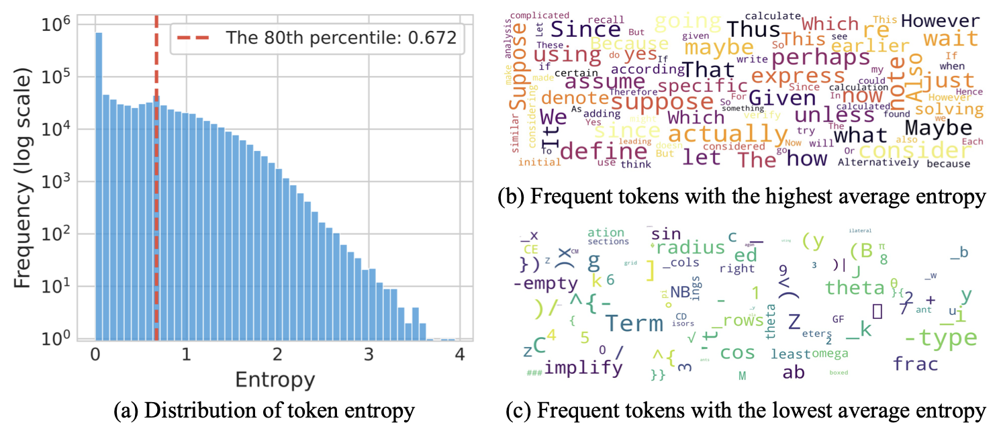
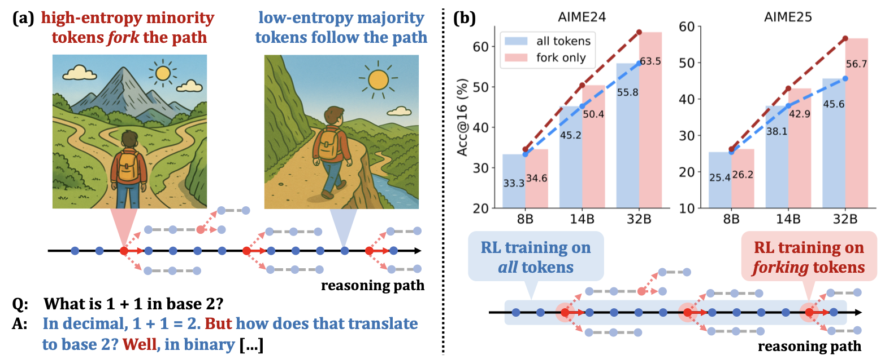
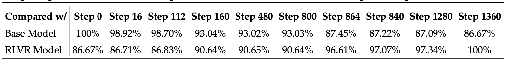

## 0. Overview

In LLM Chain-of-Thought reasoning, only ~20% of tokens are "high-entropy forks" that actually steer reasoning direction — and restricting RLVR policy gradient updates to just these tokens matches or surpasses full-gradient training, with gains that scale strongly with model size.

## 1. Background & Motivation

- **Field / Problem:** Reinforcement Learning with Verifiable Rewards (RLVR) has become a key technique for improving LLM reasoning (as seen in o1, DeepSeek R1, Qwen3), yet its underlying mechanisms are poorly understood. Existing implementations apply policy gradient updates uniformly to all tokens in a Chain-of-Thought (CoT) response without distinguishing their functional roles.
- **Why it matters:** If only a small subset of tokens actually drive reasoning improvements, then treating all tokens equally during training is both wasteful and potentially harmful — it dilutes the gradient signal with noise from low-value tokens. Understanding *which* tokens matter is both a scientific question about how RLVR works and an engineering question about how to make it more efficient and powerful.

## 2. Related Work & Gaps

- **Prior approaches:** PPO (Schulman et al.), GRPO (used in DeepSeek R1), and DAPO (Dynamic sAmpling Policy Optimization) are the main RLVR algorithms — all apply policy gradients uniformly across all tokens. Prior analyses of generation entropy in CoT reasoning (Yang et al. 2025; Yu et al. 2025; Yue et al. 2025) examined *aggregate* entropy across all tokens collectively, not its fine-grained distribution within a sequence.
- **Key limitations / gaps:** No prior work had studied the within-sequence heterogeneity of token entropy in CoTs, nor had anyone asked whether gradient updates to high- vs. low-entropy tokens differ in their effect on reasoning performance. The entropy bonus technique (used to encourage exploration) operates on all tokens indiscriminately, which may be suboptimal.

## 3. Core Idea & Contributions

- **Main idea (intuition):** Not all tokens in a reasoning chain are created equal. A small minority of tokens are genuinely uncertain decision points — "forks" where the model chooses among multiple plausible reasoning directions. These are the tokens that matter for RLVR; the majority are just filling in already-determined linguistic structures and contribute little to learning.
- **Claimed contributions:**
  1. Empirical discovery and characterization of two entropy patterns in CoT reasoning: (a) high-entropy minority tokens act as reasoning "forks," and (b) RLVR training predominantly modifies these high-entropy tokens while leaving low-entropy tokens stable.
  2. Quantitative validation that high-entropy "forking tokens" causally drive reasoning quality — via controlled temperature manipulation experiments during decoding.
  3. A simple RLVR improvement: masking gradients of the bottom 80% lowest-entropy tokens and training only on the top 20% highest-entropy tokens, achieving SoTA on AIME benchmarks with a strong model-size scaling trend.
- **Evaluation preview:** Evaluated on AIME 2024 and AIME 2025 math competition benchmarks, plus additional domains. Primary model series: Qwen3-8B, Qwen3-14B, Qwen3-32B base models, with DAPO as the baseline RLVR algorithm.

## 4. Method

The paper proceeds in three stages: analysis, causal validation, and algorithmic improvement.

### Stage 1 — Characterizing Token Entropy Patterns in CoT

Token entropy at position $t$ is defined as the Shannon entropy of the model's next-token distribution:

$$
H_t = -\sum_{v \in \mathcal{V}} p_\theta(v \mid x_{<t}) \log p_\theta(v \mid x_{<t})
$$

where $\mathcal{V}$ is the vocabulary. Crucially, "token entropy" refers to the *distribution* the token is sampled from, not a property of the token itself — the same surface token (e.g., "therefore") can have high or low entropy depending on context.

**Entropy Pattern 1:** Across CoT responses, the entropy distribution is highly skewed — most tokens have near-zero entropy (the model is nearly certain), while a small tail of tokens have high entropy. This is a log-scale phenomenon: only a minority (~20%) exhibit meaningfully high entropy.

**Entropy Pattern 2:** Qualitative inspection of the highest- and lowest-entropy tokens (via word-cloud analysis) reveals a clear semantic split. Low-entropy tokens tend to be mid-word completions, punctuation, or routine formula steps — tokens that *execute* an already-chosen reasoning path. High-entropy tokens tend to be words like "alternatively," "wait," "so," "but" — tokens that *redirect* or *branch* reasoning into a new direction. The paper calls these **forking tokens**.

(Figure: Token entropy distribution in CoTs shown on a log-scale histogram, alongside word clouds of the top-100 highest- and lowest-entropy tokens. High-entropy tokens cluster around logical connectives and hedges; low-entropy tokens cluster around word completions and routine arithmetic.)

### Stage 2 — Causal Validation via Temperature Manipulation

To confirm that high-entropy tokens causally drive reasoning performance (rather than merely correlating with hard problems), the authors run a controlled decoding experiment: they decouple the temperature used for high-entropy vs. low-entropy tokens during generation. The red curve in their figure shows that raising the temperature of only the high-entropy tokens improves AIME scores, while raising the temperature of only the low-entropy tokens (the blue curve) has minimal or slightly negative effect. This confirms that forking tokens are functionally active decision points whose uncertainty level matters for solution quality.

### Stage 3 — RLVR Training Dynamics Analysis

The authors track which positions are classified as "top-20% entropy" throughout RLVR training. They find that the overlap between the base model's high-entropy positions and those of the trained model stays above 86% even at convergence — RLVR largely preserves the base model's structural entropy pattern rather than redistributing uncertainty. Furthermore, RLVR increases entropy most strongly in the already-high-entropy tokens: the average entropy change is monotonically increasing as a function of a token's initial entropy percentile (shown on a log scale).

### Stage 4 — Forking-Token RLVR

Building directly on the analysis, the authors propose a simple modification to DAPO: at each training step, compute per-token entropy from the current policy, rank tokens within each response by entropy, and **zero-out (mask) the policy gradient for the bottom 80% lowest-entropy tokens**. Only the top 20% of tokens — the forking tokens — receive gradient updates. The training objective is otherwise identical to DAPO (clip-higher PPO variant with group-relative rewards).

(Figure: Overview figure with two panels: (a) a schematic of CoT with high-entropy fork tokens highlighted, showing how they branch reasoning; (b) scaling curves comparing vanilla DAPO vs. forking-token DAPO across 8B, 14B, and 32B model sizes on AIME benchmarks, showing increasing gain with model size.)

## 5. Experimental Setup

- **Datasets / Benchmarks:** AIME 2024 and AIME 2025 (primary, math competition), plus generalization experiments on other reasoning domains (science, coding).
- **Baselines:** Vanilla DAPO with full-gradient updates (the direct comparison); the paper also references GRPO and PPO for context. All experiments use the same training data and hyperparameters, differing only in the gradient masking.
- **Metrics:** Acc@16 (average accuracy over 16 sampled rollouts per problem) and Len@16 (average response length) on AIME benchmarks. SoTA comparison uses final AIME scores for sub-600B base models.

## 6. Results & Analysis

- **Main results:** Forking-token RLVR (top-20% only) vs. full-gradient DAPO:
  - **Qwen3-8B:** Roughly comparable performance — no gain, but no loss either.
  - **Qwen3-14B:** +4.79 on AIME'25, +5.21 on AIME'24.
  - **Qwen3-32B:** +11.04 on AIME'25, +7.71 on AIME'24. With 20k max response length: 63.5 on AIME'24 and 56.7 on AIME'25 (SoTA for RLVR on base models under 600B). Extending to 29k response length: 68.1 on AIME'24.
  - Training on only the bottom 80% low-entropy tokens: severe performance degradation, confirming the asymmetry is not just a neutral irrelevance.

(Table: Main results comparing vanilla DAPO vs. forking-token DAPO on Qwen3-8B/14B/32B across AIME'24 and AIME'25, including Acc@16 and Len@16 metrics. Forking-token DAPO shows flat or negative results on 8B but increasingly large gains on 14B and 32B.)

- **Do results support claims?** Yes, strongly. The mechanistic analysis and the performance results are mutually reinforcing: the analysis predicts that high-entropy tokens are what matter, and the ablation (masking low-entropy gradients) confirms this directly.
- **Ablations / key insights:**
  - The scaling trend is the most important finding: the benefit of forking-token training *increases* with model size, suggesting that larger models have richer internal representations of uncertainty and benefit more from targeted gradient updates.
  - The overlap analysis (>86% of high-entropy positions preserved from base model to trained model) reveals that RLVR is not learning a new entropy structure — it is fine-tuning the decisions the base model was already uncertain about.
  - The entropy-change-by-percentile analysis shows RLVR selectively amplifies forking tokens' uncertainty, which aligns with the exploration hypothesis.
- **Surprising findings:**
  - The gains are not just competitive — on larger models, training on 20% of tokens *outperforms* training on 100%. This is counterintuitive: more training signal is usually better.
  - The strong scaling trend suggests the method becomes more valuable, not less, as model size grows.
  - The discussion proposes a compelling hypothesis: that forking tokens may explain why RLVR generalizes while SFT memorizes. SFT applies loss to all tokens (including low-entropy "executors"), which reinforces specific paths. RLVR on forking tokens instead reshapes decision-making at branch points, leaving execution paths intact and enabling generalization.

## 7. Discussion & Implications

- **When / why does this work?** The method works because not all tokens contribute equally to a reasoning trajectory's outcome. Low-entropy tokens are nearly deterministic — updating them adds noise to the gradient signal without changing behavior in any meaningful way. High-entropy tokens are where the model "decides" which reasoning branch to pursue; these are the tokens where RL signal can reshape exploration behavior.
- **Potential applications:** Direct drop-in improvement for any RLVR training pipeline (PPO, GRPO, DAPO). The masking is cheap to compute (just requires per-token entropy from the policy's own logits). Could also inform inference-time compute allocation (e.g., spending more tokens on "forking decisions" via search or beam expansion).
- **Broader significance:** The finding offers a new lens for understanding how RLVR differs from SFT: RL's generalization advantage may stem specifically from its effect on uncertainty at decision branch points, not from some diffuse global change in the model. This reframes the "why does RL generalize?" question from a mystery into a tractable mechanistic hypothesis.

## 8. Limitations & Open Questions

- **Authors' stated limitations:** The study uses primarily Qwen3 model series; generalization to other model families is tested but not exhaustive. The threshold of 20%/80% is a design choice — the paper does not extensively ablate other thresholds or dynamic thresholding strategies. The entropy calculation requires a forward pass over the full vocabulary, which adds modest computational overhead.
- **Critique:**
  - The 20% threshold is treated somewhat as a fixed hyperparameter, but the optimal split may vary with model size, problem difficulty, or training phase. A sensitivity analysis is partially provided but could be more thorough.
  - The SFT-vs-RL generalization hypothesis in the discussion section (Discussion 1) is compelling but not empirically tested in this paper. It remains speculative.
  - Experiments use DAPO as the sole RLVR algorithm. It is plausible (but unverified) that the gains would transfer to PPO or GRPO, which have different clipping and normalization behaviors.
  - Response length increases alongside accuracy gains — the paper reports Len@16 but does not deeply analyze whether forking-token training encourages longer, more exploratory reasoning chains or simply better-targeted chains.
- **Future directions:** Dynamic entropy thresholding (adaptive split per step or per prompt). Applying the forking-token lens to inference-time search (e.g., tree search at high-entropy positions only). Empirical test of the SFT-vs-RL generalization hypothesis by comparing memorization vs. generalization on novel problem types. Extension to non-math domains with verified rewards.

## 9. Key Takeaways

1. **Reasoning CoTs have a sparse entropy structure: most tokens are near-deterministic executors, and only ~20% are high-entropy "forks" that actually choose among reasoning directions.** Knowing which tokens are which is key to understanding how RLVR changes a model's behavior.
2. **Masking policy gradients for the low-entropy 80% of tokens is a simple, free-lunch improvement to RLVR** — it matches or surpasses full-gradient training, with larger models benefiting more, suggesting this is a scalable technique for frontier reasoning model training.
3. **RLVR's primary effect is amplifying uncertainty at forking tokens, not redistributing entropy globally.** This suggests that RLVR teaches the model to *explore more at decision points*, not to become a fundamentally different model — a mechanistic insight that connects to the broader puzzle of why RL generalizes while SFT memorizes.