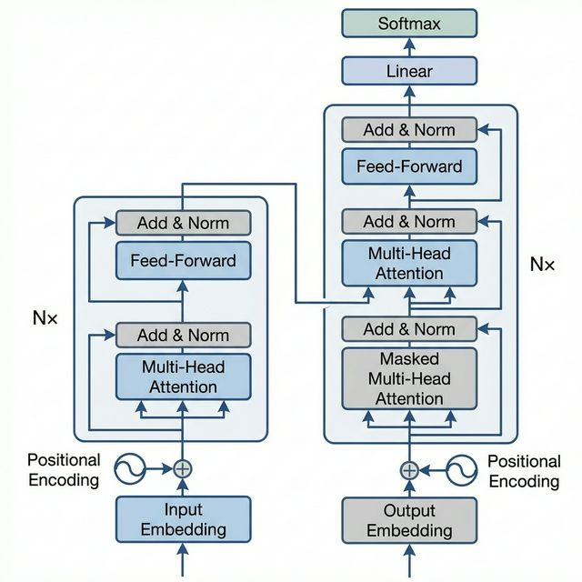

## Research Questions

Can a model architecture based entirely on attention mechanisms, dispensing with recurrence and convolutions, achieve competitive or superior performance on sequence transduction tasks?

## Methodology

Proposed the Transformer architecture using multi-head self-attention and positional encoding. Evaluated on WMT 2014 English-to-German and English-to-French translation benchmarks. Compared training cost and BLEU scores against existing RNN and CNN-based models.

## Discussion

The Transformer achieves 28.4 BLEU on EN-DE and 41.8 BLEU on EN-FR, establishing new state-of-the-art results. Training is significantly more parallelizable and requires less time than recurrent architectures. Multi-head attention allows the model to attend to information from different representation subspaces.

## Notes

Foundational paper for modern LLMs (GPT, BERT, etc.). The scaled dot-product attention and positional encoding are the key innovations. The paper also introduced the encoder-decoder structure used widely today.
