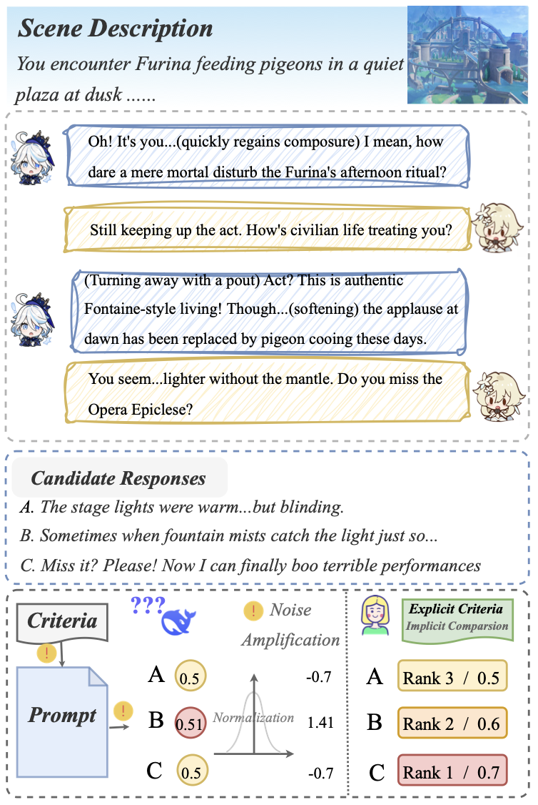
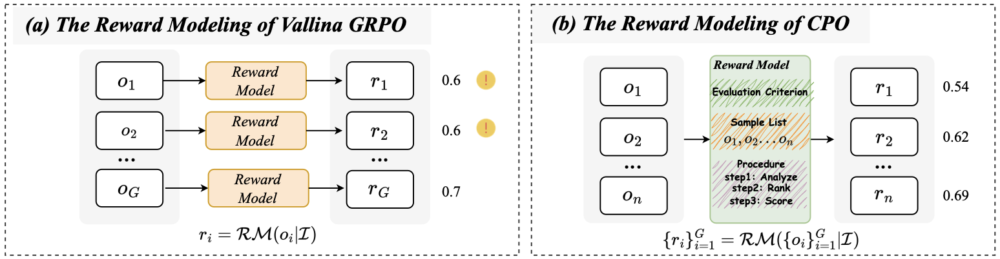
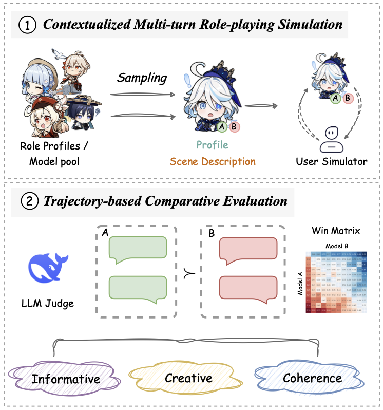
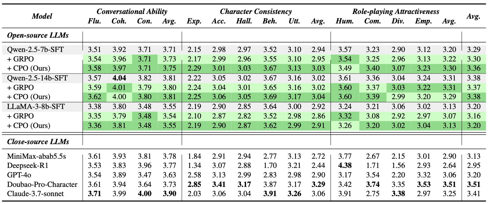
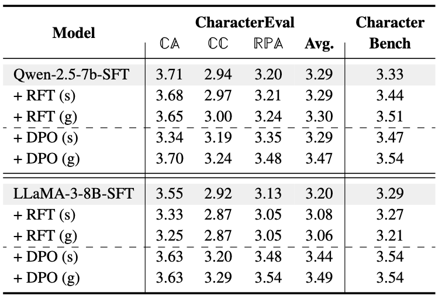

# CPO: Addressing Reward Ambiguity in Role-playing Dialogue via Comparative Policy Optimization

## 0. Overview

Standard RLFT reward models fail on subjective tasks like role-playing because sample-wise scoring is noisy and unstable. CPO replaces individual scoring with group-wise comparative evaluation, reducing reward ambiguity and yielding consistent gains over GRPO across multiple model architectures and benchmarks.

## 1. Background & Motivation

- **Field / Problem:** Reinforcement Learning Fine-Tuning (RLFT) of LLMs for open-ended, subjective dialogue — specifically role-playing agents that must maintain consistent character personas, narrative coherence, and emotional engagement across multi-turn conversations.
- **Why it matters:** RLFT has proven powerful for tasks with verifiable answers (math, code) but breaks down when reward signals are inherently ambiguous. Role-playing is a commercially significant domain (entertainment, education, companionship applications) where existing RLHF pipelines produce unstable learning signals, limiting the quality of deployed systems.

## 2. Related Work & Gaps

- **Prior approaches:**
  - SFT over curated role-playing corpora (RoleLLM, CharacterGLM, CoSER) — the dominant paradigm; limited by training distribution.
  - Standard RLHF/RLFT pipelines (PPO, GRPO, DPO) applied with LLM-based reward models that score each response independently.
  - QA-style role-playing benchmarks (CharacterEval, CharacterBench) that assess utterance-level quality using static conversation histories.
- **Key limitations / gaps:** Sample-wise LLM scoring for subjective outputs (1) produces inconsistent scores across prompting variations, (2) collapses many responses into narrow score bands, and (3) amplifies small scoring noise during GRPO advantage normalization. Existing benchmarks also rely on externally provided conversation histories, which may not reflect the model's own generation style — a bias that confounds multi-turn evaluation.

## 3. Core Idea & Contributions

- **Main idea (intuition):** Just as human evaluators naturally judge quality by comparing options rather than assigning absolute scores in a vacuum, reward models for subjective tasks should evaluate response groups jointly rather than each response independently.
- **Claimed contributions:**
  1. **CPO** — a new RLFT method that substitutes group-wise comparative scoring for sample-wise scoring within the GRPO advantage estimation framework.
  2. **CharacterArena** — a new evaluation framework that generates matched dialogue trajectories from competing models under identical conditions and ranks them via trajectory-level pairwise comparison, minimizing context bias.
  3. Empirical validation showing CPO outperforms GRPO on CharacterEval and CharacterBench and that group-wise scoring improves human agreement by up to ~20%.
- **Evaluation preview:** Evaluated on two established utterance-level benchmarks (CharacterEval, CharacterBench) and one new session-level benchmark (CharacterArena) across Qwen-2.5-7B, Qwen-2.5-14B, and LLaMA-3-8B backbones, plus pairwise human evaluation.

## 4. Method

### Problem: Why Sample-wise Scoring Fails for Role-playing

Three failure modes motivate the redesign. First, *ambiguity*: role-playing responses differ subtly in tone and persona alignment; without a reference point, LLM judges struggle to assign discriminative scores. Second, *instability*: independent scoring is sensitive to prompt phrasing and LLM stochasticity — the same response may score 0.7 one run and 0.9 the next. Third, *error amplification*: GRPO normalizes rewards within a group (mean/std) to compute advantages; small absolute score noise gets magnified after normalization when responses cluster in a narrow range.

(Figure: Example of failure in reward modeling process. Three candidate responses receive nearly identical sample-wise scores (0.5, 0.51, 0.5), causing noise amplification after normalization, while group-wise ranking makes the relative quality ordering explicit.)

### CPO: Group-wise Comparative Reward Modeling

Rather than scoring each response $o_i$ independently, CPO feeds the entire sampled group $\{o_1, \ldots, o_G\}$ to the reward model simultaneously:

$$\{r_i\}_{i=1}^G = \text{RM}(\{o_i\}_{i=1}^G \mid I)$$

The reward model is prompted to (1) analyze the full set against the evaluation criteria, (2) rank responses relative to one another, and (3) assign calibrated scores that reflect group-relative quality. This shifts the scoring task from "how good is this response on an absolute scale?" to "how does this response compare to its peers?" — a cognitively easier and more stable task for an LLM judge.

**Length penalty.** To prevent reward hacking via verbosity (a known bias of LLM judges that favor longer outputs), CPO adds a soft overlength penalty. Responses within a buffer zone below the maximum length are unpenalized; responses exceeding the maximum receive a hard penalty of −1. The final reward clips the sum of comparative reward and length penalty to [0, 1].

**Integration with GRPO.** CPO reuses the PPO-style policy loss from GRPO exactly; the only change is that the reward values plugged into advantage estimation come from group-wise rather than sample-wise scoring. This makes CPO a drop-in replacement with minimal implementation overhead.

(Figure: side-by-side comparison of vanilla GRPO vs. CPO reward modeling pipelines, showing how independent reward model calls become a single joint call in CPO.)

### CharacterArena Evaluation Framework

CharacterArena addresses a complementary problem: existing benchmarks evaluate models on externally-provided conversation histories, introducing context bias from non-self-generated turns. CharacterArena runs in two phases:

1. **Contextualized Multi-turn Simulation.** For each model pair $(m_A, m_B)$, both models engage in $N$-turn conversations with a shared user simulator under the same character profile and scenario. This generates two complete, self-consistent dialogue trajectories under identical conditions. The benchmark covers 294 character profiles spanning virtual, historical, and custom-designed roles.

2. **Trajectory-level Comparative Evaluation.** An LLM judge (DeepSeek-R1, selected based on highest human agreement at 73.9% accuracy) receives both full trajectories and rates them on creativity, coherence, and character consistency. Pairwise win rates are aggregated into a win-rate matrix for ranking.

(Figure: Overview of of the two-phase CharacterArena (their proposed benchmark).)

## 5. Experimental Setup

- **Datasets / Benchmarks:**
  - *SFT*: RoleplayPref (1,108 roles, 13,230 filtered dialogues) for role-playing; 50,000 story continuation samples + GPT-WritingPrompts for story creation.
  - *RLFT*: Dialogues generated by interacting policy with a simulated user (Doubao-Pro-Character) across the 294 CharacterArena character profiles.
  - *Evaluation*: CharacterEval (1,785 multi-turn dialogues, 77 Chinese characters), CharacterBench zh (22,859 annotated samples, 3,956 characters), CharacterArena (50 pairwise sessions × 15 turns per model pair).
- **Baselines:** Vanilla GRPO, RFT (rejection sampling), DPO — all with same-architecture SFT starting point. Closed-source comparison: GPT-4o, Claude-3.7-Sonnet, Doubao-Pro-Character, MiniMax.
- **Metrics:** CharacterEval scores across 12 dimensions (Fluency, Coherence, Consistency, Character Knowledge, Persona Behavior, Human-likeness, etc.); CharacterBench scores across 13 dimensions (Memory, Persona, Emotion, Morality, Believability, etc.); CharacterArena win rates; Pearson correlation with human judgments; pairwise human evaluation win rates (Fleiss' κ = 0.473).

## 6. Results & Analysis

- **Main results:** CPO consistently outperforms GRPO across all three backbones on both utterance-level benchmarks, with average gains of +0.06 on Qwen-2.5-7B and +0.04 on LLaMA-3-8B on CharacterEval. In CharacterArena win-rate matrices, CPO beats GRPO with win rates of 0.58 (Qwen-7B), 0.68 (Qwen-14B), and 0.68 (LLaMA-8B). Human evaluation confirms CPO outperforms both SFT and GRPO, though by more conservative margins, consistent with the inherent subjectivity of the task.

(Table: CharacterEval benchmark results across all open-source and closed-source models, showing CPO's advantage over GRPO on all sub-dimensions.)

(Table: Generalizability analysis showing group-wise rewarding applied to DPO and RFT also outperforms sample-wise counterparts, with DPO(g) showing the largest gain (+0.18 on CharacterEval for Qwen-7B).)

- **Do results support claims?** Yes, across multiple architectures, multiple benchmarks, and human evaluation. The core claim — that group-wise scoring reduces reward ambiguity — is further supported by the Pearson correlation analysis (Figure 7), where group-wise scoring achieves 15–25% higher correlation with human judgments than sample-wise scoring across three LLM judges.
- **Ablations / key insights:** The generalizability experiment (Section 6.2.2 / Table 3) is particularly important: when group-wise scoring is applied to DPO and RFT — not just GRPO — consistent improvements emerge, confirming that the benefit is in the reward paradigm, not in CPO's specific policy update. The length control ablation (Figure 10) shows that without the soft overlength penalty, response length quickly saturates the maximum budget during training, producing verbosity-biased reward hacking.
- **Surprising findings:** DPO outperforms online RL methods (CPO, GRPO) on CharacterEval and CharacterBench in absolute terms. The authors attribute this to length bias in LLM-as-a-Judge evaluation: DPO-trained models generate longer responses, and current judges reward verbosity. This self-critique exposes a systemic evaluation blind spot.

## 7. Discussion & Implications

- **When / why does this work?** Group-wise scoring works because the LLM judge's task changes from absolute estimation (hard for subjective criteria) to relative ranking (cognitively easier and more consistent). The benefit is largest when individual response quality is similar and small absolute score noise would otherwise dominate advantage computation.
- **Potential applications:** Any RLFT pipeline for subjective open-ended tasks — creative writing, storytelling, dialogue quality, stylistic generation — where reward criteria cannot be reduced to verifiable rules. The CharacterArena evaluation framework is reusable as a general multi-turn agent evaluation harness.
- **Broader significance:** The paper provides a principled bridge between the success of RLFT on objective tasks and the harder regime of subjective generation, suggesting that the bottleneck is reward modeling design, not the RL algorithm itself.

## 8. Limitations & Open Questions

- **Authors' stated limitations:**
  - CPO currently optimizes single-turn responses; extending to full multi-turn dialogue policy learning is left as future work.
  - Evaluation is primarily on Chinese-language benchmarks (CharacterEval, CharacterBench zh); cross-lingual generalization is not validated.
  - Testing on a broader range of open-ended tasks (creative writing, story continuation at full scale) is noted as ongoing.
- **Critique:**
  - The paper shows DPO outperforms CPO on absolute scores while attributing this to length bias in evaluation — but it does not propose or validate a fix. If the evaluation framework is biased, some of CPO's gains might also be partially confounded by the length penalty (which suppresses a source of bias GRPO has but the evaluation may still reward).
  - Human evaluation Fleiss' κ = 0.473 signals only moderate agreement — this is acknowledged, but it raises questions about how meaningful the win-rate differences really are at the margins.
  - The group-wise reward model prompt (Appendix D.1) is elaborate and in Chinese; whether the method transfers equally to English role-playing or other languages is unclear.
- **Future directions:** End-to-end multi-turn policy optimization; language-agnostic evaluation; combining group-wise rewards with process-level reward models for longer horizon tasks; addressing the verbosity bias in LLM-as-a-Judge evaluation more rigorously.

## 9. Key Takeaways

1. **Comparative > Absolute for Subjective Rewards.** Asking an LLM judge to rank a group of responses jointly is substantially more reliable than asking it to score each response independently — group-wise scoring achieves 15–25% higher Pearson correlation with human judgments, which translates into better RLFT outcomes.
2. **The Benefit Is in the Reward Paradigm, Not the RL Algorithm.** Applying group-wise scoring to DPO and RFT — not just GRPO — also yields consistent improvements, showing that the design principle generalizes across RLFT frameworks.
3. **Length Bias Remains an Open Problem.** DPO's surprising top performance on absolute benchmarks, driven by verbosity rather than quality, is a candid self-critique that should make practitioners cautious about LLM-as-a-Judge evaluation for any generation task where response length correlates with perceived quality.