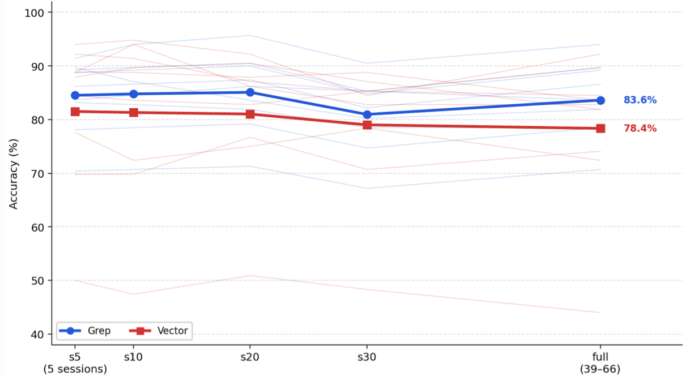
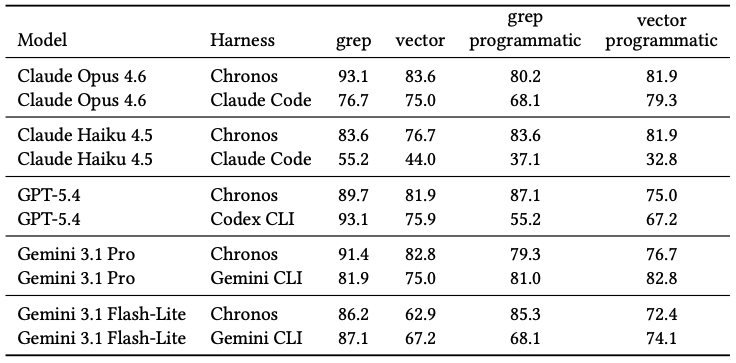

## 0. Overview

In end-to-end agentic retrieval, simple lexical search (grep) surprisingly beats semantic vector search — but the bigger story is that the choice of agent harness and how results are delivered to the model matter just as much as which retriever is used. This empirical study disentangles retrieval strategy, harness architecture, and tool-calling presentation across four agent stacks and five LLMs.

## 1. Background & Motivation

- **Field / Problem:** Retrieval-Augmented Generation (RAG) for LLM agents — specifically how agents equipped with search tools retrieve information over large, multi-session corpora to answer questions. While retrieval strategy (lexical vs. dense) has been studied extensively in standalone pipelines, almost no work examines how this choice interacts with the *agent harness* (the orchestration layer managing tool-calling loops) and *how results are delivered* to the model.
- **Why it matters:** Agentic workflows are increasingly deployed in production for complex tasks (long-memory assistants, knowledge workers, autonomous coders). If practitioners default to vector search without understanding the interaction with their chosen agent stack, they may be making a suboptimal choice that costs accuracy. The gap between "retrieval quality in a static pipeline" and "retrieval quality inside an agent loop" turns out to be large.

## 2. Related Work & Gaps

- **Prior approaches:**
  - Classical IR benchmarks (BEIR) comparing BM25 and dense retrieval on fixed pipelines.
  - RAG surveys (Gao et al., 2024) documenting best practices for retrieval, chunking, and reranking.
  - Provider-native CLI agents (Claude Code, Codex/SWE-agent, Gemini CLI) evaluated primarily on code tasks.
  - LongMemEval (Wu et al., 2025) as a benchmark for long-horizon conversational memory.
- **Key limitations / gaps:** Prior retrieval evaluations assume a fixed pipeline where top-$k$ documents are concatenated into a prompt. They ignore (1) the iterative, agent-directed loop where the model decides what and how many times to search; (2) the *harness architecture* (custom vs. provider-native CLI); and (3) the *tool-calling presentation mode* (are results injected inline into context, or written to disk for the agent to read explicitly?). Robustness to corpus noise as irrelevant sessions accumulate is also understudied.

## 3. Core Idea & Contributions

- **Main idea (intuition):** Retrieval strategy, harness orchestration, and result delivery path are a *single jointly evaluated system*, not independent design choices — and ignoring the latter two while optimizing the former leads to misleading conclusions.
- **Claimed contributions:**
  1. Evidence on how the choice between lexical (grep) and dense (vector) retrieval interacts with the agent orchestration layer and with whether tool outputs are delivered inline or through files.
  2. Characterization of how end-to-end accuracy changes as irrelevant surrounding content grows — showing the grep–vector ordering is not preserved under corpus scaling and depends on harness and backbone.
  3. A direct comparison demonstrating that retrieval effectiveness is not stable across architecturally distinct harnesses (custom Chronos vs. provider-native CLIs), even with an identical on-disk corpus.
- **Evaluation preview:** Evaluated on 116 questions from the LongMemEval benchmark across four harnesses (Chronos, Claude Code, Codex, Gemini CLI), five LLMs, two retrieval modes, two delivery modes, and five corpus-noise levels; graded by GPT-4o.

## 4. Method

The study is organized into two experiments, using the **Chronos** framework as a shared preprocessing and custom-harness layer.

### Corpus & Preprocessing
The LongMemEval benchmark provides multi-session chat dialogues. Chronos preprocessing extracts structured temporal events (dates, intervals, spans) from transcripts and serializes them alongside raw turns into per-question JSON files. This gives both the grep and vector tools a richer, temporally normalized corpus to search over, and ensures that performance on temporal questions reflects retrieval quality rather than the model's ability to reconstruct dates from fragmented text.

### Retrieval Implementations
- **Grep (lexical):** Regex matching over raw text fields in local JSON files. No embedding model, no vector index — results scored by match count.
- **Vector (semantic):** Per-question vector indices built at ingestion time; ANN search at query time with a reranking step before returning top-$k$ results.

### Agent Harnesses
- **Chronos (custom):** LangChain-based agent with four search tools (grep and vector over turns and events). Uses *dynamic prompting* — system instructions are conditioned on detected question category (e.g., temporal reasoning vs. preference recall). Starts each episode with a broad context block (top-15 vector results) before the tool-calling loop.
- **Provider-native CLIs:** Claude Code (Anthropic), Codex CLI (OpenAI), and Gemini CLI (Google) — shell-based interfaces where the model executes bash commands (grep, cat, etc.) natively. Context construction and iteration are largely opaque to the researcher.

### Tool-Calling Delivery Modes
- **Inline (standard):** Search results are returned directly as tool response messages injected into the context window. Simple, but large result sets compete for context space.
- **Programmatic (file-based):** Results are written to disk; the agent must explicitly read or grep the result file. Decouples result size from context pressure, but adds a multi-step "locate → read → integrate" workflow that can fail independently of retrieval quality.

### Experiment 1 — Retrieval × Harness × Delivery Mode
All harness–model pairs run with (grep-only, inline), (vector-only, inline), (grep-only, programmatic), and (vector-only, programmatic) on the full 116-question haystack.

### Experiment 2 — Corpus Noise Scaling
Session limits are swept across five levels (s5, s10, s20, s30, full = 39–66 sessions per question). Oracle sessions are always retained; remaining slots are filled with distractor sessions drawn from the same per-question bundle. This tests how retrieval accuracy degrades — and whether grep and vector degrade in parallel — as the needle-to-haystack ratio drops.

(Figure: Mean accuracy across models and harnesses as distractor sessions are added (s5 → full), comparing grep-only and vector-only. Both methods show minimal monotone degradation overall, but grep maintains a higher average across configurations.)

## 5. Experimental Setup

- **Datasets / Benchmarks:** 116-question subset of LongMemEval-S, spanning six categories: knowledge-update (KU), multi-session (MS), single-session-assistant (SS-A), single-session-preference (SS-P), single-session-user (SS-U), and temporal-reasoning (TR).
- **Baselines:** All combinations of {grep, vector} × {inline, programmatic} × {Chronos, Claude Code, Codex, Gemini CLI} are treated as conditions rather than baselines; no single condition is designated ground truth.
- **Models:** Claude Opus 4.6, Claude Haiku 4.5, GPT-5.4, Gemini 3.1 Pro, Gemini 3.1 Flash-Lite.
- **Metrics:** End-to-end accuracy (fraction of 116 questions answered correctly), assessed by a GPT-4o grader using category-conditioned rubrics (e.g., off-by-one tolerance for temporal items, abstention handling). Grader prompt templates and decoding settings are held fixed across all conditions.

## 6. Results & Analysis

- **Main results:** With **inline delivery**, grep beats vector for *every* harness–model pair tested. The largest gap is Chronos + Gemini 3.1 Flash-Lite (86.2% grep vs. 62.9% vector); the narrowest is Claude Code + Claude Opus 4.6 (76.7% vs. 75.0%). Chronos + Claude Opus 4.6 reaches 93.1% with inline grep — but the same model on Claude Code reaches only 76.7%, a ~17-point swing from harness alone (comparable to the gap from swapping retrievers within a fixed harness). With **programmatic delivery**, the ordering reverses on several pairs: programmatic vector exceeds programmatic grep on 5 of 10 harness–model conditions.

(Table: Experiment 1 overall accuracy (%) on 116-question LongMemEval-S subset, crossing retrieval mode (grep/vector) with delivery mode (inline/programmatic) for all harness–model pairs. Inline grep is uniformly best; programmatic results are mixed.)

- **Do results support claims?** Yes. The paper's core claims — that harness and delivery path matter as much as retrieval strategy, and that retrieval effectiveness is not stable across harnesses — are clearly supported by the factorial data in Table 1.
- **Ablations / key insights:**
  - The **Codex + GPT-5.4 programmatic grep collapse** is striking: 93.1% inline grep drops to 55.2% programmatic grep, with programmatic vector at 67.2%. This shows that "cheap retrieval" (regex over local JSON) is not "easy" end-to-end when the harness turns each hit into a brittle multi-step read–integrate–retry cycle.
  - **Weaker models suffer more from dense retrieval**: Claude Haiku 4.5 on Claude Code shows especially large inline grep–vector gaps (55.2% vs. 44.0%), consistent with the hypothesis that weaker models are less able to iteratively refine queries and integrate ranked results.
  - **Noise scaling (Experiment 2)** shows the grep–vector ordering is *not* monotone — vector is sometimes stronger at low session counts (e.g., Chronos + Claude Opus 4.6 is vector-ahead from s5–s20), but grep can overtake at higher distraction. The crossover point depends on harness and backbone, not corpus size alone.
  - **Stable inductive biases by provider**: Claude Code consistently favors grep for Opus/Haiku at every session limit; Gemini CLI Pro consistently favors vector. This suggests provider tooling embeds implicit retrieval preferences through default hints, stdout chunking, and prompt formatting.
- **Surprising findings:** The intuition that "lexical search is fine on small corpora but semantic search becomes necessary at scale" is only partially supported — the crossover is harness-dependent, not corpus-size-dependent. Also counterintuitive: file-based delivery, motivated as relief from context pressure, can *invert* the retrieval ordering even when context pressure is identical between conditions.

## 7. Discussion & Implications

- **When / why does this work?** Grep's advantage on LongMemEval is interpretable: the benchmark's answers are often licensed by literal spans (exact dates, counts, preferences). Lexical matching recovers these without an embedding bottleneck. Dense retrieval, by contrast, can surface semantically "near" distractors that share topical overlap but not the exact answer string — a precision vs. recall tradeoff that favors lexical search on this task distribution.
- **Potential applications:** The findings directly inform practitioners choosing retrieval strategies for long-memory assistants, customer-service agents, personal data managers, and any agentic system that must answer questions over multi-session conversational corpora. The harness-level variation also motivates reporting standards: agent papers should disclose both retrieval mechanics and delivery path, not just retriever type.
- **Broader significance:** The paper reframes "retrieval strategy" as a system-level property rather than a component-level one. The practical implication is that migrating between agent stacks (e.g., from a custom harness to a provider CLI) is *not* retrieval-interchangeable, even when the on-disk corpus is byte-identical. This has significant implications for benchmarking, reproducibility, and deployment planning.

## 8. Limitations & Open Questions

- **Authors' stated limitations:** Results are tied to long-memory conversational QA where answers are often verbatim spans. In domains where evidence is rarely literal — scientific synthesis, visual documents, code semantics — dense retrieval and hybrid approaches may perform differently. The authors explicitly do not claim that grep "beats" vector in general.
- **Critique (missing, unclear, or questionable aspects):**
  - The Codex vector rows in Experiment 2 are incomplete (only the full-haystack condition is reported), preventing a vendor-complete picture of scaling behavior.
  - No trace-level analysis is provided — we cannot inspect which queries each harness issues, how many tool calls it makes, or why specific conditions collapse. The "inductive bias" explanations for provider CLI preferences remain hypotheses.
  - The study uses a single benchmark (LongMemEval-S) and a single grader model (GPT-4o). Grader agreement and calibration across category types is assumed but not validated.
  - Hybrid retrieval (combining grep and vector) is conceptually discussed but not experimentally evaluated, leaving the most practically interesting configuration untested.
- **Future directions:** Evaluation of hybrid retrieval policies within agent loops; extension to non-chat corpora (scientific papers, codebases, legal documents); trace-level analysis of query formulation and iteration patterns across harnesses; broader vendor coverage to close incomplete rows in the scaling experiment.

## 9. Key Takeaways

1. **Grep beats vector inline — but harness matters as much as retriever.** On LongMemEval with inline delivery, lexical grep outperforms semantic vector for every harness–model pair tested. Yet swapping harnesses with the same backbone and retriever produces accuracy swings comparable in magnitude to swapping retrievers within a fixed harness, meaning harness orchestration is a first-class experimental variable, not passive infrastructure.
2. **Delivery path can invert the retrieval ordering.** File-based (programmatic) delivery — motivated as relief from context pressure — reshuffles and sometimes reverses the grep–vector comparison, with no change to the underlying index. This makes the delivery path a hidden but consequential design choice that agent papers should always report alongside retriever type.
3. **Provider CLI stacks embed stable, opaque retrieval biases.** Claude Code consistently favors grep; Gemini CLI Pro consistently favors vector — across all session limits tested. These vendor-stable patterns imply that migrating between agent stacks is not retrieval-interchangeable even when the corpus is identical, which matters for reproducibility, benchmarking, and deployment planning.