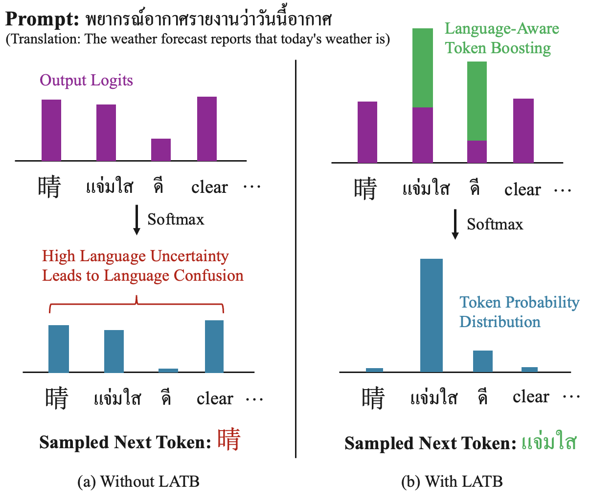
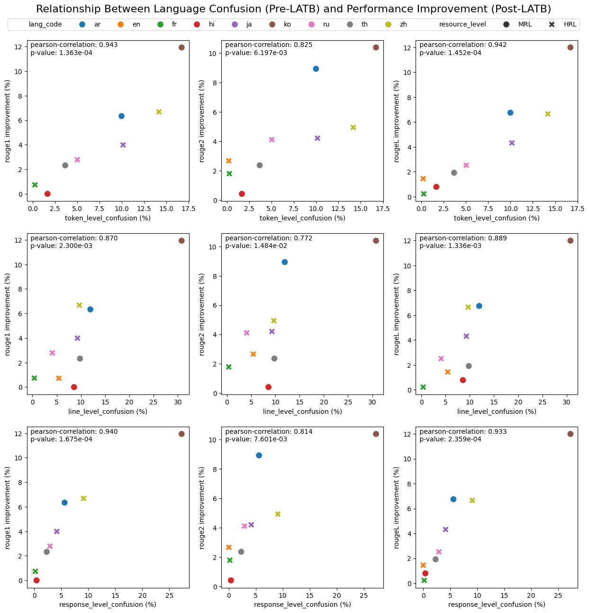
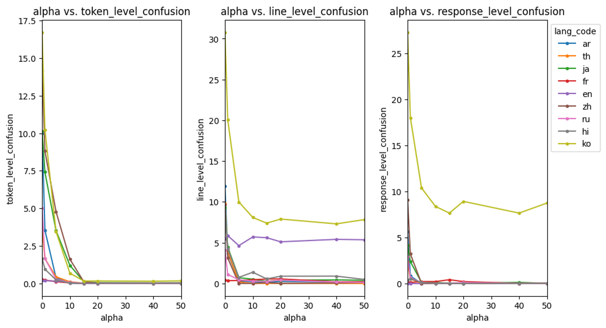
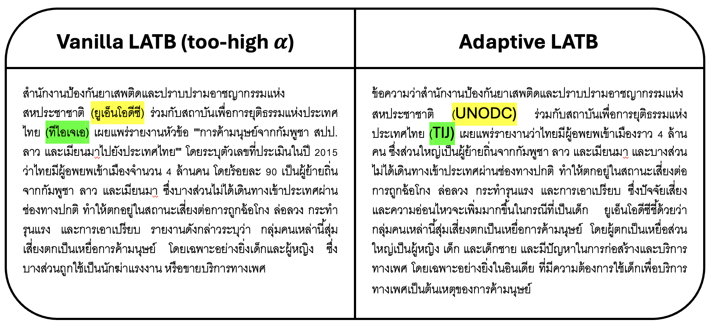

## 0. Overview

English-centric LLMs often drift into the wrong language when generating non-English text — a failure known as language confusion. Instead of fine-tuning, this paper adds a constant boost to the logits of tokens belonging to the target language at decode time. The vanilla method (LATB) applies the boost always; the adaptive variant (Adaptive-LATB) applies it only when the model is uncertain which language to emit. On XLSUM across eight languages, both variants reduce language confusion below that of a multilingual fine-tuned baseline while preserving — and sometimes improving — summarization quality, at essentially zero extra inference cost.

## 1. Background & Motivation

- **Field / Problem:** Multilingual alignment of English-centric LLMs — specifically language confusion, where a model fails to consistently generate in the requested target language, especially for non-English prompts.
- **Why it matters:** LLM development is English-centric, and non-English users routinely receive responses that mix in English or other languages. Known mitigations — lowering temperature, few-shot prompting, or fine-tuning — either reduce output diversity, add prompt overhead, or require costly training. A method that fixes language confusion purely at inference time makes multilingual deployment cheaper and more practical.

## 2. Related Work & Gaps

- **Prior approaches:**
  - **Parameter-tuning alignment (PTA):** multilingual pretraining (mT5, BLOOM), multilingual SFT (Suzume, Typhoon), and RLHF-based alignment — effective but expensive and model-specific.
  - **Parameter-frozen alignment (PFA):** prompting techniques (strict language instructions, chain-of-dictionary) and retrieval-augmented alignment — no training, but brittle and prompt-dependent.
  - Marchisio et al. (2024) systematically studied language confusion and proposed temperature lowering, few-shot prompting, and fine-tuning as mitigations.
- **Key limitations / gaps:** No prior work manipulates the logits directly for multilingual alignment. Existing PFA methods leave the underlying token distribution untouched, so a confused model remains confused; PTA methods require retraining for every model. The paper introduces the first logits-perturbation-based taxonomy for multilingual alignment.

## 3. Core Idea & Contributions

- **Main idea (intuition):** Language confusion happens when the model assigns comparable probability to tokens from multiple languages at a decoding step, so sampling occasionally jumps languages. If you know the desired output language, you can identify its tokens by Unicode range and add a constant α to their logits, tilting every sampling decision toward the target language — no gradient updates, no prompt changes.
- **Claimed contributions:**
  1. A tuning-free multilingual alignment paradigm based on logits perturbation, with two methods: **LATB** (always boost) and **Adaptive-LATB** (boost only under language uncertainty).
  2. Evaluation on the XLSUM benchmark across eight languages showing reduced language confusion with maintained summarization quality.
  3. A short analysis proving that adding a constant to a subset of logits leaves the relative probability ratios among boosted tokens unchanged — the intra-language token ranking is preserved.
- **Evaluation preview:** Compared against the base Llama3 8B Instruct (normal and strict prompts) and a multilingual fine-tuned baseline (Suzume 8B) on XLSUM in four high-resource (ru, zh, ja, fr) and four medium-resource (ko, th, hi, ar) languages.

(Figure: Without LATB, target-language and English tokens receive comparable probability mass, so sampling occasionally emits the wrong language; boosting target-language logits concentrates the distribution on the desired language.)

## 4. Method

### Token Language Identification

Tokens to boost are selected by Unicode filtering (following Wen-Yi & Mimno, 2023): a token is valid for the target language if all of its characters fall within that language's Unicode set. Numbers, special characters, and the end-of-sentence token are always included in the desired set $I$.

### Perturbation Vector

A perturbation vector $p$ assigns a constant boost $\alpha \geq 0$ to every desired token index and zero elsewhere:

$$p_i = \begin{cases} \alpha & \text{if } i \in I, \\ 0 & \text{otherwise.} \end{cases}$$

### LATB (Vanilla)

At every decoding step, simply add the perturbation to the logits before softmax:

$$\text{logits}' = \text{LLM}(x) + p, \qquad y' = \text{Softmax}(\text{logits}')$$

### Adaptive-LATB

Always boosting can suppress legitimate non-target tokens (e.g., English technical terms inside a Thai summary). Adaptive-LATB perturbs only when the model is uncertain about the language: let $a$ be the max probability among target-language tokens and $b$ the max among all other tokens. If $|a - b| < \beta$ (the confidence difference threshold, $0 \leq \beta \leq 1$), apply the boost; otherwise leave the distribution untouched. This lets the model switch languages when it is confident it should.

### Why Quality Is Preserved

For any two boosted tokens $m, n \in I$, the ratio of their post-perturbation probabilities equals the original ratio:

$$\frac{y'_m}{y'_n} = \frac{e^{v_m + \alpha}}{e^{v_n + \alpha}} = \frac{e^{v_m}}{e^{v_n}} = \frac{y_m}{y_n}$$

The perturbation reallocates probability mass *between* languages but never reorders tokens *within* the target language, so generation quality in the target language is untouched by construction.

## 5. Experimental Setup

- **Datasets / Benchmarks:** XLSUM multilingual abstractive summarization, up to 1,000 sampled test instances per language across eight languages — HRL: Russian, Simplified Chinese, Japanese, French; MRL: Korean, Thai, Hindi, Arabic. Sampling at temperature 1.0, top-p 1.0.
- **Baselines:** Llama3 8B Instruct with (i) a normal prompt (no language constraint), (ii) a strict prompt explicitly demanding the target language, and (iii) Suzume 8B Multilingual — a multilingual SFT variant of the same base model. LATB uses $\alpha = 5$; Adaptive-LATB uses $\alpha = 1000$, $\beta = 0.8$.
- **Metrics:** Language confusion at three granularities — token-level (Unicode-based misalignment rate), line-level and response-level (FastText language identification) — plus ROUGE-1/2/L for summarization quality.

## 6. Results & Analysis

- **Main results:** The unconstrained base model is catastrophically confused (80–86% token-level confusion for most non-Latin languages). Strict prompting helps but leaves substantial confusion (e.g., 16.7/30.8/27.3% for Korean). Both LATB variants cut confusion below Suzume, the multilingual fine-tuned baseline — e.g., Russian drops to 0.28/0.44/0.10% with LATB vs. 3.04/2.30/2.10% for Suzume — while ROUGE matches or slightly beats both the strict-prompt baseline and Suzume in nearly all languages.
- **Do results support claims?** Yes for the core claim: tuning-free logits perturbation beats a fine-tuned multilingual model on language confusion without degrading ROUGE. Appendix F strengthens this with a strong correlation (Pearson 0.77–0.94) between a language's pre-LATB confusion level and its post-LATB ROUGE improvement — evidence that language confusion itself is a driver of measured performance degradation, and fixing it recovers quality.

(Figure: Performance improvement from LATB correlates strongly with the degree of pre-existing language confusion (Pearson 0.77–0.94 across ROUGE metrics and confusion granularities), suggesting confusion directly causes quality degradation.)

- **Ablations / key insights:**
  - **Hyperparameter sweeps (Appendix C):** increasing $\alpha$ monotonically reduces confusion, with ROUGE peaking at intermediate $\alpha$ — too large a boost suppresses legitimate non-target tokens (e.g., English technical terms) and degrades quality. The $\beta$ threshold in Adaptive-LATB shows the same trade-off with a milder penalty for overshooting.
  - **Vanilla vs. Adaptive:** comparable headline numbers, but vanilla LATB needs careful $\alpha$ search; with excessive $\alpha$ it produces "Thai-dubbed English" — phonetic transliterations of English terms — where Adaptive-LATB correctly keeps the English form.
  - **Throughput:** vanilla LATB is free (1189.5 vs. 1145.8 tokens/s for the base model on an A100 with vLLM); Adaptive-LATB drops to 838 tokens/s due to per-step confidence computation but stays deployable.
  - **Already-aligned models (Appendix E):** on Qwen3-4B-Instruct, which shows zero response-level confusion out of the box, LATB neither helps nor hurts — consistent with the ratio-preservation property.

(Figure: Impact of the perturbation value on language confusion in LATB — confusion drops steeply as the boost increases and saturates around the intermediate values, with Korean remaining the hardest language.)

(Figure: With an excessively high boost, vanilla LATB transliterates English entity abbreviations into Thai phonetics, whereas Adaptive-LATB keeps the natural English forms like "UNODC" and "TIJ".)

## 7. Discussion & Implications

- **When / why does this work?** Language confusion is a decoding-time symptom: the model already knows the right content but distributes probability across languages. Because the boost preserves intra-language token ratios, it acts as a pure language selector, correcting the symptom exactly where it occurs. The benefit is largest precisely where confusion is worst (the Appendix F correlation), and it is a no-op for models that are already aligned.
- **Potential applications:** Any deployment serving non-English users with an English-centric model — the method is a drop-in logit-bias processor compatible with standard inference stacks (implemented on vLLM). Particularly attractive for low- and medium-resource languages where multilingual fine-tuning data is scarce.
- **Broader significance:** Demonstrates that some "capability gaps" attributed to insufficient multilingual training are actually decoding-time alignment failures that can be corrected for free — a caution against reaching for fine-tuning before checking whether inference-time intervention suffices.

## 8. Limitations & Open Questions

- **Authors' stated limitations:**
  - Cannot align to languages whose tokens are untrained or out-of-vocabulary — boosting cannot create capability that isn't in the model.
  - Unicode-based token identification breaks down for languages that substantially share Latin script (e.g., French vs. English — note French shows the weakest gains in Table 1).
  - Hyperparameters ($\alpha$, $\beta$) still need tuning to balance confusion reduction against legitimate cross-language expression.
- **Critique:**
  - Evaluation covers a single task (summarization) and primarily one model family; broader task coverage (QA, reasoning, dialogue) would strengthen the generality claim, especially since language mixing in reasoning traces is cited as motivation but never tested.
  - ROUGE is a coarse quality measure for abstractive multilingual summarization; a human or LLM-judge fluency evaluation would better detect subtle degradation from suppressed code-switching.
  - The Adaptive-LATB confidence test uses only the two maximum probabilities; a distribution-level uncertainty measure (e.g., per-language probability mass) might be more robust.
- **Future directions:** Better handling of OOV tokens; token language identification beyond Unicode filtering for script-sharing languages; language-agnostic (auto-tuned) hyperparameter selection.

## 9. Key Takeaways

1. **Language confusion is fixable at decode time.** A constant logit boost on target-language tokens cuts confusion below what multilingual fine-tuning achieves — at zero training cost and negligible inference overhead.
2. **The math guarantees quality preservation within the target language.** Adding a constant to a subset of logits leaves relative probabilities among boosted tokens unchanged, so the intervention only chooses *which language* to speak, never *what* to say in it.
3. **Adapt the boost to model confidence.** Always-on boosting risks suppressing legitimate code-switching (English terms, entity names); gating the perturbation on the model's language uncertainty keeps outputs natural while remaining robust to hyperparameter choice.
