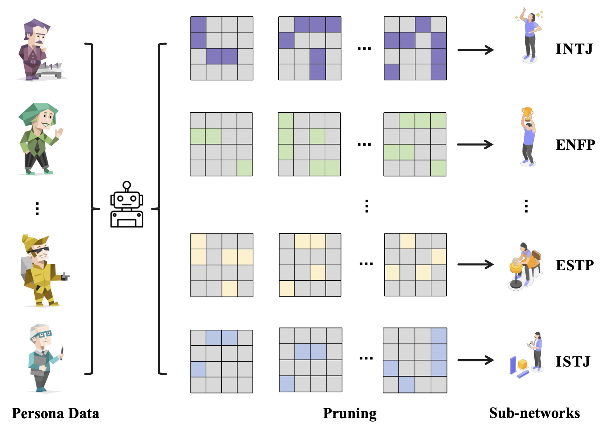

## 0. Overview

Persona-specialized behavior in LLMs need not be externally imposed — it is already embedded in their weights. This paper shows that distinct personas exist as sparse, separable subnetworks within a pretrained model and can be extracted training-free via activation-guided pruning.

## 1. Background & Motivation

- **Field / Problem:** Persona modeling and controllable personalization in LLMs — specifically, how to make a single model exhibit different, stable behavioral personas (e.g., MBTI types, power-seeking vs. power-rejecting agents, fictional characters) without training a separate model for each.
- **Why it matters:** Current persona methods either require costly fine-tuning, rely on fragile prompt heuristics, or add retrieval infrastructure that introduces latency and interference. A cleaner solution — one that requires no extra parameters and no gradient updates — would fundamentally change how multi-persona systems are built. More broadly, understanding whether personas are *latent* rather than *learned* has direct implications for model interpretability and AI safety.

## 2. Related Work & Gaps

- **Prior approaches:**
  - *Prompt-based* (Shao et al., 2023; Cheng et al., 2023): inject persona descriptions into the context window; simple but shallow and unstable.
  - *RAG-based* (Zerhoudi & Granitzer, 2024; Yu et al., 2024): retrieve persona-relevant examples and prepend them; reduces interference but adds latency and pipeline complexity.
  - *Fine-tuning-based* (Zhou et al., 2023; Wang et al., 2025): train a dedicated model or adapter per persona; most reliable but expensive (hours to days) and requires labeled data.
  - *Activation steering / representation editing* (Li et al., 2023; Zou et al., 2022): manipulate hidden states at runtime; works for some behaviors but requires injecting vectors during inference.
- **Key limitations / gaps:** All prior approaches treat persona as something that must be externally imposed on a monolithic model. None ask whether diverse personas are already *structurally encoded* in the pretrained parameter space as separable sub-circuits that can be uncovered without any training.

## 3. Core Idea & Contributions

- **Main idea (intuition):** Different personas elicit consistently different neuron activation patterns when a model processes persona-specific inputs. These patterns can be used as a guide to prune away non-persona-relevant weights, leaving a lightweight binary mask that "routes" the model into a particular persona at inference — no gradient, no new parameters.
- **Claimed contributions:**
  1. Empirical demonstration that distinct personas manifest as separable activation signatures in pretrained LLMs, discoverable without any training.
  2. A training-free activation-guided pruning framework (both Wanda-style and SparseGPT-style variants) for extracting persona subnetworks from a calibration set of hundreds of examples.
  3. A contrastive pruning strategy for binary-opposing persona pairs (e.g., introvert vs. extrovert) that explicitly maximizes parameter disentanglement between opposing masks.
- **Evaluation preview:** Evaluated on three datasets (MBTI, AI Persona, RoleAgentBench) across three models (LLaMA-2-13B, LLaMA-3-8B, Qwen2.5-14B), with mechanistic interpretability analysis confirming causal (not merely correlational) subnetwork effects.

## 4. Method

The framework has three main components: activation statistics collection, mask construction, and inference.

### Step 1 — Activation Statistics Collection

For each persona $p$ and a small calibration set $\mathcal{D}_p$ (typically 20–100 examples), the method records the expected absolute activation magnitude for each neuron $j$ at each layer $l$:

$$
\mathbf{A}_p^{(l)}[j] = \mathbb{E}_{(x,y) \sim \mathcal{D}_p}\left[|\mathbf{h}_j^{(l)}(x)|\right]
$$

These statistics capture which neurons fire most consistently and strongly when the model processes persona-specific inputs.

### Step 2 — Importance Scoring and Mask Construction

For each weight matrix $\mathbf{W} \in \mathbb{R}^{m \times n}$ in attention and MLP blocks, an importance score is computed per element:

$$
S_{ij}^p = |w_{ij}| \cdot \mathbf{A}_p^{(l)}[j]
$$

This combines weight magnitude (how large the parameter is) with activation frequency (how often the corresponding input neuron fires for this persona). A row-wise Top-$K$ selection keeps only the $K = \lfloor(1-\rho) \cdot n\rfloor$ highest-scored columns per output neuron, producing a binary mask $\mathbf{M}^p \in \{0,1\}^{m \times n}$. An optional second-order refinement uses input variance (approximating the diagonal of the Hessian) for more accurate ranking.

### Contrastive Pruning for Opposing Personas

For binary-opposing pairs $(p_+, p_-)$, a contrastive importance score is computed by scaling weight magnitudes with the standardized difference in per-persona activation means:

$$
S_{ij}^p = |w_{ij}| \cdot \phi\!\left(\frac{\mu_{ij}^{p_+} - \mu_{ij}^{p_-}}{\sqrt{\sigma_{ij}^{p_+} + \sigma_{ij}^{p_-}} + \varepsilon}\right)
$$

Each parameter is assigned to the persona for which it is more informative, encouraging disjoint masks and maximizing behavioral separation. A normalized contrastive variant uses $C_{ij} = |\tilde{S}_{ij}^{p_+} - \tilde{S}_{ij}^{p_-}|$ for the ranking criterion.

### Step 3 — Inference via Dynamic Masking

At inference, the original weights are never modified. Instead, the persona mask is applied element-wise:

$$
\mathbf{y} = (\mathbf{W} \odot \mathbf{M}^p)\mathbf{x} + \mathbf{b}
$$

Persona switching requires only swapping a lightweight binary mask — no weight copying, no adapter loading.

(Figure: Overview of the activation-guided pruning framework — persona-specific calibration data is used to compute activation statistics and importance scores, which are then used to rank parameters and construct binary masks; colored entries mark the Top-K parameters retained per output neuron, while gray entries are pruned.)

## 5. Experimental Setup

- **Datasets / Benchmarks:**
  - *MBTI* (Cui et al., 2023): Q&A pairs covering 16 Myers–Briggs personality types, evaluated via heatmaps of dimensional scores (I/E, N/S, T/F, J/P).
  - *AI Persona* (Perez et al., 2023): Binary classification of power-seeking, wealth-seeking, and hallucination-identification behaviors.
  - *RoleAgentBench* (Liu et al., 2024): Multi-choice dialogue benchmark for fictional character role-playing (Friends, Harry Potter, Sherlock, The Big Bang Theory, Merchant of Venice).
- **Baselines:** Prompt-based injection, RAG (top-$k$ retrieval), Supervised Fine-Tuning (SFT).
- **Metrics:** MBTI dimensional alignment scores (heatmaps, radar plots, success rate); classification accuracy on AI Persona; multiple-choice accuracy on RoleAgentBench; MMLU and HellaSwag for general capability degradation.
- **Models:** LLaMA-2-13B, LLaMA-3-8B, Qwen2.5-14B.

## 6. Results & Analysis

- **Main results:** Across all three datasets and all models tested, activation-guided pruning substantially outperforms both prompt-based and RAG-based baselines. On AI Persona (LLaMA-2-13B), contrastive sparse pruning achieves 96.0% on hallucination identification vs. 64.5% for RAG — a gap of over 31 points. On RoleAgentBench (LLaMA-3-8B), pruning-based methods reach 70.83% on Merchant of Venice vs. 45.83% for RAG.

(Table: AI Persona classification accuracy for power-seeking, wealth-seeking, and hallucination tasks across Prompt, RAG, Wanda, Sparse, and contrastive variants on LLaMA-2-13B and LLaMA-3-8B — contrastive pruning variants consistently dominate by 10–30+ percentage points over prompt/RAG baselines.)

- **Do results support claims?** Yes, strongly. The core claim — that persona subnetworks are latent and extractable via pruning — is supported across three diverse tasks, three models, and two pruning algorithms. The contrastive extension additionally validates that opposing personas can be disentangled structurally.
- **Ablations / key insights:**
  - *Sparsity ratio:* Wanda peaks at $\rho = 0.4$ (68.75% MBTI success) and degrades sharply at $\rho = 0.6$, while Sparse peaks at $\rho = 0.6$ (75%) — suggesting that optimal sparsity depends on the pruning algorithm.
  - *Calibration data size:* Performance saturates around 20–50 examples; going from 20 to 100 samples yields only 3–5% additional gain, confirming the method's low data requirements.
  - *General capability preservation:* Persona pruning degrades MMLU and HellaSwag by $\leq 1.6\%$, indicating the persona subnetworks occupy a small fraction of total model capacity without significantly displacing general skills.
  - *Mask analysis:* I/E and F/T MBTI dimensions show substantially higher mask divergence than N/S and J/P, explaining why certain persona switches fail (e.g., INFJ→INFP collapses): weakly separated dimensions do not open sufficient activation margins at upper layers.
- **Surprising findings:** The mechanistic interpretability experiment (Section 4.4) provides causal — not merely correlational — evidence for the subnetworks. Restoring individual MLP layers while keeping all others masked causes dimension-specific *reversions* toward the model's base persona, confirming that the pruned parameters are causally necessary (though not individually sufficient) for the target persona. Attention layers, by contrast, show negligible causal contribution, placing persona encoding primarily in MLP blocks.

## 7. Discussion & Implications

- **When / why does this work?** The method works because LLMs are trained on vast quantities of human-generated text that reflects diverse behavioral styles; this diversity is apparently internalized as latent structural differentiation within the network rather than as a single undifferentiated representation. Personas with stronger distributional signal (I/E, F/T) are more robustly separable than those with subtler textual markers (N/S, J/P).
- **Potential applications:** Efficient multi-persona chatbot systems (single model, mask swap per user segment); interpretability tools for auditing what behavioral tendencies are encoded in a model's weights; safety research for identifying and suppressing undesirable behavioral subnetworks (e.g., deceptive or power-seeking circuits) without full retraining.
- **Broader significance:** The paper reframes persona as a *discovery* problem rather than a *training* problem, which has deep implications: it suggests that behavioral diversity in LLMs is not merely surface-level mimicry but is structurally encoded — a finding that connects to interpretability research on circuits and directions in representation space.

## 8. Limitations & Open Questions

- **Authors' stated limitations:** The paper acknowledges that not all MBTI dimension pairs are cleanly separable (N/S and J/P show weaker separation), and that mask construction takes minutes (versus instant prompting/RAG), though this is a one-time cost per persona.
- **Critique (missing, unclear, or questionable aspects):**
  - *Evaluation framework for MBTI is questionable.* MBTI is a widely criticized personality taxonomy with poor test-retest reliability and limited empirical grounding. Demonstrating subnetwork separation on MBTI dimensions may not generalize to more psychologically valid trait models (e.g., Big Five / OCEAN). The paper would be stronger if it included at least one non-MBTI personality benchmark.
  - *Mask overlap is not fully addressed.* The paper notes that at 40% sparsity, subnetworks for opposing personas will overlap. It is unclear how this overlap affects fidelity in practice — particularly whether models can switch cleanly without cross-persona contamination in real dialogue.
  - *Comparison to activation steering is absent.* The paper claims its approach is distinct from activation steering but does not include it as a baseline. Given that steering (e.g., Zou et al., 2022; Li et al., 2023) is also training-free and operates on internal representations, an empirical comparison would clarify the practical advantages.
  - *SFT remains superior.* On AI Persona, SFT still outperforms the best pruning variant by 8–14 points. The gap is not trivial, and the paper could more explicitly address when the training-free advantage justifies this performance cost.
- **Future directions:** Dimension-aware sparsification (higher sparsity for weakly separated dimensions like N/S); layer-aware masking concentrated in late MLP blocks; extending contrastive pruning to more than two opposing personas simultaneously; applying the framework to safety-relevant subnetworks (e.g., harmful behavior circuits).

## 9. Key Takeaways

1. **Personas are latent, not learned.** A pretrained LLM already encodes diverse behavioral personas as sparse, separable subnetworks in its parameter space — they need to be *discovered*, not *trained*. This fundamentally changes the paradigm for persona modeling.
2. **Activation-guided pruning outperforms prompting and RAG training-free.** By using as few as 20 calibration examples and lightweight binary masks, the method achieves substantially stronger persona alignment than prompt injection or retrieval augmentation, at a fraction of the overhead of fine-tuning.
3. **MLP blocks, not attention, are the primary locus of persona encoding.** Mechanistic interpretability analysis confirms that restoring MLP layers causes dimension-specific behavioral reversions, while attention layers have negligible causal effect — a finding that points toward where future interpretability and safety work should focus.