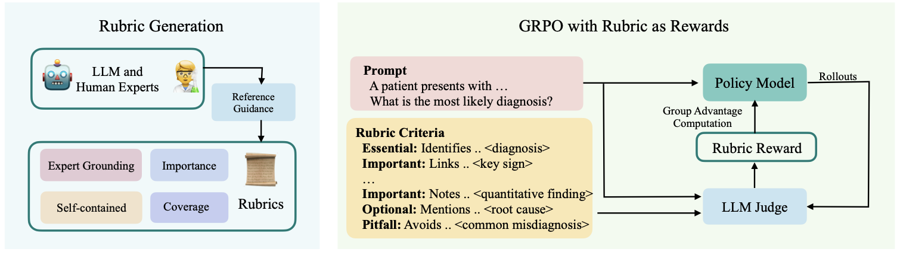
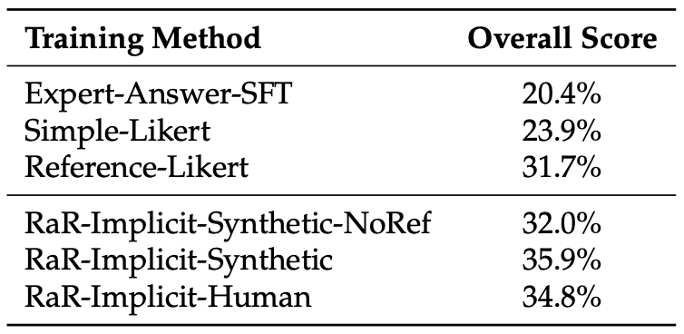

# Rubrics as Rewards: Reinforcement Learning Beyond Verifiable Domains

## 0. Overview

RLVR works great for math and code, but falls apart when "correct" is nuanced. This paper introduces **Rubrics as Rewards (RaR)**: use instance-specific, LLM-generated evaluation checklists as reward signals for on-policy RL, achieving up to 31% relative gains on medical and scientific reasoning benchmarks.

## 1. Background & Motivation

- **Field / Problem:** Post-training of large language models via reinforcement learning (RL). Specifically, how to extend Reinforcement Learning with Verifiable Rewards (RLVR) — which has proven powerful for math and coding — to open-ended expert domains like medicine and science where no single ground-truth answer exists.
- **Why it matters:** Most real-world tasks require nuanced, multi-criteria judgments (e.g., clinical advice must be accurate, safe, complete, and appropriately caveated). Current reward approaches either use opaque preference models that overfit surface artifacts, or coarse Likert scores that lose the structure of "what makes a good response." Getting this right is critical for deploying LLMs in high-stakes domains.

## 2. Related Work & Gaps

- **Prior approaches:**
  - *RLVR* (DeepSeek-R1, DAPO, etc.): binary verifiable rewards for math/code; exact match or test-case execution.
  - *Preference-based RL (RLHF/DPO)*: reward models trained on pairwise human preferences; expensive and prone to reward hacking on stylistic artifacts.
  - *LLM-as-judge with Likert scores*: direct or reference-guided scalar ratings; widely used but coarse.
  - *Generative reward models*: train a separate model to assign interpretable scores, but requires its own training data and can be opaque.
  - *Rubrics for evaluation*: HealthBench uses physician-written rubrics for benchmarking, but prior work has not used rubrics as training reward signals.
- **Key limitations / gaps:** No prior work closes the loop between rubric-based evaluation and on-policy RL training. Generic Likert-based rewards lose the decomposed, criteria-specific supervision that rubrics provide, and static rubrics don't adapt to the specific requirements of each prompt.

## 3. Core Idea & Contributions

- **Main idea (intuition):** Instead of asking a judge "how good is this response?" (Likert), decompose the question into a checklist: "Does the response satisfy criterion 1? Criterion 2? …?" Each prompt gets its own tailored rubric; the binary pass/fail signals from those criteria are aggregated into a scalar reward for GRPO training.
- **Claimed contributions:**
  1. **RaR framework**: an on-policy RL method using checklist-style rubrics as structured, multi-criteria reward signals, formally generalizing RLVR (RLVR is the special case $k{=}1$).
  2. **RaR-Medicine and RaR-Science datasets**: two ~20k-prompt training sets with synthetically generated instance-specific rubrics, publicly released.
  3. **Empirical results**: RaR-trained models outperform Likert-based baselines on both rubric-scored (HealthBench) and multiple-choice (GPQA-Diamond) evals, with gains of up to 31% and 7% respectively.
  4. **Alignment finding**: rubric structure improves LLM judge alignment with human preferences across all judge sizes, especially benefiting smaller judges.
- **Evaluation preview:** Evaluated on HealthBench (5k clinical conversations with physician rubrics) and GPQA-Diamond (graduate-level multiple-choice science). Base policy: Qwen2.5-7B trained with GRPO on 8 H100s.

## 4. Method

The RaR framework has two stages: rubric generation and rubric-guided GRPO training.

### Rubric Generation

For each training prompt $x$, a strong LLM (o3-mini or GPT-4o) is prompted with the reference answer to produce a set of $k = 7$–$20$ self-contained rubric criteria $\{(w_j, c_j)\}_{j=1}^k$. Each criterion $c_j$ is a binary check and each weight $w_j$ reflects importance. The four desiderata driving rubric design are: (1) grounded in expert knowledge via reference answers; (2) comprehensive coverage of accuracy, coherence, completeness, safety; (3) weighted by importance (Essential, Important, Optional, Pitfall); (4) self-contained so each item can be evaluated in isolation.

### Reward Aggregation

Two aggregation strategies are investigated:

**Explicit Aggregation (RaR-Explicit):** An LLM judge scores each criterion independently; the final reward is the weighted sum normalized by total weight:

$$r(x, \hat{y}) = \frac{\sum_{j=1}^{k} w_j \cdot c_j(x, \hat{y})}{\sum_{j=1}^{k} w_j}$$

Weights are set by category: Essential = 1.0, Important = 0.7, Optional = 0.3, Pitfall = 0.9.

**Implicit Aggregation (RaR-Implicit):** All rubric criteria are passed to the LLM judge at once, which produces a single holistic Likert score incorporating the rubric as context:

$$r_{\text{implicit}}(x, \hat{y}) = f_\phi(x, \hat{y}, \{d_j\}_{j=1}^k)$$

This avoids manual weight tuning and lets the judge reason about criteria holistically.

### GRPO Training Loop

For each prompt, 16 responses are sampled from the policy; rewards are computed by gpt-4o-mini; policy weights are updated via GRPO. Base policy: Qwen2.5-7B, trained with lr = $5 \times 10^{-6}$, batch size 96, context length 3584.

(Figure: Overview of the RaR framework — left panel shows rubric generation from reference answers using a strong LLM; right panel shows GRPO training loop where generated rubrics prompt a judge for reward estimation that drives policy updates.)

### Formal Relationship to RLVR

The paper proves that RLVR is a special case of RaR: set $k{=}1$, $w_1{=}1$, and $c_1(x,\hat{y}) = \text{match}(y, \hat{y})$. This positions RaR as a strict generalization.

## 5. Experimental Setup

- **Datasets / Benchmarks:**
  - *Training:* RaR-Medicine (20k prompts from medical-o1-reasoning-SFT, natural_reasoning, SCP-116K, GeneralThought-430K); RaR-Science (~20k GPQA-Diamond-aligned prompts from same sources).
  - *Evaluation:* HealthBench (5k clinical conversations scored with physician rubrics); GPQA-Diamond (graduate-level multiple-choice, 10 runs, mean accuracy ± 95% CI).
- **Baselines:**
  - *Off-the-shelf:* Qwen2.5-7B (base), Qwen2.5-7B-Instruct.
  - *Rubric-free RL:* Direct-Likert (1–10 score, no reference); Reference-Likert (1–10 score comparing to reference answer).
  - *Rubric-guided:* RaR-Predefined (fixed generic rubrics, explicit aggregation); RaR-Explicit (instance-specific rubrics, weighted sum); RaR-Implicit (instance-specific rubrics, holistic judge scoring).
- **Metrics:** HealthBench overall score + 5 per-axis scores (rubric-based %; higher is better); GPQA-Diamond accuracy (%); pairwise preference accuracy for judge alignment study.

## 6. Results & Analysis

- **Main results:** RaR-Implicit is the best-performing variant. On HealthBench it achieves 35.9% overall (vs. 23.9% for Direct-Likert and 31.7% for Reference-Likert) — a relative improvement of ~31% over Direct-Likert. On GPQA-Diamond it achieves ~7% relative improvement over Direct-Likert. Both rubric-guided variants outperform instruction-tuned Qwen2.5-7B-Instruct.

(Table: HealthBench overall scores comparing SFT, Likert-based baselines, and RaR variants — shows RaR-Implicit-Synthetic (35.9%) and RaR-Implicit-Human (34.8%) substantially outperform Reference-Likert (31.7%) and Direct-Likert (23.9%).)

- **Do results support claims?** Yes, strongly. Gains hold on both rubric-based and multiple-choice evaluation, demonstrating generalization beyond the rubric-training signal. The alignment study further corroborates that rubrics produce better-calibrated rewards.
- **Ablations / key insights:**
  - *Instance-specific vs. generic rubrics:* RaR-Predefined (generic) substantially underperforms instance-specific variants — generic criteria miss prompt-specific failure modes.
  - *Rubric design elements:* Removing categorical labels (treating all criteria equally) yields the best ablation score (38.8%), suggesting fine-grained weighting can sometimes hurt. Removing Pitfall criteria drops performance (37.2% → same), and using Essential-only rubrics is worst (34.9%).
  - *Expert grounding:* Rubrics generated without reference answers (RaR-Implicit-Synthetic-NoRef, 32.0%) perform notably worse than reference-grounded rubrics (35.9%), confirming expert grounding is key.
  - *Human vs. synthetic rubrics:* Human-authored rubrics (34.8%) and synthetic rubrics with reference access (35.9%) achieve comparable performance — implying synthetic generation with expert-grounded references is a scalable substitute for costly human annotation.
  - *Judge scale:* Rubric-guided scoring improves pairwise preference accuracy for every judge size, with the greatest benefit for smaller judges — rubric structure compensates for weaker reasoning ability in small models.
- **Surprising findings:** Removing categorical label weights and treating all criteria uniformly sometimes *improves* performance, suggesting the hand-tuned {1.0, 0.7, 0.3, 0.9} weight mapping may not be optimal and that equal weighting is a surprisingly strong alternative.

## 7. Discussion & Implications

- **When / why does this work?** RaR is most effective when: (a) tasks have no single ground-truth answer but can be decomposed into evaluable sub-criteria; (b) high-quality reference answers exist to ground rubric generation; (c) the evaluation space is multi-dimensional (safety + accuracy + completeness). The key mechanism is that decomposed binary signals are lower-variance and more informative than coarse scalar judgments, giving GRPO a cleaner learning signal.
- **Potential applications:** Medical QA, scientific reasoning, legal and policy analysis, educational feedback — any domain where expert evaluation is multi-faceted. The released datasets (RaR-Medicine, RaR-Science) provide immediate training resources.
- **Broader significance:** RaR offers a principled bridge between RLVR (powerful but narrow) and preference-based RL (expressive but noisy). The finding that synthetic rubrics with reference grounding match human-authored rubrics suggests the approach is scalable without expensive expert annotation, opening post-training to any domain that has strong reference answers.

## 8. Limitations & Open Questions

- **Authors' stated limitations:** (1) Rubric quality depends heavily on the quality of reference answers used for generation; domains without reliable references will produce weaker rubrics. (2) The study trains only Qwen2.5-7B — results may not transfer to all model families or scales. (3) Rubric generation incurs additional API cost (o3-mini, GPT-4o) that may be prohibitive at large scale.
- **Critique:**
  - The ablation finding that *removing* categorical weights outperforms the tuned weights (38.8% vs. 37.2%) is underexplored — the paper notes this but doesn't investigate learned or optimized weighting, leaving an obvious improvement on the table.
  - The RaR-Predefined baseline (generic rubrics) is weak by design; a stronger baseline would be static domain-specific rubrics (e.g., a fixed medical rubric), not completely generic ones.
  - All experiments use a single base policy (Qwen2.5-7B). Whether the gains hold for larger models (e.g., 70B), instruction-tuned starting points, or different architectures is an open question.
  - The paper does not ablate the number of rubric items $k$ — it's unclear whether 7 vs. 20 criteria meaningfully changes training quality.
- **Future directions:** Learned or dynamic criterion weighting; scaling to larger base models; extending rubric generation to domains without reference answers (e.g., via self-play); applying RaR to safety-critical domains (legal, finance); investigating multi-turn or agentic settings.

## 9. Key Takeaways

1. **Rubrics as structured rewards outperform Likert-based rewards for open-ended domains.** Decomposing "quality" into instance-specific, weighted checklists provides cleaner RL training signals than scalar ratings — yielding up to 31% relative gains on clinical benchmarks and generalizing to multiple-choice tasks.
2. **Synthetic rubrics grounded in reference answers match human-authored ones.** Expert-guided LLM generation (using reference answers as proxies) is a scalable substitute for costly human annotation, removing a key bottleneck for applying RaR to new domains.
3. **Rubric structure especially helps weaker judges.** Providing explicit criteria narrows the performance gap between small and large LLM judges, democratizing reliable reward computation without requiring frontier-scale judge models.