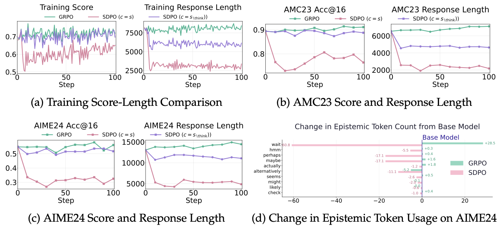
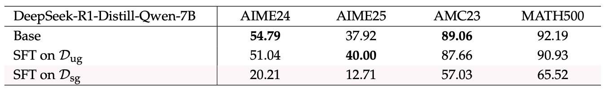

## 0. Overview

Self-distillation — training an LLM using its own teacher-conditioned outputs — sometimes *hurts* math reasoning despite training on correct traces. The culprit is suppression of epistemic verbalization: tokens like "Wait" or "Hmm" that signal uncertainty and enable error correction are trained away, undermining out-of-distribution generalization.

## 1. Background & Motivation

- **Field / Problem:** Post-training of LLMs via self-distillation — a paradigm where one instance of the same model acts as a "teacher" (conditioned on rich context, e.g., ground-truth solutions) to provide reward signals for a "student" instance that must generate answers without that context. Recent works combining self-distillation with Reinforcement Learning from Verifiable Rewards (RLVR) have shown strong gains in science Q&A, tool use, and code.
- **Why it matters:** Self-distillation is increasingly popular as a label-free post-training signal. If it silently degrades reasoning in certain regimes — up to 40% performance drops on math benchmarks — practitioners need to understand when and why, and what to do about it. The finding also speaks to a broader principle: optimizing for correct answers is not the same as optimizing for good reasoning *behavior*.

## 2. Related Work & Gaps

- **Prior approaches:**
  - SDPO (Hübotter et al., 2026): RL via self-distillation; shows strong gains in Chemistry, Physics, and coding with shorter, more concise outputs.
  - GRPO: Standard group relative policy optimization for LLM post-training; the primary baseline throughout this paper.
  - DeepSeek-R1 (Guo et al., 2025): Strong reasoning model known for heavy use of epistemic verbalizations (e.g., "Wait", "Hmm") inside `<think>` tags.
  - Kim et al. (2026): Prior work showing that suppressing epistemic verbalization specifically degrades reasoning performance — a conceptual anchor for the present paper.

- **Key limitations / gaps:** Prior self-distillation work evaluated only in-domain, on narrow task distributions (e.g., six chemistry problem types, 131 coding problems). No prior analysis had examined *why* self-distillation sometimes fails on broad OOD benchmarks, nor traced the mechanism to epistemic suppression.

## 3. Core Idea & Contributions

- **Main idea (intuition):** When a teacher model is conditioned on the correct solution, it generates confident, concise traces with almost no expressed uncertainty. Training the student to imitate this style "teaches away" the uncertainty expressions that are essential for autonomous exploration and error correction at inference time — especially for diverse, out-of-distribution problems.
- **Claimed contributions:**
  1. Identification of epistemic verbalization suppression as the mechanism behind self-distillation's failure on mathematical reasoning.
  2. A controlled empirical analysis showing that conditioning context richness (measured via conditional mutual information $I(y; c \mid x)$) monotonically reduces both response length and epistemic token count.
  3. An account of why task coverage mediates the effect: epistemic suppression helps with narrow, repetitive tasks but hurts generalization on diverse, OOD tasks.
- **Evaluation preview:** Evaluated across Qwen3-8B, DeepSeek-R1-Distill-Qwen-7B, and OLMo3-7B-Instruct on AIME24, AIME25, AMC23, and MATH500; performance drops of up to 40% observed under self-distillation.

## 4. Method

The paper is primarily an empirical analysis rather than a novel algorithm. The methodology consists of three interlocking experiments:

### Formalizing Self-Distillation

In the self-distillation framework, student and teacher share parameters $\pi_\theta$ but differ in conditioning. The student generates $y \sim \pi_\theta(\cdot \mid x)$, while the teacher has access to a richer context $c$ (e.g., the ground-truth solution $s$). Training minimizes:

$$
\mathcal{L}_\text{SD}(\theta) = \sum_t \text{KL}\!\left[\pi_\theta(\cdot \mid x, y_{<t}) \;\|\; \text{stopgrad}\, \pi_\theta(\cdot \mid x, c, y_{<t})\right]
$$

The informativeness of the conditioning context is formalized as conditional mutual information $I(y; c \mid x) = H(y \mid x) - H(y \mid x, c)$, which captures how much $c$ reduces uncertainty about the generated response $y$.

### Measuring Epistemic Verbalization

The authors define a set of 10 epistemic marker tokens: $\mathcal{T} = \{\text{wait, hmm, perhaps, maybe, actually, alternatively, seems, might, likely, check}\}$, and measure epistemic token count as $E(y) = \sum_{t \in \mathcal{T}} \text{count}(t, y)$.

### Experiment 1 — Context Richness vs. Epistemic Suppression (Section 3)

Four conditioning settings are compared, ordered by increasing $I(y; c \mid x)$:
1. Unguided ($c = \emptyset$)
2. Solution-guided without think content ($c = s_{\setminus\text{think}}$)
3. Regeneration-conditioned ($c = \tilde{y}$, where $\tilde{y}$ was generated under full solution guidance)
4. Full solution-guided ($c = s$)

Both average response length $\mathbb{E}[L(y)]$ and epistemic token count $\mathbb{E}[E(y)]$ decrease monotonically as $I(y; c \mid x)$ increases.

### Experiment 2 — Off-Policy SFT (Section 4)

Two SFT datasets of 800 correct trajectories are constructed: $D_\text{ug}$ (unguided, high epistemic density, ~12k tokens/response) and $D_\text{sg}$ (solution-guided, low epistemic density, ~2k tokens/response). Training on $D_\text{sg}$ causes catastrophic performance drops despite all trajectories being correct; training on $D_\text{ug}$ causes no significant change.

### Experiment 3 — On-Policy Self-Distillation and Task Coverage (Sections 5–6)

GRPO vs. SDPO are compared across multiple models and varying dataset sizes $|D| \in \{1, 8, 64, 128, 512, \text{full DAPO-17k}\}$ to characterize how task coverage moderates the epistemic suppression effect.

(Figure: Four-panel figure showing on-policy self-distillation results for DeepSeek-R1-Distill-Qwen-7B — training score vs. steps, OOD accuracy on AMC23 and AIME24, and per-token changes in epistemic verbalization for GRPO vs. SDPO with different conditioning contexts. The figure makes the epistemic suppression mechanism visually concrete by showing that SDPO dramatically reduces "wait" token usage while GRPO slightly increases it.)

## 5. Experimental Setup

- **Datasets / Benchmarks:**
  - Training: DAPO-Math-17k (14,000 diverse math problems) for on-policy experiments; 800-problem subsets for off-policy SFT.
  - Evaluation: AIME24, AIME25, AMC23, MATH500 (all OOD relative to training data).
- **Baselines:**
  - GRPO (standard on-policy RL, no self-distillation)
  - SDPO (Hübotter et al., 2026) with $c = s$ and $c = s_{\setminus\text{think}}$
- **Metrics:**
  - Training score and response length (tracked per step)
  - OOD benchmark accuracy (Acc@16 for AIME; pass@16 also reported)
  - Epistemic token count $\mathbb{E}[E(y)]$

## 6. Results & Analysis

- **Main results:** Self-distillation with full solution conditioning ($c = s$) causes up to 40% degradation on AIME24 for DeepSeek-R1-Distill-Qwen-7B and similar drops for Qwen3-8B. GRPO, by contrast, maintains or slightly improves OOD performance while response length stays stable or grows slightly.

(Table: Math benchmark performance of DeepSeek-R1-Distill-Qwen-7B base model vs. SFT checkpoints trained on unguided (Dug) vs. solution-guided (Dsg) datasets — shows catastrophic degradation under Dsg despite all training traces being correct, with AIME24 dropping from 54.79 to 20.21 and MATH500 from 92.19 to 65.52.)

- **Do results support claims?** Yes, strongly. The epistemic suppression mechanism is demonstrated in multiple converging experiments — off-policy SFT, on-policy RL, and controlled context-richness analysis — across three different base models.

- **Ablations / key insights:**
  - Reducing conditioning richness from $c = s$ to $c = s_{\setminus\text{think}}$ consistently mitigates but does not eliminate the performance drop, proportional to the reduction in $I(y; c \mid x)$.
  - Using a fixed (initial) teacher instead of an EMA-moving teacher reduces the feedback loop that amplifies epistemic suppression.
  - At small task coverage ($|D| \leq 128$), SDPO outperforms GRPO in-domain because confident, concise reasoning suffices for familiar problems. The advantage reverses at larger $|D|$.
  - Qwen3-8B with thinking mode OFF starts with *low* epistemic verbalization; GRPO first *increases* it (growing response length), which actually improves performance — the opposite of what SDPO does.

- **Surprising findings:**
  - A dataset of entirely *correct* reasoning traces can substantially *degrade* performance if those traces were generated under solution conditioning. Correctness of the label is not sufficient — the *style* of reasoning in the trace matters.
  - Performance can improve by making the model *less certain and more verbose*, directly contradicting the usual ML prior that shorter and more confident = better.

## 7. Discussion & Implications

- **When / why does this work?** Self-distillation is beneficial when task coverage is narrow and problems are repetitive (small $|D|$, limited structural diversity). In these settings, confident, concise reasoning is sufficient and efficiency gains are real. The mechanism breaks down when task coverage is broad and evaluation requires generalization to unseen problem structures, where the model needs to express and act on uncertainty.
- **Potential applications:** The analysis directly informs the design of post-training pipelines for reasoning models — particularly the choice of teacher conditioning and dataset diversity. Practitioners should be cautious about applying self-distillation to heterogeneous math and reasoning datasets without monitoring epistemic token usage.
- **Broader significance:** The paper challenges the assumption that "training on correct outputs = improving reasoning." It shows that *how* a model reasons — including its expressions of uncertainty — is an independent axis that post-training objectives must explicitly account for. This has implications for RLVR, SFT data curation, and the growing use of self-improvement loops in LLM training.

## 8. Limitations & Open Questions

- **Authors' stated limitations:** The paper is an analysis work and does not propose a concrete fix. It identifies the problem and characterizes the failure mode but leaves the design of a remediation strategy as future work.
- **Critique:**
  - The 10-token epistemic marker set is a pragmatic proxy for uncertainty expression but is clearly incomplete and potentially model-specific. Tokens like "wait" and "hmm" are characteristic of DeepSeek-R1-style reasoning; other models may express uncertainty differently. No validation is provided that this proxy accurately captures all relevant epistemic behavior.
  - The paper studies only math reasoning in depth. The claim that self-distillation *works* in Chemistry is accepted from prior work without re-validation under the same framework; a unified comparison would strengthen the task-coverage hypothesis.
  - The proposed fix of using $c = s_{\setminus\text{think}}$ still underperforms GRPO on OOD benchmarks in most conditions — so the paper identifies a mitigation but not a solution.
  - The information-theoretic framing ($I(y; c \mid x)$) is presented as a unifying lens but is never computed; it serves as a conceptual ordering device rather than a measurable quantity.
- **Future directions:** Designing self-distillation objectives that explicitly preserve epistemic verbalization; exploring mixed-conditioning strategies; extending analysis to domains beyond math; developing metrics to monitor reasoning style degradation during training.

## 9. Key Takeaways

1. **Correct traces can be bad training data.** A dataset composed entirely of correct reasoning steps can catastrophically degrade OOD performance if those steps were generated under rich conditioning (e.g., the correct solution was provided to the model that produced them), because the resulting traces suppress uncertainty tokens the student needs at inference time.
2. **Epistemic verbalization is not stylistic noise — it is functional.** Expressions like "Wait" or "Hmm" signal that the model may be on a wrong path and prompt course correction. Removing them via imitation learning produces confidently wrong reasoning, especially on novel problem types.
3. **Task coverage is the moderating variable.** Self-distillation's tendency to suppress epistemic verbalization is a feature, not a bug, on narrow, repetitive tasks — and a serious bug on broad, diverse, or OOD tasks. The same mechanism that makes self-distillation efficient on Chemistry makes it harmful on AIME.