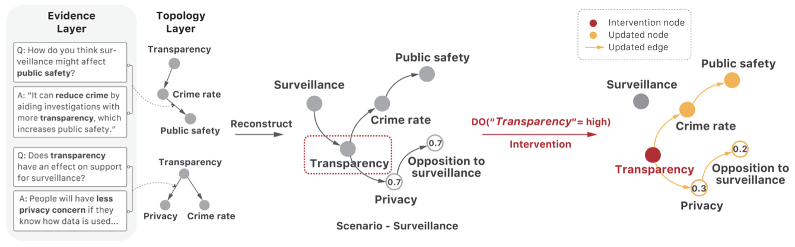

# TL;DR

**What are they arguing?**
This is a **position paper** that argues simulating human society with LLMs requires more than generating plausible behavior — it demands **cognitively grounded reasoning** that is structured, revisable, and traceable. Current "demographics in, behavior out" approaches are fundamentally behaviorist and produce agents that sound human but don't think like humans.

**Why does this matter?**
Current LLM-based social simulations suffer from three structural failures: (1) lack of reasoning **fidelity** — agents produce plausible text without internal causal structure, (2) loss of **individuality** — agents collapse toward median narratives and stereotypes, and (3) **evaluation gaps** — benchmarks measure output fluency, not reasoning quality. These failures make LLM simulations unreliable for high-stakes policy testing.

**What do they propose?**
A "Cognitive Turn": shifting from output-centric mimicry to cognitively grounded simulation. They introduce **GenMinds**, a conceptual framework that maps beliefs into causal DAGs using modular **cognitive motifs**, and **RECAP** (REconstructing CAusal Paths), a benchmark schema for evaluating reasoning fidelity via traceability, counterfactual adaptability, and motif compositionality.

**What is the contribution?**
This is a conceptual contribution, not an empirical one. There are no experiments. The value lies in: (a) a precise diagnosis of why current approaches fail, (b) a theoretically grounded design framework drawing from cognitive science, and (c) an evaluation schema that shifts benchmarking from output plausibility to structural reasoning fidelity.

**Next steps?**
The team is building agent architectures for modular belief reasoning, tools for causal motif extraction from interviews, and datasets across housing, surveillance, and healthcare domains. They acknowledge open challenges including NL-to-causal-graph construction and capturing non-causal aspects of cognition (emotion, analogy).

(Figure 1: Current LLM simulations capture only surface opinions (top left). Deeper belief formation processes remain unmodeled (bottom left, "below the waterline"). Cognitively grounded reasoning (bottom right) models latent belief dynamics, producing heterogeneous, interpretable, and causally faithful collective patterns.)

---

# Core Thesis & Problem Diagnosis

The paper grounds its critique in a historical parallel: the progression from **behaviorism → cognitivism → constructivism** in psychology. Current LLM-based social simulations are stuck at the behaviorist stage — modeling behavior as a function of external stimuli while ignoring internal cognitive states. The authors argue this is not a prompting problem but an **architectural limitation**: autoregressive models optimize next-token likelihood, not belief-state transitions.

## Failure 1: Fidelity — Next-Token Prediction ≠ Belief-State Transitions

Two distinct mismatches:

**Decoding faithfulness mismatch:** The model's visible reasoning (e.g., CoT output) diverges from its actual internal computational path. CoT outputs are constructed post-hoc from language patterns rather than derived from an underlying belief model. Key evidence: Zhao et al. show that CoT performance collapses when tasks or prompt formats deviate from training distribution, confirming that CoT traces are not faithful representations of the model's reasoning.

**Cognitive-alignment mismatch:** Even if the inference path were faithful to the model's internals, it may not reflect how humans form beliefs. No standardized benchmark measures correspondence between model-internal belief transitions and human causal inference sequences.

**Counterfactual intervention sensitivity:** Current agents respond to changed assumptions with inertia or token-level paraphrasing. They cannot explain why a belief holds under some conditions but not others. Empirical studies show agents may support a policy in one scenario and oppose it in another without any causal grounding.

> **Alternative View (from the paper):** Post-hoc rationalization may be cognitively authentic — humans often rationalize decisions after the fact too (Cushman, 2020).
>
> **Authors' Response:** The target is not post-hoc rationalization per se, but its *total detachment from structured belief representation*. Human justifications are imperfect but still rely on internal models of causality, memory, and values. Form (shape of the rationale) is not the same as function (structured, belief-guided deliberation).

## Failure 2: Individuality — Collapse to the Mean

**Illusion of consensus:** In multi-agent setups, LLMs exhibit conformity behavior — models converge toward a median perspective that suppresses genuine disagreement. This is a statistical artifact: models trained to minimize token-level loss implicitly average across pretraining distributions, biasing toward high-frequency, socially moderate continuations.

**Identity flattening:** LLMs factorize across demographic dimensions (race, class, gender) as monolithic proxies, reproducing majority-class correlations rather than capturing the joint distribution of beliefs, values, and positionality conditioned on intersecting variables. This is epistemic harm: the rich, positional knowledge of real stakeholders is replaced with decontextualized stereotypes.

> **Alternative View (from the paper):** Generalization over identity categories is necessary for tractable simulation at scale. Identity flattening may be viewed as necessary regularization.
>
> **Authors' Response:** The critique is not about abstraction per se, but that LLMs abstract *without modeling the joint distribution* of beliefs, values, and positionality. In social simulations used for policy, such abstractions introduce bias and undermine epistemic representativeness.

## Failure 3: Evaluation — Benchmarks Measure Outputs, Not Reasoning

Three gaps in current evaluation:

* **Traceability gap:** Benchmarks assess outputs (stance labels, fluency scores) instead of reasoning trajectories. Stance classification checks whether a model picks a side but is agnostic about how or why.
* **Intervention blindness:** Benchmarks test on static inputs but fail to measure belief revision under counterfactual perturbations.
* **Positional individuality unaddressed:** Evaluation suites aggregate performance across stances (mean accuracy, sentiment agreement) but rarely quantify inter-agent divergence or distributional variance.

(Figure 2: The "Cognitive Turn" — from behaviorist output mimicry to structured belief modeling.)

---

# Theoretical Foundations

<!-- MENTOR NOTE: Your original summary skipped Section 4.2 entirely.
     This section is the cognitive science backbone of the paper —
     without it, GenMinds looks like an arbitrary design choice rather
     than a principled one grounded in decades of cognitive science.
     Always capture the theoretical motivation for a framework. -->

The paper draws on cognitive science to define three properties of human-like reasoning:

1. **Causal:** Humans reason in terms of causes and consequences. Even young children exhibit Bayesian-like inference over causal relationships (Gopnik et al., 2004). Mental models are structured around "what caused what," enabling robust generalization and counterfactual reasoning.

2. **Compositional:** Human reasoning is modular and reusable. Cognitive architectures compose shared schemas — what the authors term **cognitive motifs** — that generalize across domains (Tenenbaum et al., 2011; Lake et al., 2017). These motifs support efficient reasoning by enabling simulation of belief structures without re-learning from scratch.

3. **Revisable:** Human beliefs evolve dynamically. When presented with new information or contradiction, individuals revise prior assumptions. This has been modeled through probabilistic programming and counterfactual simulation frameworks (Goodman et al., 2014; Wong et al., 2023).

These three properties together define **reasoning fidelity**: the structural integrity of belief formation and revision processes in generative agents. This is the paper's core evaluative concept.

---

# Proposed Frameworks

## GenMinds: Modeling Structured Belief Formation

GenMinds operationalizes the cognitive turn through a symbolic-neural hybrid pipeline:

### Step 1: Structured Thought Capture
Semi-structured interviews (conducted or guided by LLMs) elicit causal explanations in everyday language. Responses are parsed into **Directed Acyclic Graphs (DAGs)**:
* **Nodes (V):** Concept units (e.g., "Fairness," "Safety," "Privacy")
* **Edges (E):** Directional causal relations with confidence and polarity scores

### Step 2: Cognitive Motifs as Shared Knowledge
**Cognitive motifs** are minimal causal reasoning units extracted from natural language, e.g., `Surveillance → Crime Rate → Public Safety`. When aggregated across interviews, they form a topology of commonly held belief structures. Motifs are represented in a symbolic **Causal Bayesian Network (CBN)**.

### Step 3: Inference via Symbolic-Neural Hybrid Graph Simulation
Reasoning is defined as forward inference over belief graphs. Given a causal structure and an intervention, the agent uses probabilistic updates (do-calculus) to simulate belief shifts:

$$P(\text{Belief} \mid do(\text{Intervention}))$$

An LLM selects relevant interventions and assembles motifs into the CBN. This hybrid method ensures both interpretability (trace "why" a conclusion was reached) and expressive power (LLM handles natural language complexity).

### Step 4: Handling Uncertainty
The framework visualizes weakly supported or isolated nodes to highlight missing links or uncertain dependencies. The system is designed to remain adaptive and open-ended, rather than overfitting to known paths.

### Illustrative Example: Urban Surveillance

**Motif extraction from interviews:**
* QA#1: "How does surveillance affect public safety?" → "It can reduce crime by aiding investigations with more transparency..." → Motif: `Transparency → Crime Rate → Public Safety`
* QA#2: "Does transparency affect support for surveillance?" → "People will have less privacy concern if they know how data is used..." → Motif: `Privacy ← Transparency → Crime Rate`

**Compose into Causal Belief Network:** Motifs are compiled into a personalized belief graph with confidence scores derived from motif density or respondent emphasis.

**Simulate intervention:** Apply `do(Transparency = high)` (e.g., increasing camera accountability). Belief propagation updates downstream posteriors:

$$P(\text{Privacy Concern}): 0.7 \to 0.3$$
$$P(\text{Opposition to Surveillance}): 0.7 \to 0.2$$

This demonstrates how motif-based causal modeling can simulate how individuals update beliefs in response to policy changes — beyond static opinion snapshots.

(Figure 3: Natural language responses are parsed into motif-level causal links, forming a personalized belief graph. A simulated intervention on Transparency propagates downstream updates.)

## RECAP: Evaluating Reasoning Fidelity

**RECAP** (REconstructing CAusal Paths) is a benchmark *schema* (not a static dataset) for evaluating cognitively grounded agents.

**Design Principles:**
* **Traceability:** Can the agent construct a transparent chain of intermediate beliefs?
* **Demographic Sensitivity:** Can it represent diverse reasoning paths across identities or contexts?
* **Intervention Coherence:** Does it revise beliefs consistently under hypothetical changes?

**Structure and Inputs:**
* Situated prompt in a morally/socially complex domain
* Human-annotated responses capturing causal motifs and belief chains
* Tasks requiring structured inference: graph reconstruction, stance explanation, or counterfactual reasoning

**Metrics:**
* **Motif Alignment:** Structural similarity between human and model belief graphs
* **Belief Coherence:** Internal consistency of the model's reasoning trace
* **Counterfactual Robustness:** Sensible belief updates under interventions

**Grounding:** All items originate from real-world semi-structured interviews, ensuring the benchmark reflects causal depth of actual human reasoning.

## Paradigm Comparison

| Dimension | Existing Paradigm | GenMinds Proposal |
|-----------|------------------|-------------------|
| Reasoning Format | Token-level generation, post-hoc | Structured belief graphs, motifs |
| Belief Dynamics | Static or reset each prompt | Revisable via causal updates |
| Evaluation Lens | Output fluency, stance labels | Reasoning fidelity and adaptability |
| Social Representation | Averaged, flattened views | Divergent, positional cognition |

---

# Notes

## Strengths

**S1. The problem diagnosis is precise, well-structured, and well-cited.**
The paper doesn't just claim "current simulations are bad" — it decomposes the problem into three specific, independently testable failures (fidelity, individuality, evaluation) with distinct sub-mechanisms (decoding faithfulness mismatch, cognitive-alignment mismatch, intervention invariance). Each failure is grounded in concrete references to recent empirical work (e.g., Zhao et al. on CoT collapse, Wang et al. 2025 on identity flattening). This level of diagnostic precision is rare in position papers.

**S2. Intellectual honesty via "Alternative View / Response" pairs.**
The paper actively steelmans counterarguments to its own thesis (e.g., "post-hoc rationalization may be cognitively authentic," "identity flattening is necessary regularization") and then responds to them. This is a hallmark of mature academic writing and is relatively unusual in ML position papers. It preemptively addresses likely reviewer objections and demonstrates that the authors have thought through the limitations of their framing.

**S3. The cognitive motif concept is genuinely novel and well-motivated.**
Framing reusable causal reasoning units as "motifs" — modular, composable, transferable across domains — bridges cognitive science (Tenenbaum, Lake, Goodman) with practical agent design in a way that goes beyond existing work on knowledge graphs or chain-of-thought. The key insight is that *compositionality* is what enables generalization: if an agent has motifs for "density" and "transit," it can reason about "transit-oriented development" without re-training. This connects directly to foundational work on how humans generalize.

**S4. The paper correctly identifies reasoning fidelity as a distinct evaluation axis.**
The distinction between "output plausibility" and "reasoning fidelity" is important and under-recognized. By defining fidelity through three measurable properties (traceability, counterfactual adaptability, motif compositionality), the authors provide a concrete evaluation vocabulary that the community can adopt and operationalize, regardless of whether GenMinds itself succeeds.

**S5. Grounding in real interviews adds credibility.**
The surveillance example with actual QA pairs → motif extraction → CBN construction → do-calculus intervention is the most compelling part of the paper. It shows the pipeline is not purely hypothetical — there is a concrete instantiation pathway.

## Weaknesses

**W1. No empirical validation of any kind — even for a position paper, this is a gap.**
While position papers are not expected to have full experimental sections, the strongest position papers at top venues include at least a proof-of-concept evaluation or pilot study. GenMinds and RECAP are presented entirely as conceptual frameworks with zero quantitative evidence that: (a) LLM-guided interviews reliably produce coherent DAGs, (b) motif extraction preserves human reasoning structure, (c) do-calculus propagation over extracted graphs predicts actual belief changes, or (d) RECAP metrics correlate with any meaningful ground truth. The surveillance example is illustrative but hand-constructed — it doesn't demonstrate that the pipeline works at scale or with real noise. Without even a small pilot, the reader is asked to accept the framework's viability on faith.

**W2. The DAG assumption is a strong and potentially limiting commitment.**
The framework requires beliefs to be representable as a Directed Acyclic Graph. But the authors themselves acknowledge that human reasoning includes associative, analogical, and emotional processes that resist symbolic modeling. More critically, many real belief structures contain *cycles* (A influences B which reinforces A), feedback loops (policy → perception → policy support), and contradictions that are not "grounded incoherence" but genuine structural circularity. The paper waves at this ("causality alone cannot capture the full range") but does not discuss how serious this limitation is or what fraction of real human reasoning it excludes. For policy domains like housing or healthcare, feedback loops are arguably the norm, not the exception.

**W3. The gap between "extracting motifs from interviews" and "scalable simulation" is enormous and unaddressed.**
The paper's vision requires: (1) conducting semi-structured interviews with representative populations, (2) parsing them into causal graphs via LLMs, (3) validating graph structure against human judgment, (4) composing motifs into CBNs, and (5) running do-calculus inference. Each step introduces noise, ambiguity, and potential for error. The paper acknowledges that "constructing causal belief networks from natural language transcripts remains challenging, due to ambiguity in concept identification, causal direction, polarity, and conceptual granularity" — but this is the *entire technical problem*. The framework's value depends on solving precisely the step the authors flag as unsolved.

**W4. The critique of CoT and LLM reasoning is accurate but overstated in scope.**
The paper argues that autoregressive architectures fundamentally cannot achieve reasoning fidelity ("an architectural limitation rather than a prompting issue"). But recent work on reasoning models (o1, DeepSeek-R1, etc.) and test-time compute scaling suggests that the boundary between "pattern matching" and "reasoning" in LLMs is actively shifting. The paper's diagnosis is grounded in 2024-era LLM capabilities but frames its conclusions as if they apply to the paradigm indefinitely. A stronger paper would acknowledge that the target is moving and position GenMinds as complementary to, rather than a replacement for, advances in LLM reasoning.

**W5. RECAP is underspecified as an evaluation framework.**
RECAP is described through design principles and metric names (motif alignment, belief coherence, counterfactual robustness) but provides no operational definitions: How is structural similarity between belief graphs computed? What is the ground truth for "belief coherence"? How many interventions constitute a meaningful test of counterfactual robustness? Without these details, RECAP is more a wish list than a benchmark. Compare this to how well-specified benchmarks like BigBench or HELM defined their metrics — RECAP is orders of magnitude less concrete.

**W6. The paper's novelty over existing work on causal reasoning and knowledge graphs is not clearly delineated.**
The related work discussion (Section 2) cites work on causal memory, knowledge graphs, belief graphs, and structured reasoning layers but dismisses them as "domain-specific and disconnected from live generative processes." However, GenMinds itself has only been demonstrated in a single domain (surveillance) with a hand-crafted example. The paper does not provide a systematic comparison of GenMinds against these existing approaches to show what GenMinds adds beyond reframing.

**W7. The "Alternative View / Response" pairs, while commendable, sometimes sidestep the strongest versions of the objection.**
For example, the response to "identity flattening as necessary regularization" argues that LLMs "abstract without modeling the joint distribution." But this response presumes that modeling the joint distribution is feasible at scale — which is itself an open and very hard problem. The alternative view deserved a more quantitative engagement with the tractability concern.

## Open Questions

* **Validation pathway:** What would a minimally viable empirical test of the GenMinds pipeline look like? Could the authors run even 10 interviews, extract motifs, build CBNs, apply interventions, and compare predicted belief shifts against follow-up interview data?
* **Motif granularity:** How do you decide the right level of abstraction for nodes? "Safety" is very different from "physical safety at night in my neighborhood." Who decides the granularity, and how does it affect downstream inference?
* **Scalability of interviews:** The framework depends on semi-structured interviews as input. How does this scale to populations of thousands? Can the interview process be automated without losing the very richness it aims to capture?
* **Relationship to reasoning models:** How does GenMinds interact with the emerging class of reasoning-capable LLMs (o1, R1, QwQ)? Could these models serve as better motif extractors or even replace the symbolic CBN inference?
* **Dynamic beliefs over time:** The framework shows one-shot belief propagation. How does it handle multi-round deliberation where agents' beliefs evolve through interaction with each other?
* **What counts as success?** If GenMinds-powered agents produce different predictions than standard LLM agents, how do we know which is more "faithful" to real human reasoning? What is the gold standard?

---

# Key Takeaways & Broader Implications

1. **The behaviorism/cognitivism framing is powerful and portable.** Even if you never use GenMinds, the diagnosis that current LLM simulations are "behaviorist" — modeling stimulus→response without internal states — is a useful lens for evaluating any agent-based system. Ask of any simulation: does this agent have beliefs, or does it just have outputs?

2. **Reasoning fidelity as an evaluation axis is the paper's most durable contribution.** The three-property decomposition (traceability, counterfactual adaptability, compositionality) can be applied to evaluate *any* reasoning system, not just social simulation agents. This vocabulary is likely to outlive the specific GenMinds framework.

3. **The tension between symbolic structure and neural flexibility is the central open problem.** GenMinds proposes a symbolic-neural hybrid, but the hard work — reliably extracting causal structure from messy natural language — remains unsolved. This is not a weakness unique to this paper; it's the fundamental challenge of neuro-symbolic AI. The paper's contribution is making this challenge explicit in the social simulation context.

4. **Position papers at top venues set research agendas.** This paper at NeurIPS 2025 is likely to influence how the community thinks about LLM-based social simulation for the next 2-3 years. Whether or not GenMinds becomes the standard framework, the argument that "output plausibility ≠ reasoning fidelity" will shape how new benchmarks and agent architectures are designed.

5. **The gap between this vision and deployment is large.** For anyone building practical social simulation systems *today*, this paper offers a compelling north star but not a usable toolkit. The most actionable near-term takeaway is the RECAP evaluation schema — even a simplified version could improve how we assess existing LLM simulation pipelines.