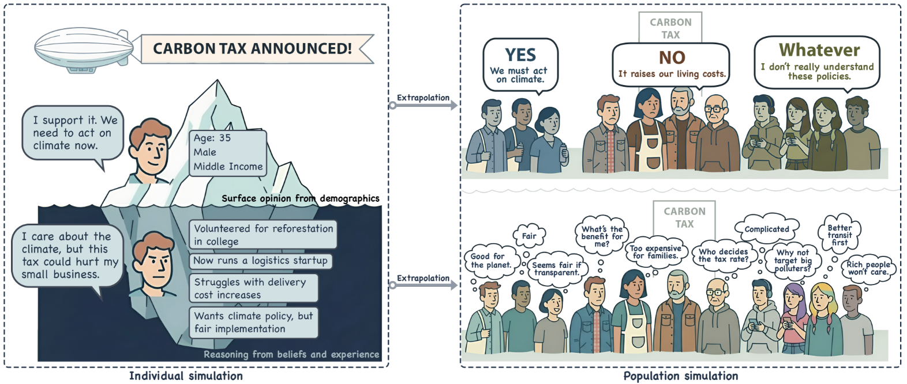
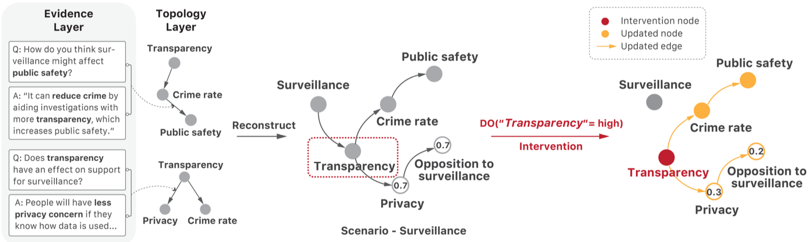
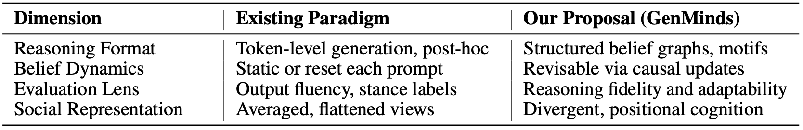

# Simulating Society Requires Simulating Thought

## 0. Overview

LLM agents can mimic what people say, but not how they think — and for social simulations that inform real policy, that gap matters. This paper makes the case for cognitively grounded agents whose reasoning is structured, traceable, and causally faithful, proposing GenMinds and RECAP as conceptual frameworks to get there.

## 1. Background & Motivation

- **Field / Problem:** LLM-based social simulation — using large language models as stand-ins for human agents in computational models of society, policy, and group behavior.
- **Why it matters:** Social simulations increasingly inform real-world decisions in urban planning, public health, and policy design. If the agents populating those simulations don't reason the way humans actually do — not just produce human-sounding outputs — the emergent patterns they generate will be unreliable or actively misleading. The stakes are highest in high-complexity domains like housing policy, healthcare access, and surveillance, where nuanced, causally grounded reasoning is essential.

## 2. Related Work & Gaps

- **Prior approaches:** Classical agent-based models (ABMs) used hand-crafted rules or utility functions. The recent wave of LLM-driven work (e.g., Park et al.'s Generative Agents) plugs language models into agent roles via persona prompting, chain-of-thought (CoT) generation, and reinforcement learning from human feedback (RLHF), relying on linguistic fluency as a proxy for human-like behavior.
- **Key limitations / gaps:** Current approaches are grounded in what the authors call a "demographics in, behavior out" behaviorist paradigm — they map surface-level input descriptions to output stances without modeling the *internal* belief dynamics that produce those stances. This leads to three structural failures: (1) agents produce post-hoc rationalizations rather than traceable reasoning; (2) they fail to revise beliefs consistently under counterfactual interventions; and (3) multi-agent systems converge to artificial consensus, erasing the heterogeneity present in real human populations. Critically, existing benchmarks only measure output plausibility, so these failures are routinely missed.

## 3. Core Idea & Contributions

- **Main idea (intuition):** To simulate society faithfully, agents must not merely produce plausible-sounding outputs — they must reason in ways that are *structured*, *revisable*, and *causally grounded*. The paper calls this property "reasoning fidelity," and argues it requires a fundamental paradigm shift from behavioral mimicry to cognitive modeling.
- **Claimed contributions:**
  1. A conceptual critique of the current behaviorist simulation paradigm, identifying failures in fidelity, individuality, and evaluation.
  2. **GenMinds** — a symbolic-neural framework for modeling structured belief formation using causal graphs and modular "cognitive motifs" extracted from natural language.
  3. **RECAP** (REconstructing CAusal Paths) — a benchmark framework for evaluating reasoning fidelity via causal traceability, demographic sensitivity, and intervention coherence.
- **Evaluation preview:** As a position paper, there are no quantitative experiments. Claims are supported via theoretical argument, literature synthesis, and an illustrative worked example using a real urban surveillance scenario.

## 4. Method

Since this is a position paper, the "method" is better understood as two conceptual frameworks proposed for modeling and evaluating cognitively grounded agents.

### The Problem: Reasoning Fidelity and Individuality

The authors distinguish two dimensions along which current agents fail:

**Reasoning fidelity** — whether an agent's belief formation process is internally coherent, causally structured, and stable under perturbation. Current LLMs fail on three counts: their reasoning traces are assembled post-hoc from language patterns rather than derived from an underlying belief model (a "data mirage," per cited empirical work); they respond to counterfactual interventions with inertia or token-level paraphrasing rather than principled belief revision; and their chain-of-thought outputs collapse when prompt format or task distribution changes slightly.

**Individuality** — whether agents preserve heterogeneous belief structures across a simulated population. Because LLMs are trained to minimize token-level loss over aggregated corpora, their generative priors push toward statistical averages. In multi-agent settings this produces an *illusion of consensus* — agents appear to agree not because of shared reasoning, but because their generative priors converge to a median narrative. Within demographic conditioning, this yields *identity flattening*, where intersectional variation is erased in favor of majority-class stereotypes.

(Figure: Contrasts current LLM-based simulations (top: surface opinions derived from demographics) with GenMinds (bottom: latent belief dynamics producing heterogeneous, causally faithful population-level patterns).)

### GenMinds: Structured Belief Formation

GenMinds models individuals' internal reasoning via three steps:

1. **Causal motif extraction.** Semi-structured interviews are conducted (potentially LLM-guided) to elicit causal explanations in everyday language. These are parsed into directed acyclic graphs — *Causal Belief Networks* (CBNs) — where nodes represent concepts (e.g., "fairness," "crime rate") and directed edges encode influence relationships with confidence and polarity scores.

2. **Cognitive motifs as shared units.** Recurring sub-patterns across interviews (e.g., `Transparency → Crime Rate → Public Safety`) are abstracted as *cognitive motifs* — minimal, reusable causal structures. Aggregating motifs across individuals yields a topology of commonly held belief structures, while preserving individual-level variation.

3. **Inference via symbolic-neural hybrid.** Given a CBN and a hypothetical intervention (e.g., `do(Transparency = high)`), the agent performs forward inference using belief propagation (do-calculus), simulating how downstream beliefs shift. A language model handles natural language parsing and motif assembly; the causal graph handles structural inference. This hybrid ensures both interpretability and expressive power.

(Figure: Illustrataiton of the motif-based belief graph for a surveillance scenario, showing how natural language QA responses are parsed into causal links, composed into a personalized belief graph, and updated via intervention propagation.)

The illustrative example in the paper is instructive: two QA pairs from a surveillance interview are parsed into motifs (`Transparency → Crime rate → Public Safety` and `Privacy ← Transparency → Crime rate`), composed into a CBN, and then a policy intervention `do(Transparency = high)` is applied. The result is a principled, traceable shift in downstream beliefs: P(Privacy Concern) drops from 0.7 to 0.3, and P(Opposition to Surveillance) drops from 0.7 to 0.2.

### RECAP: Evaluating Reasoning Fidelity

RECAP is a benchmark *schema* rather than a static dataset — a replicable protocol grounded in human-derived causal motifs from real semi-structured interviews. Tasks require structured inference: graph reconstruction, stance explanation, or counterfactual reasoning. Evaluation axes are:

- **Motif alignment** — structural similarity between model-generated and human belief graphs.
- **Belief coherence** — internal consistency of the model's reasoning trace.
- **Counterfactual robustness** — sensible, causally grounded belief updates under hypothetical interventions.

(Table: paradigm shift from existing output-mimicry approaches to GenMinds along four dimensions: reasoning format, belief dynamics, evaluation lens, and social representation.)

## 5. Experimental Setup

Not applicable — this is a position paper. No quantitative experiments are conducted. The authors support their claims through theoretical argumentation, references to established cognitive science and NLP literature, and a worked qualitative example (the urban surveillance scenario). They explicitly acknowledge this and frame empirical validation as future work.

## 6. Results & Analysis

- **Main results:** The paper presents the surveillance scenario as a proof-of-concept illustration, not a formal evaluation. It shows that motif-based causal propagation produces interpretable, context-sensitive belief updates — something current LLMs cannot replicate through prompting alone.
- **Do results support claims?** The theoretical arguments are well-grounded in cognitive science and supported by citations to empirical NLP work (e.g., studies showing that CoT outputs are unstable under distributional shift, that multi-agent LLM systems converge under majority pressure, and that demographic conditioning produces stereotyping). However, the core claims about GenMinds improving simulation fidelity are unvalidated empirically.
- **Ablations / key insights:** The most incisive analytical point is the distinction between *form* and *function* in reasoning: human post-hoc rationalizations, though imperfect, are still anchored to internal models of causality and memory. LLMs produce rationalizations without any such structural anchoring — a difference that matters for emergent social dynamics even when surface outputs look similar.
- **Surprising findings:** The paper argues that demanding greater *consistency* from agents — not greater capability — is the key lever. This reframes the problem: the goal is not to make agents smarter, but to make their reasoning *structurally grounded*, which may require deliberately constraining or scaffolding how they reason rather than simply scaling up.

## 7. Discussion & Implications

- **When / why does this work?** GenMinds is most compelling for simulations where emergent outcomes depend on the structured interaction of heterogeneous belief-holders — civic deliberation, policy design, multi-stakeholder negotiation. It is less necessary for settings where aggregate statistics are robust to individual-level cognitive details.
- **Potential applications:** Urban planning (simulating community responses to zoning or transit policies), public health (modeling vaccination hesitancy), AI governance (participatory policy design), and social science research (generating diverse synthetic respondents rather than stereotyped personas).
- **Broader significance:** The paper advances a critique with implications well beyond social simulation: it challenges the field's implicit assumption that linguistic fluency is a sufficient proxy for cognitive fidelity. In any high-stakes application where understanding *why* an agent holds a belief matters — not just *what* it says — the behaviorist paradigm is inadequate.

## 8. Limitations & Open Questions

- **Authors' stated limitations:**
  - No empirical validation. The paper explicitly acknowledges that GenMinds and RECAP are conceptual scaffolds awaiting empirical testing.
  - Constructing causal belief networks from natural language transcripts is technically hard: concept identification, causal direction, polarity assignment, and granularity choices all introduce ambiguity.
  - Causality alone cannot capture the full range of human reasoning (associative, analogical, emotional). The authors acknowledge this as a deliberate, tractable starting point.
- **Critique:**
  - The paper introduces both a modeling framework (GenMinds) and an evaluation framework (RECAP), but the relationship between them is underspecified. It is unclear how RECAP would be operationalized in practice without GenMinds-style agents to evaluate against.
  - The claim that semi-structured interviews can be reliably parsed into causal graphs by LLMs is assumed rather than demonstrated. Given known LLM failures in causal reasoning (cited in the paper itself), this is a significant gap.
  - Social cognition — theory of mind, group identity, norm internalization — receives minimal attention despite being central to multi-agent social dynamics. The three properties of human-like reasoning (causal, compositional, revisable) are well-chosen but incomplete.
  - No concrete compute or scalability analysis is provided. Maintaining persistent, individual-level causal belief networks across a large simulated population could be expensive.
- **Future directions:** Empirical validation comparing GenMinds-style agents to baseline LLM agents on reproducible social phenomena (e.g., known market anomalies, social contagion curves). Development of standardized RECAP datasets across multiple domains. Extension to associative and emotional reasoning processes beyond causal graphs.

## 9. Key Takeaways

1. **Output plausibility is not cognitive fidelity.** An LLM agent that says the right things may still be a broken simulation component — because emergent social dynamics depend on the *process* of belief formation, not just its surface outputs. Behaviorist metrics that reward fluency systematically miss this failure mode.
2. **GenMinds proposes a concrete alternative:** represent individual reasoning as modular causal graphs (belief networks built from reusable cognitive motifs), enable principled belief revision under interventions, and evaluate agents on structural reasoning properties — traceability, counterfactual adaptability, and motif compositionality — rather than output alignment alone.
3. **This is a call to action, not a finished system.** The paper's theoretical framework is rigorous and its critique is well-evidenced, but GenMinds and RECAP remain unvalidated. The central challenge it poses to the community — building benchmarks and architectures that treat reasoning as a structured process, not a stylistic performance — is open and important.