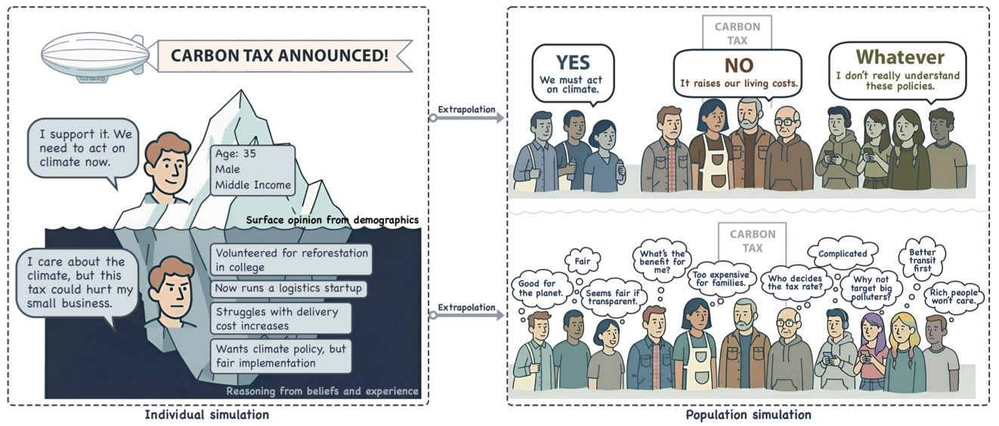
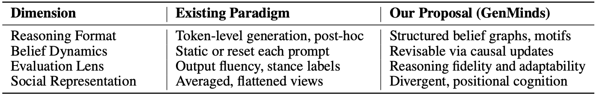

# TL;DR
**What are they doing?**
They are pushing a major pivot from surface-level AI mimicry to simulating the actual structure of human thought. They introduced the **GenMinds** framework and the **RECAP** benchmark to study casual reasoning traces.

**Why do we need it?**
Current benchmarks assess output instead of reasoning trajectories, and current LLM simulations use "demographics in, behavior out" approach. They lack reasoning fidelity and create identity flattening.

**How do they solve it?**
By mapping beliefs into causal graphs using modular **cognitive motifs**. They use a symbolic-neural hybrid system to simulate how beliefs update via mathematical interventions, like a "logic map" for the brain.

**What are the results?**
We get "reasoning fidelity" which is simulations that are traceable, revisable, and represent genuine human diversity instead of just statistical averages. This makes AI behavior interpretable and reliable for high-stakes policy testing.

**Next steps?**
The team is building tools to extract these "logic blocks" from real-world interviews and developing new datasets for complex domains like housing, surveillance, and healthcare

{: width="50%"}

<em>Figure 1: Three main schools of thoughts for human simulations.</em>

---

# Research Questions

The paper focuses on three core failures in current AI social simulation:
* **Fidelity:** How can we ensure agents think in ways that are causally structured, internally coherent, and dynamically revisable rather than just generating plausible text?
* **Individuality:** How do we preserve the unique, heterogeneous reasoning of real individuals and stop models from collapsing into a "median narrative" or stereotype?
* **Evaluation:** How can we move past benchmarks that only look at "fluency" and start measuring the actual internal structure and traceability of an agent's reasoning

{: width="50%"}

<em>Figure 2: Paradigm shift from role-playing at a surface level to cognitively grounded simulation.</em>

---

# Approach

The authors propose a "Cognitive Turn" by moving from output-centric mimicry to a structured, symbolic-neural hybrid paradigm.

## GenMinds Framework
This framework captures "Structured Thought" by conducting interviews and parsing them into **Directed Acyclic Graphs (DAGs)**.
* **Nodes (V):** Represent concept units like "Fairness," "Safety," or "Privacy".
* **Edges (E):** Encode directional causal relations with confidence and polarity scores.

{: width="50%"}

<em>Figure 3: GenMinds framework.</em>

## Mathematical Inference
Reasoning is defined as forward inference over these graphs. Using **do-calculus** interventions, the system simulates how beliefs shift mathematically:

$$P(\text{Belief} \mid do(\text{Intervention}))$$

## RECAP Evaluation
The **RECAP** (REconstructing Causal Paths) framework evaluates agents on three measurable properties:
* **Traceability:** Inspecting how a stance was formed through intermediate steps.
* **Counterfactual Adaptability:** Revising beliefs predictably when context changes.
* **Motif Compositionality:** Reusing modular logic blocks across different domains.

---

# Results and Discussion

The authors argue that current "output-centric" models are failing the vibe check in high-stakes settings:
* **Reasoning Fidelity:** By adopting the "Cognitive Turn," simulations become more than just "plausible behavior"; they become traceable and causally faithful, which is essential for auditability and fairness in policy-making.
* **The Illusion of Consensus:** Multi-agent simulations often converge on a fake agreement because models are trained to pick the "most likely" (median) perspective, suppressing real disagreement.
* **Identity Flattening:** Agents often replace rich, positional knowledge with monolithic stereotypes because they "average" across pre-training data.

{: width="50%"}

<em>Figure 4: Differences between GenMinds and other approaches.</em>

---

# Notes

This paper is basically saying that if you want to simulate society, you can't have your agents just "playing a role"—they need to have actual skin in the game (internal logic).

* **Strength:** The concept of **"Cognitive Motifs"** is brilliant. It allows for modular reasoning where an AI can "think" about a new topic by recombining logic blocks it already knows from other areas.
* **Weakness:** The authors admit that human reasoning isn't always 100% causal—we have emotions, analogies, and vibes that are hard to turn into a math graph.
