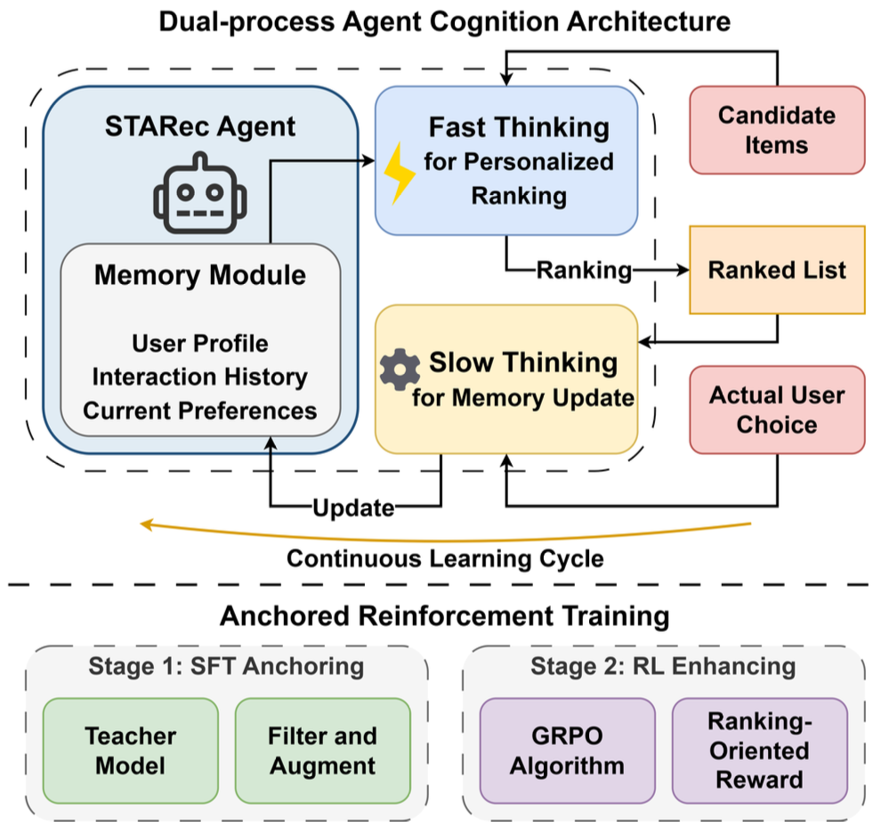
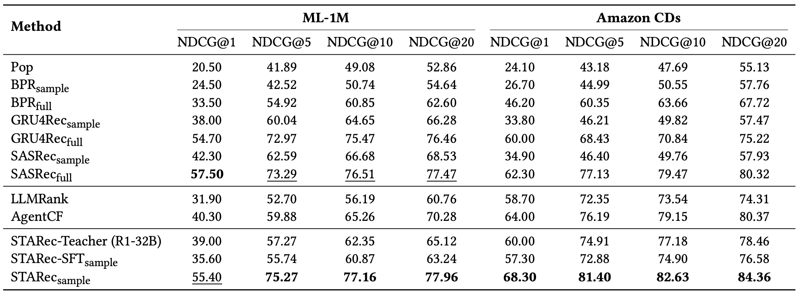

## 0. Overview

STARec equips LLM-based recommender systems with "slow thinking" — deliberate, chain-of-thought reasoning — by training each user agent via a two-stage pipeline of knowledge distillation followed by reinforcement learning. Trained on just 0.4% of available data, it outperforms state-of-the-art baselines on two standard benchmarks.

## 1. Background & Motivation

- **Field / Problem:** LLM-based recommender systems — using language models to rank candidate items for users based on their preferences and interaction history.
- **Why it matters:** Current LLM recommendation agents operate in a "fast thinking" (System 1) mode: they pattern-match from user history to items but cannot reason carefully about *why* a user might prefer something, struggle with conflicting signals, and are brittle when interaction data is sparse. This limits personalization depth and performance in real-world settings, especially for cold-start users.

## 2. Related Work & Gaps

- **Prior approaches:** Classical recommenders (BPR, GRU4Rec, SASRec) learn from interaction patterns via collaborative filtering or sequential modeling. More recent LLM-based approaches either reframe recommendation as a language task end-to-end (e.g., P5, LLMRank) or use LLMs to enrich traditional models. AgentCF introduced user-item collaborative agents but still lacks explicit slow reasoning. DeepSeek-R1 demonstrated the power of RL-induced chain-of-thought reasoning for general tasks.
- **Key limitations / gaps:** Existing LLM recommendation agents rely on heuristic prompt-based ranking with no structured reasoning process. They capture shallow correlations, fail at multi-step inference, and cannot adapt dynamically to evolving user preferences. No prior work has applied slow-thinking RL training specifically to recommendation agents.

## 3. Core Idea & Contributions

- **Main idea (intuition):** Model each user as an autonomous agent with *dual-process cognition* — fast thinking for immediate ranking and slow thinking (via chain-of-thought reflection) for updating its understanding of the user. Train this slow-thinking capacity using a teacher model for initialization and RL for refinement, rather than relying on prompting alone.
- **Claimed contributions:**
  1. A dual-process agent architecture that separates fast ranking from slow memory updates via self-reflection.
  2. An **anchored reinforcement training** strategy combining SFT-based knowledge distillation (from a strong teacher model) with GRPO-based RL and a ranking-oriented reward signal.
  3. Empirical demonstration that STARec surpasses state-of-the-art baselines on ML-1M and Amazon CDs using only 0.4% of the full training data.
- **Evaluation preview:** Standard NDCG@K evaluation (K = 1, 5, 10, 20) with leave-one-out splits, plus ablation studies and scaling experiments.

## 4. Method

STARec frames each user as an autonomous LLM agent with persistent memory and two reasoning modes.

### Memory Architecture

Each agent maintains a natural-language memory module storing the user's profile, interaction history, and a running "preference description" — a textual summary of what the user likes and why. This memory is mutable and updated after each interaction.

### Fast Thinking: Personalized Ranking

When presented with a set of candidate items, the agent ranks them using its current memory via a standard prompting setup: user demographics, the current preference description, viewing history, and candidate item metadata are assembled into a prompt, and the model outputs a ranked list with brief justifications. This is the "reactive" pass — quick and direct.

### Slow Thinking: Memory Update via Self-Reflection

After observing actual user feedback, the agent compares its predictions against reality. Where they diverge — e.g., the agent ranked a movie highly but the user disliked it — the agent is prompted to *reflect*: given the discrepancy, what does this reveal about the user's true preferences? The output is an updated preference description that integrates the new insight. This reflection step is the core of "slow thinking" and is where the CoT reasoning happens.

This prediction → comparison → reflection → memory update cycle runs iteratively, allowing agents to continuously refine their user model.

### Anchored Reinforcement Training

Achieving slow thinking via zero-shot prompting is unreliable, so the authors train it in with a two-stage process:

**Stage 1 — SFT Anchoring.** A powerful teacher model (DeepSeek-R1-Distill-Qwen-32B) generates a curated dataset of high-quality ranking outputs with CoT rationales and preference descriptions. This data is filtered for quality (NDCG threshold, format checks) and augmented by looping flawed samples back through the teacher with error feedback. The student model (Qwen2.5-7B as the primary) is then fine-tuned on this corpus to learn the basic structure of preference reasoning.

**Stage 2 — RL Enhancement.** Starting from the SFT model, GRPO (Group Relative Policy Optimization — a memory-efficient RL algorithm without a separate critic model) is applied. The reward function is ranking-oriented: +1.0 if the ground-truth item is ranked 1st, +0.5 for ranks 2–5, 0.0 for 6–10, −0.5 for 11–20, and −1.0 if it falls outside the top 20. For memory update steps, the updated preference description is immediately tested on a follow-up ranking task and rewarded accordingly — ensuring preference summaries actually improve downstream performance. A KL divergence penalty prevents excessive drift from the SFT baseline.

(Figure: STARec framework: the dual-process agent architecture)

## 5. Experimental Setup

- **Datasets / Benchmarks:** MovieLens 1M (ML-1M) and Amazon CDs and Vinyl (CDs). Both are subsampled to 1,000 training users and 1,000 test users, with interaction sequences capped at 40. Only users and items with at least 10 interactions are kept. Ratings > 3 are treated as positive.
- **Baselines:** Pop (popularity), BPR (matrix factorization), GRU4Rec (RNN sequential), SASRec (Transformer sequential), LLMRank (zero-shot LLM ranking), AgentCF (LLM collaborative agents). BPR and SASRec are evaluated in both sampled and full-data variants to give fair comparison points.
- **Metrics:** NDCG@K for K ∈ {1, 5, 10, 20}, evaluated via leave-one-out with 1 positive against 19 random negatives, averaged over 3 runs.

## 6. Results & Analysis

- **Main results:** STARec (7B, RL-trained on sampled data) achieves NDCG@1 of 55.4 and NDCG@10 of 77.16 on ML-1M, and NDCG@1 of 68.3 and NDCG@10 of 82.63 on Amazon CDs — surpassing all baselines including SASRec and AgentCF trained on the full dataset.

(Table: Comparison of all methods on both datasets across NDCG@1/5/10/20, clearly showing STARec (sample) outperforming even full-data traditional models and the teacher model itself.)

- **Do results support claims?** Yes, with the notable caveat that the teacher model (R1-32B) actually underperforms the student after RL training — a meaningful result demonstrating that task-specific RL fine-tuning can surpass a much larger generalist model.
- **Ablations / key insights:**
  - Removing SFT anchoring and training with RL from scratch causes a catastrophic performance drop (NDCG@1 falls from 51.3 to 26.1 on ML-1M), confirming that RL needs a strong initialization.
  - Removing self-reflection and replacing it with simple history appending causes a meaningful but less severe drop, confirming that the LLM-driven reflection adds value beyond just longer context.
  - GRPO and Reinforce++ perform comparably, suggesting the framework is robust to the choice of RL algorithm.
- **Surprising findings:** The "Best of N" analysis (Figure 2b) shows that if you sample the SFT model N times and take the best result, performance approaches the RL model's single-attempt performance at large N. This reframes RL's role: it is not adding new knowledge but performing "success amplification" — sharpening the model's ability to produce its best solution on the first try. This is an unusually clean characterization of what RL does over SFT.

## 7. Discussion & Implications

- **When / why does this work?** The framework is most compelling for sparse-data settings where traditional collaborative filtering fails. The RL training on only 0.4% of interaction data — and the self-reflection mechanism that extracts causal preference signals from single interactions — enables meaningful generalization to low-activity users.
- **Potential applications:** Any domain where user preferences are nuanced, evolving, and hard to infer from implicit feedback alone: video/music streaming, e-commerce, news feeds, job matching.
- **Broader significance:** The paper operationalizes the System 1/System 2 cognitive framework from psychology directly into a recommendation agent training pipeline. It also provides a practical recipe for inducing slow thinking in small models (sub-10B) that could otherwise only be approximated via expensive large models.

## 8. Limitations & Open Questions

- **Authors' stated limitations:** The evaluation is on sampled subsets (1,000 users) rather than the full datasets, which limits conclusions about large-scale behavior. The authors also note the high inference cost of slow-thinking LLM agents in production settings.
- **Critique:**
  - The reward function design (discrete tiered NDCG-inspired rewards) is hand-crafted and somewhat arbitrary; it is unclear how sensitive results are to these specific thresholds and values.
  - Experiments use only two domains (movies and music CDs). Both are relatively content-rich with natural language titles. Generalization to domains where items are harder to describe in text (e.g., fashion, grocery) is unvalidated.
  - The 0.4% data efficiency claim is striking but partly a result of the experimental setup: the sampled dataset is pre-filtered to active users (≥10 interactions). Performance on truly cold-start users with no history is not directly evaluated.
  - The proxy reward for memory updates (test the new preference description on a follow-up ranking task) is indirect and potentially noisy — it may reward preference descriptions that are useful for the specific test items rather than accurate in general.
- **Future directions:** Multi-agent collaboration between user agents, curriculum learning for training, integration of more powerful teacher models, and extending to multi-modal recommendation scenarios.

## 9. Key Takeaways

1. **Slow thinking can be trained into small models.** A 7B-parameter student, trained via knowledge distillation from a 32B teacher followed by RL, outperforms both the teacher and strong full-data baselines — demonstrating that task-specific RL training is more important than raw model scale for recommendation.
2. **RL amplifies success; SFT builds the foundation.** The "Best of N" analysis shows that SFT already contains the capacity to generate good recommendations — RL simply makes the model reliably extract that capacity on the first try, rather than by luck. Skipping SFT and applying RL directly collapses performance.
3. **Self-reflection is load-bearing.** The memory update mechanism — where the agent explicitly reasons about why its prediction was wrong and revises its user model accordingly — is not a cosmetic addition; removing it causes a clear performance drop, confirming that the quality of the preference representation drives recommendation quality.