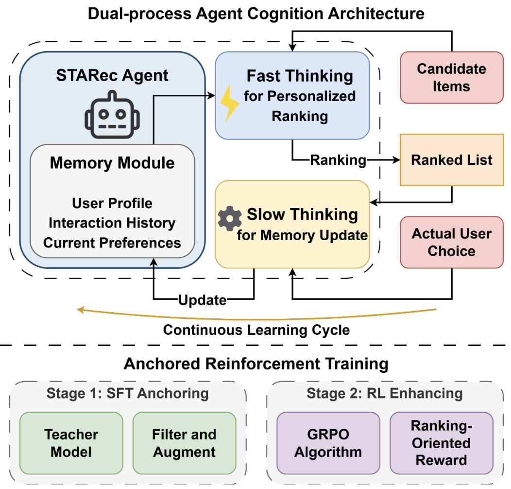
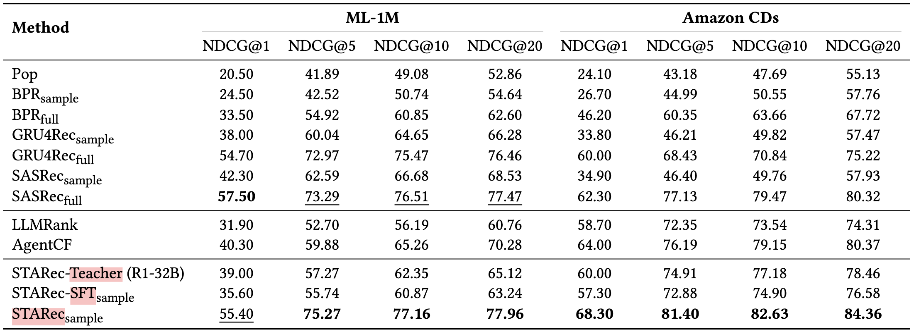
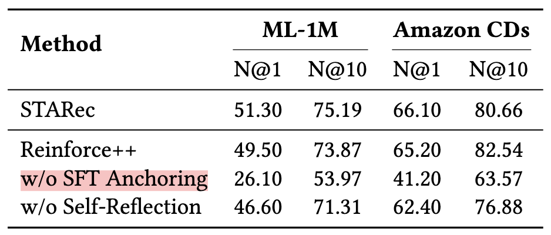
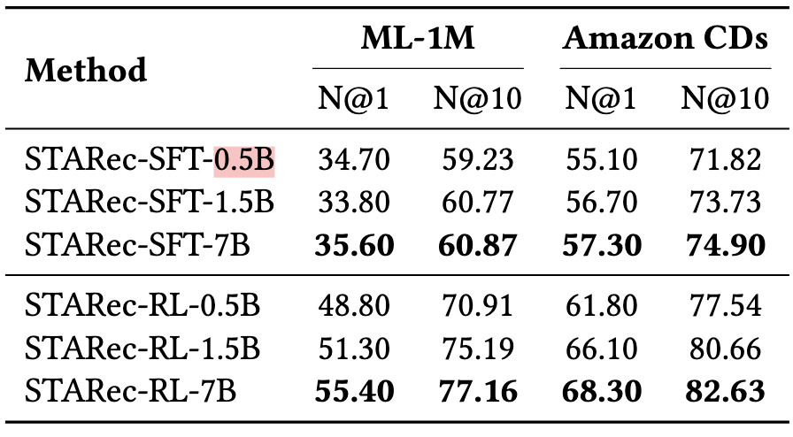
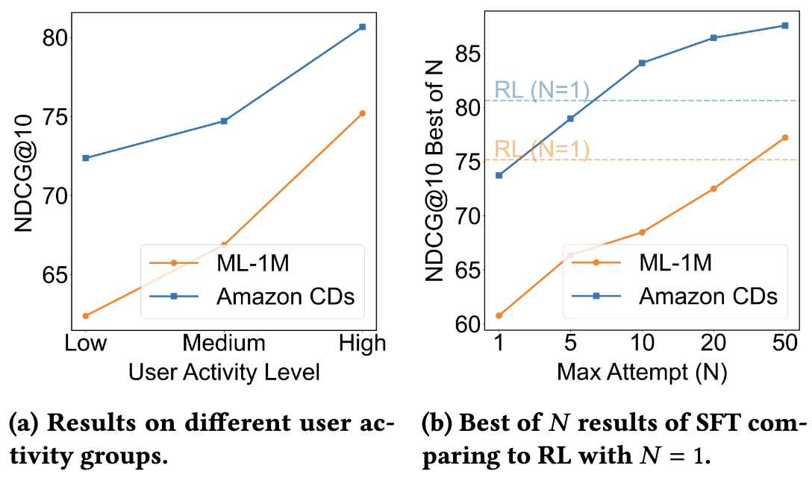

# 1. TL;DR
**What are they doing?**
The researchers created **STARec**, an efficient agent framework that transforms recommendation systems by giving them "autonomous deliberate reasoning". Instead of just matching patterns, each user is modeled as an agent with a "dual-process" brain: one for fast, intuitive ranking and one for slow, reflective reasoning.

**Why do we need it?**
Current AI recommenders are "System 1" thinkers which are reactive, prone to shallow biases, and struggle when data is sparse. They lack the "cognitive flexibility" to infer latent preferences or handle complex, conflicting user signals.

**How do they solve it?**
They use a **Dual-process Agent Cognition Architecture** where "Fast Thinking" handles personalized ranking while "Slow Thinking" performs self-reflection to update the user's preference memory. To train this, they developed **Anchored Reinforcement Training**, a two-stage process that first distills knowledge from a powerful "teacher" model (like DeepSeek-R1) and then uses Reinforcement Learning (GRPO) to align the agent's reasoning with actual user preferences.

**What are the results?**
It’s incredibly efficient. STARec achieves massive performance gains on MovieLens 1M and Amazon CDs benchmarks while using **only 0.4% of the full training data**. It also effectively solves the "cold-start" problem for infrequent users.

**Next steps?**
The authors plan to strengthen reasoning by integrating even more advanced teacher models and exploring multi-agent collaboration and hierarchical planning.

{: width="50%"}

<em>Figure 1: STARec framework.</em>

---

# 2. Research Questions
The paper aims to address several critical limitations in modern recommendation systems:
* **The Reasoning Gap:** How can we move beyond "fast-thinking" reactive models toward systems capable of human-like "slow reasoning"?
* **The Data Efficiency Challenge:** Is it possible to surpass state-of-the-art baselines while training on a tiny fraction (0.4%) of the data?
* **The Sparse Data Problem:** Can deliberate reasoning improve performance in "cold-start" scenarios where user interaction history is limited?

---

# 3. Approach
The core of the methodology is **Anchored Reinforcement Training (ART)**, which bridges the gap between general AI knowledge and specific recommendation needs.

## Stage 1: SFT Anchoring (The Foundation)
The agent begins with **Structured Knowledge Distillation**. A "teacher" model (DeepSeek-R1-32B) generates diverse reasoning samples, including ranking logic and Chain-of-Thought (CoT) rationales. The student model is fine-tuned using the SFT loss:
$$\mathcal{L}_{SFT}(\Phi)=\sum_{(x,y)\in\mathcal{Z}}\sum_{t=1}^{|y|}log(P_{\Phi},(y_{t}|x,y_{<t}))$$

## Stage 2: RL Enhancing (The Polishing)
To encourage flexible reasoning, the framework uses **Group Relative Policy Optimization (GRPO)**. This algorithm reduces memory consumption by avoiding a separate critic model.
$$\mathcal{J}_{GRPO}(\theta)=\mathbb{E}[q\sim P(Q),\{o_{i}\}_{i=1}^{G}\sim\pi_{\theta_{old}}(O|q)] \frac{1}{G}\sum_{i=1}^{G}\dots$$

**The Reward Modeling ($f(a|s)$):**
* **Ranking Reward:** Agents get +1.0 for a 1st place rank, +0.5 for 2nd–5th, and penalties for ranking the correct item poorly.
* **Memory Update Reward:** After updating a preference summary through "Slow Thinking," the agent is rewarded if that new summary leads to a better ranking in a follow-up task.

---

# 4. Results and Discussion
* **Superior Data Efficiency:** STARec outperformed traditional models like SASRec and BPR even when they were trained on 100% of the data, despite STARec only using 0.4%.

<em>Figure 2: Leaderboard on MovieLens and CDs recommendations with 1,000 test samples.</em>

* **STARec compomnents:** Removing either the SFT Anchoring stage or the LLM-driven Slow Thinking self-reflection mechanism causes clear performance degradation.

{: width="50%"}

<em>Figure 3: Ablation study on removing components in the STARec framework.</em>

* **Scaling Laws:** Performance consistently improves with model size (from 0.5B to 7B), but even the tiny 0.5B model retains about 88-97% of the 7B model's effectiveness.

{: width="50%"}

<em>Figure 4: Scaling laws for STARec.</em>

* **Robustness to Sparse Data:** While performance is best with high user activity, STARec remains remarkably resilient and accurate for "Low Activity" users.
* **Success Amplification:** Analysis suggests that RL's primary role is "success amplification"—sharpening the model's ability to select high-quality solutions it already "knows" from the SFT stage.

{: width="50%"}

<em>Figure 5: STARec-1.5B performance on (a) different user groups, and (b) different components (SFT & RL) with varying max attempt.</em>

---

# 5. Notes

**Strength**
* **Generalization.** By focusing on reasoning rationales (CoT), the model can "extrapolate" what a user might like even with very little data.
* **Interpretabilty.** The generated Chain-of-Thought rationales provide clear, human-readable support for why a recommendation was made.

**Weakness**
* Training Complexity.** The two-stage training process requires a high-quality "teacher" model to generate the initial anchoring data
