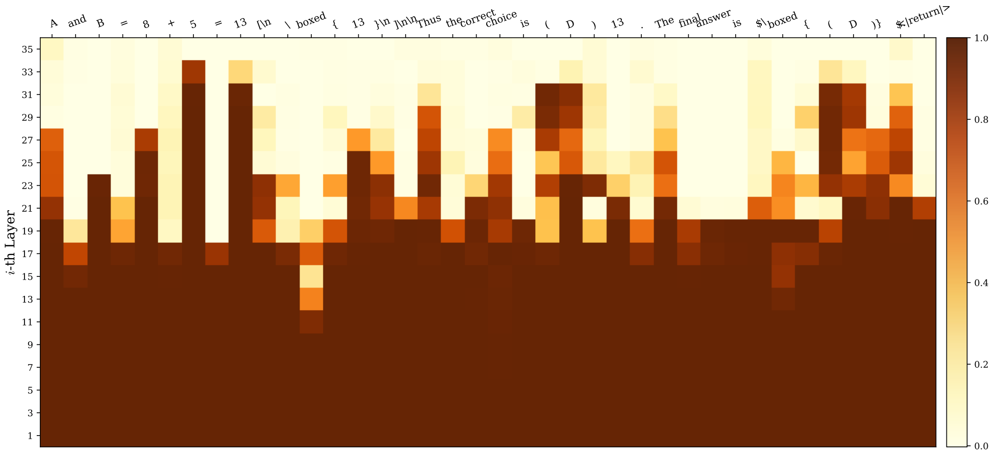
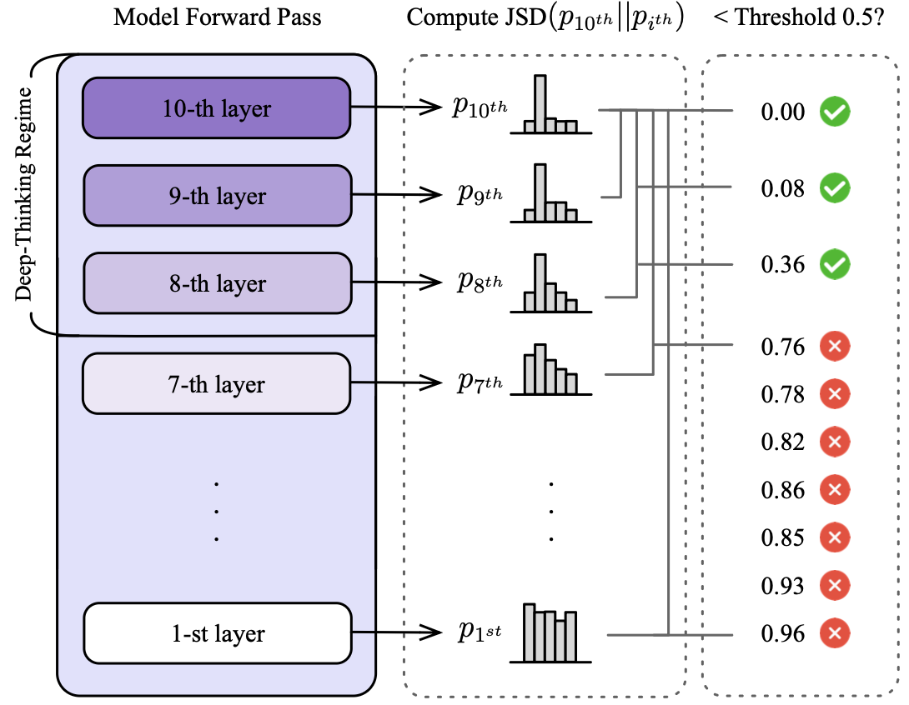
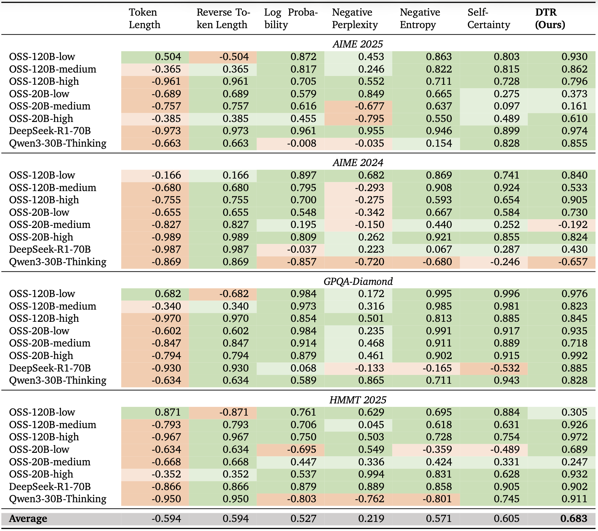
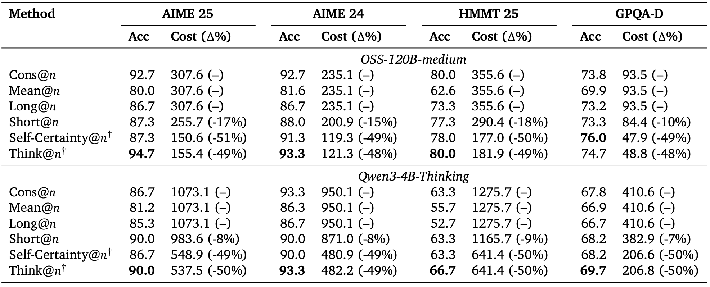

## 0. Overview

Token count is a poor proxy for LLM reasoning quality — longer outputs often signal *overthinking*, not better thinking. This paper proposes measuring reasoning effort by how deeply a model's internal token predictions are revised across transformer layers, and leverages this signal to build a more efficient test-time scaling strategy.

[video](https://youtu.be/iQjc_1rHNW0)

## 1. Background & Motivation

- **Field / Problem:** Test-time scaling for LLM reasoning — the practice of allocating more computation at inference to improve accuracy. The dominant proxy for this compute has been output token length (i.e., longer Chain-of-Thought = more effort = better answers).
- **Why it matters:** A growing body of evidence shows that token length is an unreliable and sometimes inversely correlated proxy for accuracy. Models can generate long, verbose reasoning traces that are wrong, while short, focused traces can be correct. Relying on length either wastes compute or actively misleads selection strategies. A principled, mechanistic measure of "how hard a model is thinking" is needed.

## 2. Related Work & Gaps

- **Prior approaches:** Chain-of-Thought (CoT) prompting and its extension to long reasoning traces (o1-style models, DeepSeek-R1, Qwen3) represent the dominant paradigm. Self-consistency (majority voting over multiple samples) is the standard parallel scaling strategy. Recent work on "overthinking" has noted inverse scaling between length and accuracy and proposed heuristics like preferring shorter chains.
- **Key limitations / gaps:** Existing alternatives to token count — confidence scores (log probability, entropy, perplexity) and brevity heuristics — are either inconsistent across models and tasks or purely post-hoc statistical adjustments. None of them is grounded in the model's internal computation. Prior interpretability work on layer-wise hidden states (the "logit lens") has not been connected to reasoning quality measurement.

## 3. Core Idea & Contributions

- **Main idea (intuition):** A token that the model "settles on" early — where the predicted token distribution converges to its final value in shallow layers — required little internal computation. A token whose distribution continues to shift until deep layers required more internal computation. The fraction of such *deep-thinking tokens* in a generated sequence is a direct measure of how hard the model worked on that sequence.
- **Claimed contributions:**
  1. **Deep-thinking ratio (DTR):** A new inference-time metric that measures reasoning effort by tracking depth-wise distributional stabilization of token predictions using Jensen–Shannon divergence (JSD) between intermediate and final layer outputs.
  2. **Empirical validation:** Across four hard benchmarks (AIME 24/25, HMMT 25, GPQA-Diamond) and eight model variants (GPT-OSS, DeepSeek-R1, Qwen3), DTR shows substantially stronger and more consistent positive correlation with accuracy (avg $r = 0.683$) than token count (avg $r = −0.594$) or confidence-based baselines.
  3. **Think@n:** A test-time scaling strategy that uses DTR estimated from short prefixes (as few as 50 tokens) to reject unpromising generations early, matching or exceeding standard self-consistency at approximately half the inference cost.
- **Evaluation preview:** Empirical correlation analysis across 32 model–benchmark combinations; direct accuracy vs. cost comparison against multiple aggregation baselines.

## 4. Method

### Deep-Thinking Tokens

The method builds on the "logit lens" insight: for a transformer with $L$ layers, one can project any intermediate hidden state $h_{t,l}$ into the vocabulary space using the model's final unembedding matrix $W_U$, yielding a probability distribution $p_{t,l}$ at each layer $l$ for each generation step $t$. The final-layer distribution $p_{t,L}$ is the one actually used for sampling.

(Figure: A heatmap showing JSD values across layers for each generated token in a GPQA answer. It vividly illustrates that functional words converge early while computed numerical values and answer tokens settle only in the deepest layers.)

The key observation is that some tokens "make up their mind" early — their $p_{t,l}$ converges to the final $p_{t,L}$ in shallow layers — while others undergo sustained revision deep into the network before settling. The former correspond to low-effort tokens (e.g., function words, templated phrases); the latter correspond to high-effort tokens (e.g., computed values, answer symbols).

To operationalize this, the authors measure the Jensen–Shannon divergence $D_{t,l} = \text{JSD}\left(p_{t,L} \,\middle\|\, p_{t,l}\right)$ between the intermediate and final distributions at each layer. A "settling depth" $c_t$ is defined as the first layer at which the running minimum of $D_{t,l}$ falls below a threshold $g$. A token is classified as a **deep-thinking token** if $c_t$ falls in the "late" portion of the network, defined by a depth fraction $ρ$ (e.g., the top 15% of layers for *ρ* = 0.85).

The **deep-thinking ratio (DTR)** for a full sequence is simply the proportion of its tokens that are deep-thinking tokens. Two hyperparameters govern the definition: settling threshold $g = 0.5$ and depth fraction $ρ = 0.85$, selected via ablation as the best-performing and most stable configuration.

(Figure: A step-by-step illustration of the deep-thinking token identification algorithm for a toy 10-layer model, showing which layers fail the JSD threshold and how the settling depth is determined.)

### Think@n

Given a pool of *n* sampled responses to a problem, Think@n estimates DTR from only the first $l_prefix$ tokens of each response (as few as 50 tokens suffice), ranks responses by DTR, retains the top $\eta$ = 50%, and performs majority voting over those selected responses. Early termination of low-DTR responses before full generation is what enables the ~50% compute savings.

## 5. Experimental Setup

- **Datasets / Benchmarks:** Four competition-level and graduate-level reasoning benchmarks: AIME 2024, AIME 2025, HMMT 2025 (all competition math), and GPQA-Diamond (graduate-level science multiple choice).
- **Models:** Eight variants across three families — GPT-OSS-20B and GPT-OSS-120B (low/medium/high reasoning levels), DeepSeek-R1-70B (distilled), and Qwen3-30B-Thinking.
- **Baselines:** Token count, reverse token count, log probability, negative perplexity, negative entropy, and Self-Certainty (KL divergence from uniform distribution).
- **Metrics:** Pearson correlation between per-bin accuracy and the inference-time measure; direct accuracy and inference cost (total tokens) for Think@n comparisons.

## 6. Results & Analysis

- **Main results:** DTR achieves the highest average Pearson correlation with accuracy ($r = 0.683$) across all 32 model–benchmark combinations. The next best baselines are Self-Certainty ($r = 0.605$) and negative entropy ($r = 0.571$). Token count achieves $r = −0.594$, confirming that longer outputs are systematically associated with *lower* accuracy. Only 2 of 32 DTR results are negative; confidence baselines have many more failure cases.

(Table: the full correlation matrix across all 8 models × 4 benchmarks × 7 measures, color-coded to show the consistency of DTR (green) vs. the inconsistency of baselines.)

- **Do results support claims?** Yes, strongly. The consistency of DTR's positive correlation across model families, scales, and reasoning levels is the paper's strongest empirical result.
- **Ablations / key insights:** The settling threshold $g$ is the more sensitive hyperparameter — a too-permissive threshold ($g = 0.25$) flattens the signal. The depth fraction $\rho$ affects the range of DTR values but leaves the positive slope intact across all tested values. The optimal setting ($g$, $\rho$) = (0.5, 0.85) is robust.
- **Surprising findings:** Higher reasoning level configurations of GPT-OSS produce *lower* DTR values despite achieving higher accuracy. The interpretation is that higher-level reasoning redistributes effort from per-token depth to sequence length: more forward passes, but each individual token requires less layer-wise revision. This is a genuinely counter-intuitive result and raises questions about the comparability of DTR across model modes.

For Think@n, using only 50 prefix tokens to estimate DTR not only matches but slightly outperforms DTR estimated over the full sequence on AIME 2025 (94.7% vs. 94.0%), while halving cost relative to Cons@n (155k vs. 307k tokens).

(Table: Comparison of Think@n against Cons@n, Mean@n, Long@n, Short@n, and Self-Certainty@n on all four benchmarks for two model families, showing accuracy and inference cost simultaneously.)

## 7. Discussion & Implications

- **When / why does this work?** DTR works because it taps into a property of transformer computation that is genuinely predictive of correctness: when a model is truly working out an answer, its intermediate layer representations continue to shift toward the final prediction deep into the network. The signal is mechanistically grounded, not a surface statistical regularity.
- **Potential applications:** Test-time compute budgeting (prioritize problems/samples with high DTR), training signal for reward modeling (reward deep thinking, not verbosity), interpretability (identifying which tokens in a CoT are "load-bearing"), and efficient inference systems that can abort low-DTR generations early.
- **Broader significance:** The paper reframes what it means to scale test-time compute: the goal should be to induce *deeper* per-token computation, not simply *longer* sequences. This has implications for how reasoning models are trained and evaluated.

## 8. Limitations & Open Questions

- **Authors' stated limitations:** DTR requires access to intermediate hidden states, meaning it is not applicable to black-box API models (e.g., commercial Claude, GPT-4o as deployed). The paper also acknowledges that DTR may not be directly comparable across models or reasoning modes, since different configurations trade depth for length differently.
- **Critique:**
  - The analysis is correlational. The paper shows that high-DTR samples tend to be more accurate, but does not establish that inducing higher DTR (e.g., via prompting or training) would *cause* accuracy improvements. High DTR might be a symptom of harder problems being solved correctly, not a lever one can pull.
  - The counter-intuitive finding that higher reasoning levels produce *lower* DTR is underexplored. If DTR decreases as model capability increases (within the same model), its utility as a universal measure of "effort" becomes harder to interpret.
  - Evaluation is limited to math and science benchmarks with clear right/wrong answers. It is unclear whether DTR generalizes to open-ended generation, coding, or tasks without a single correct answer.
  - There is no analysis of computational overhead. Computing JSD across all intermediate layers for every token is not free — the paper should quantify this cost relative to the savings from early stopping.
- **Future directions:** Training models to maximize DTR for correct solutions (rather than rewarding length); extending DTR to open-ended tasks; investigating whether DTR can serve as a reward signal or process supervision proxy; theoretical analysis of why late-settling tokens correlate with correctness.

## 9. Key Takeaways

1. **Token length is a misleading proxy for reasoning effort.** Across a wide range of models and benchmarks, longer outputs are negatively correlated with accuracy — the opposite of what the "more compute = better" intuition predicts. Measuring *how deeply* the model processes each token is a far more reliable signal.
2. **Deep-thinking ratio (DTR) provides a mechanistically grounded, model-agnostic measure of inference effort** that consistently outperforms confidence-based and length-based alternatives, requiring no task-specific heuristics or external annotations — only access to intermediate hidden states.
3. **DTR enables efficient test-time scaling:** Think@n uses just 50 prefix tokens to identify and discard low-quality generations early, matching or exceeding self-consistency accuracy at roughly half the inference cost — a practically significant result for deploying reasoning models at scale.