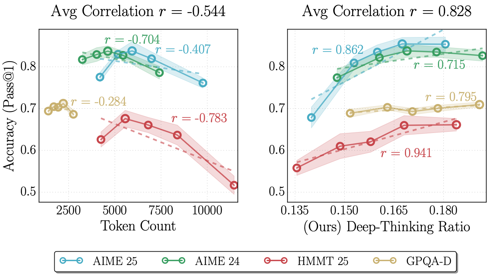
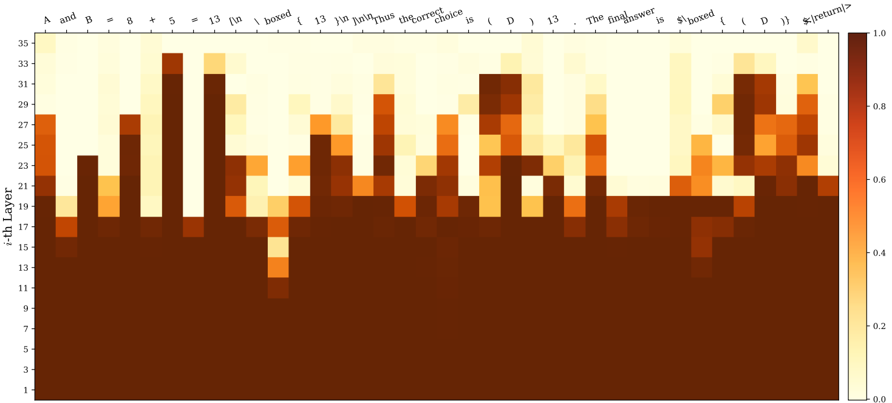
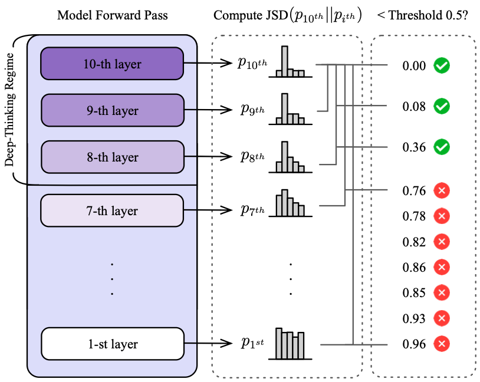
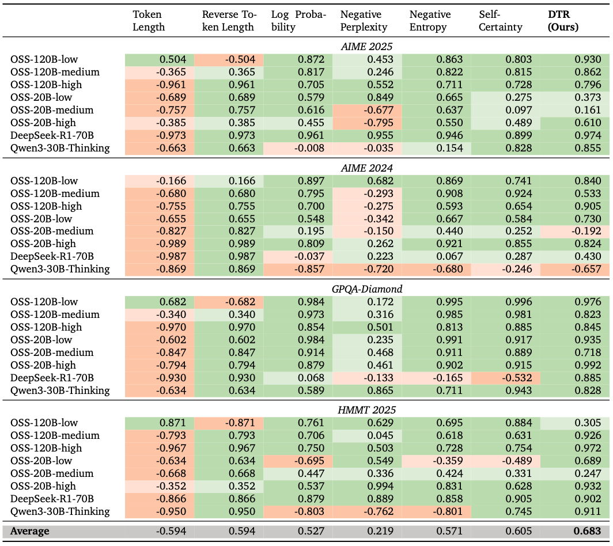
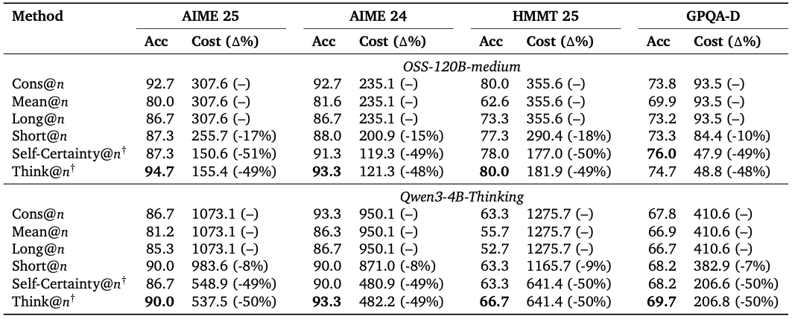
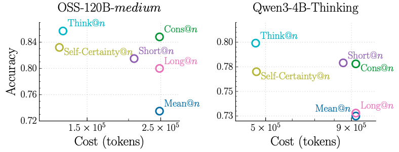

# TL;DR

**What are they doing?** This paper introduces **deep-thinking ratio (DTR)**, a token-level measure of inference-time reasoning effort in LLMs. Instead of using output length as a proxy for reasoning quality, DTR identifies tokens whose internal predictive distributions undergo sustained revision across model layers before converging — treating depth-wise stabilization as a signal of genuine computation. The authors also introduce **Think@n**, a test-time scaling strategy that leverages DTR to preferentially select high-quality generations from a pool of parallel samples.

**Why do we need it?** Token count is not only a noisy proxy for reasoning quality — it is often *negatively* correlated with accuracy, reflecting "overthinking" where longer traces amplify errors or redundant deliberation. Confidence-based alternatives (log probability, entropy, self-certainty) capture some signal but behave inconsistently across models and benchmarks. There is no existing measure that reliably distinguishes computationally effortful, high-quality reasoning from verbose but misguided generation.

**How do they solve it?** DTR is computed by projecting each token's intermediate-layer hidden states into vocabulary space using the model's unembedding matrix, then measuring Jensen-Shannon divergence (JSD) between each layer's predictive distribution and the final-layer distribution. A token is classified as a **deep-thinking token** if its distribution does not converge, fall below JSD threshold $g$, until it reaches the late-settling regime, depth fraction $\rho$,. DTR is the proportion of such tokens in a generated sequence. Think@n then draws $n$ parallel samples, estimates each sample's DTR from a short 50-token prefix, and performs majority voting over the top-$\eta$% of samples ranked by DTR — enabling early rejection of unpromising generations before full decoding completes.

**What are the results?** DTR achieves an average Pearson correlation of $r = 0.683$ with task accuracy across 32 model-benchmark combinations, compared to $r = -0.594$ for token count and $r = 0.605$ for the best confidence baseline (self-certainty). Think@n matches or exceeds standard self-consistency (Cons@n) accuracy on four benchmarks (AIME 24/25, HMMT 25, GPQA-Diamond) while reducing inference cost by approximately 50%.

**Next steps?** The authors identify shifting focus from generating longer chains of thought to inducing deeper per-token computation, developing methods for training models that allocate depth-wise effort more effectively, and extending DTR to broader task domains beyond mathematical and scientific reasoning.

(Figure 1: The key motivating result: accuracy vs. token count shows a negative average correlation ($r = -0.544$) across benchmarks and models, while accuracy vs. DTR shows a strong positive average correlation ($r = 0.828$).)

---

# Motivation & Research Questions

The paper is motivated by a concrete tension in the test-time scaling literature: longer Chain-of-Thought (CoT) reasoning has been widely treated as synonymous with more computation and better performance, but a growing body of empirical work shows this assumption breaks down. Inverted-U relationships between length and accuracy, inverse scaling regimes, and "overthinking" phenomena — where models fixate on irrelevant details or amplify flawed heuristics — suggest that token count is measuring verbosity, not thinking effort. Attempts to address this with confidence-based signals face a different limitation: confidence scores conflate model calibration with reasoning quality, and their correlation with accuracy is highly inconsistent across model families.

The paper proposes that the right unit of analysis is not the surface-level output sequence but the *internal* computational trajectory of individual tokens through model layers. The observation motivating this shift is well-supported by prior work on early exiting and the logit lens: intermediate-layer hidden states, when projected through the unembedding matrix, yield meaningful predictive distributions that converge toward the final-layer distribution as depth increases. Tokens that settle early require less "thinking"; tokens that continue to shift deep into the network reflect genuine uncertainty resolution.

The specific research questions the paper addresses are:

- Can depth-wise distributional stabilization of token predictions reliably measure inference-time thinking effort, outperforming length and confidence baselines?
- Is DTR stable across different model families, scales, and benchmarks?
- Can DTR be used to select high-quality samples in a parallel sampling framework without requiring full decoding?
- Is DTR robust to the choice of hyperparameters (settling threshold $g$, depth fraction $\rho$)?

---

# Approach

## Deep-Thinking Ratio (DTR)

For an autoregressive LM $f_\theta$ with $L$ layers, hidden dimension $d$, and vocabulary $V$, the hidden state at generation step $t$ and layer $l$ is $h_{t,l} \in \mathbb{R}^d$. The intermediate-layer predictive distribution is obtained by applying the model's unembedding matrix $W_U$ directly to this hidden state:

$$p_{t,l} = \text{softmax}(W_U h_{t,l})$$

The final-layer distribution is $p_{t,L}$. The degree of distributional divergence at each layer is measured using Jensen-Shannon divergence:

$$D_{t,l} := \text{JSD}(p_{t,L} \| p_{t,l}) = H\!\left(\frac{p_{t,L} + p_{t,l}}{2}\right) - \frac{1}{2}H(p_{t,L}) - \frac{1}{2}H(p_{t,l})$$

To enforce a strict notion of settling, the minimum divergence up to layer $l$ is tracked:

$$\bar{D}_{t,l} = \min_{j \leq l} D_{t,j}$$

The **settling depth** $c_t$ is defined as the first layer at which $\bar{D}_{t,l}$ falls below a threshold $g$:

$$c_t = \min\{l : \bar{D}_{t,l} \leq g\}$$

A **deep-thinking token** is one whose settling depth falls within the late-settling regime $\mathcal{L}_\text{deep-thinking} = \{l : l \geq \lceil \rho \times L \rceil\}$ for depth fraction $\rho \in (0,1)$. For a generated sequence $S$ of length $T$:

$$\text{DTR}(S) = \frac{1}{T} \sum_{t=1}^{T} \mathbf{1}[c_t \in \mathcal{L}_\text{deep-thinking}]$$

The paper motivates this formulation with a qualitative observation: functional and templated tokens (e.g., "and," "is," formatting tokens) tend to converge at shallow layers, while semantically loaded completions — answer tokens, numerical results, operator completions — remain unsettled deep into the network. Correct solutions are characterized by a higher proportion of such deeply-settled tokens.

(Figure 2: A heatmap of JSD values across all layers for a GPQA answer sequence illustrates the key intuition: functional words converge early (light cells), while answer tokens like "13" and "(D)" remain high-JSD until the deepest layers.)

(Figure 3:  n illustration of the DTR algorithm showing how JSD values are tracked layer-by-layer for a 10-layer model, and how a token is classified as deep-thinking when its settling depth $c_t$ falls in the late regime.)

The authors conduct a sensitivity analysis over $g \in \{0.25, 0.5, 0.75\}$ and $\rho \in \{0.80, 0.85, 0.90, 0.95\}$. The settling threshold $g$ has the stronger effect: a permissive $g = 0.25$ yields much weaker correlations by including low-effort tokens, while $g = 0.5$ provides the most robust positive signal. Varying $\rho$ shifts the distribution of DTR values but preserves positive monotonic trends across all tested settings. The configuration $(g, \rho) = (0.5, 0.85)$ is selected as the default. JSD is preferred over KL divergence (which becomes numerically unstable for early-layer flat distributions) and cosine similarity (which operates in representation space rather than prediction space and achieves much lower correlations).

## Think@n

Think@n is a parallel test-time scaling strategy built on DTR. For $n$ independently sampled responses per problem, DTR is estimated from only the first $\ell_\text{prefix} = 50$ tokens of each generation. Samples are ranked by DTR, and the top $\eta = 50\%$ are selected for majority voting. Unpromising samples are rejected early, before full decoding completes.

The 50-token prefix choice is non-trivial: the paper shows (Table 3) that using 50 tokens for DTR estimation actually *outperforms* using longer prefixes (100, 500, 1000, 2000 tokens) and matches using the full sequence, while providing significant cost savings. The authors attribute this to the fact that short prefixes already capture the model's depth-wise computation patterns before verbosity-related confounds accumulate.

---

# Experimental Setup

**Models.** Eight variants from three model families are evaluated: GPT-OSS-20B and GPT-OSS-120B (each at low, medium, and high reasoning levels), DeepSeek-R1-70B (distilled from Llama-3.3-70B-Instruct), and Qwen3-30B-Thinking. These span multiple parameter scales and are selected specifically for their strong long CoT capabilities.

**Benchmarks.** Four reasoning-intensive benchmarks are used: AIME 2024, AIME 2025, and HMMT 2025 (competition-level mathematics) and GPQA-Diamond (graduate-level scientific questions). All four are widely used in recent evaluations and represent settings where test-time compute scaling plays a central role.

**Evaluation protocol for DTR correlation.** Models generate 25 responses per question with no externally imposed token budget — models allocate computation naturally. Responses are partitioned into 5 quantile bins by DTR value and Pearson correlation between bin-average DTR and bin-average accuracy is computed. The reported statistics are averaged over 30 random seeds. The settling threshold $g = 0.5$ and depth fraction $\rho = 0.85$ are held fixed across all main experiments.

**Baselines.** DTR is compared against: (1) token count, (2) reverse token count (negated length, accounting for the frequently observed inverse scaling relationship), (3) log probability (average token log-likelihood), (4) negative perplexity, (5) negative entropy (average entropy of the final-layer output distribution), and (6) self-certainty (average KL divergence from the uniform distribution).

**Evaluation protocol for Think@n.** The Best-of-$n$ protocol samples $n = 48$ responses per problem. The aggregation methods compared are: Cons@n (standard self-consistency / majority voting), Mean@n (average accuracy with no selection), Long@n and Short@n (majority voting over longest/shortest $\eta = 50\%$ of samples), Self-Certainty@n (majority voting over highest self-certainty samples, using $\ell_\text{prefix} = 50$), and Think@n. Results are averaged over 10 trials.

---

# Results & Discussion

## DTR Correlation with Accuracy

(Table 1: Pearson correlations between task accuracy and seven inference-time measures across 32 model-benchmark combinations. Token count averages $r = -0.594$; reverse token count averages $r = 0.594$ (identical magnitude by construction); confidence baselines (log probability, negative perplexity, negative entropy, self-certainty) range from $r = 0.219$ to $r = 0.605$. DTR achieves $r = 0.683$ average, with the fewest negative-correlation instances (2 out of 32) of any measure.)

The headline result confirms the central hypothesis: DTR is a better proxy for reasoning quality than any surface-level or confidence-based measure. Token count is not just noisy — it is systematically misleading, with negative correlation in the majority of settings. The reverse token count baseline reveals this is not an artifact of the direction of the correlation: shorter responses are often better, but "shortest = best" is a heuristic, not a principled signal of computation.

Confidence-based measures perform better than length but are inconsistent across models and benchmarks. Self-certainty achieves the highest mean among confidence baselines ($r = 0.605$) but shows high variance — including several strongly negative correlations for specific model-task combinations. DTR maintains positive correlation in 30 of 32 configurations tested, indicating it captures a more task-agnostic and model-agnostic signal of reasoning effort.

An interesting secondary finding involves the interaction between reasoning level and DTR magnitude (Appendix B). For GPT-OSS models, higher reasoning levels yield lower DTR values despite better accuracy. The explanation offered is that higher reasoning levels trade depth-per-token for sequence length — redistributing computation from within-token layer revision to across-token generation. This suggests DTR is not directly comparable across model modes, and motivates treating it as a within-distribution rather than cross-mode ranking signal.

## Think@n Performance

(Table 2: Accuracy and inference cost (in thousands of tokens) for six aggregation methods across four benchmarks, for OSS-120B-medium and Qwen3-4B-Thinking. Think@n achieves the best accuracy on 7 of 8 benchmark-model combinations and reduces inference cost by approximately 49–50% relative to Cons@n.)

Think@n consistently matches or exceeds Cons@n accuracy at half the inference cost. The Pareto-dominant trade-off is most clearly visible in Figure 5, where Think@n sits above and to the left of all competing methods in the accuracy-cost plane. Self-Certainty@n achieves similar cost reduction but underperforms Think@n on three of four benchmarks, confirming that DTR provides a higher-quality selection signal.

The finding that a 50-token prefix DTR estimate is *more informative* than longer prefixes (Table 3) is particularly striking. It suggests that the signal captured by DTR is present from the earliest tokens of a generation, before compounding errors or verbosity patterns can obscure it. This has practical value for early-rejection pipelines in production settings.

(Figure 4: Accuracy vs. inference cost (tokens) for all aggregation methods, averaged across four datasets. Think@n achieves the best overall Pareto frontier.)

---

# Notes

## Strengths

**S1. The DTR measure is mechanistically grounded, not empirically tuned.**
Unlike confidence-based heuristics calibrated to observed accuracy trends, DTR is derived from a principled hypothesis about what computational effort looks like inside a transformer: tokens requiring extended depth-wise revision reflect more genuine deliberation. This grounding in the model's internal mechanics — specifically the logit lens literature — means the measure is theoretically coherent rather than post-hoc. The qualitative heatmap evidence (Figure 2) directly validates the intuition at the token level before any quantitative claim is made.

**S2. The evaluation is unusually rigorous for an inference-quality metric paper.**
The paper tests DTR across 32 model-benchmark combinations covering three model families and four benchmarks, compares it against six distinct baselines, averages over 30 seeds, and provides hyperparameter sensitivity analysis. This scope is substantially broader than typical single-model ablations. The consistent positive correlation pattern across model families with different training regimes (GPT-OSS, DeepSeek-R1, Qwen3) significantly strengthens the generalizability claim.

**S3. Think@n's 50-token prefix result is both practically important and theoretically surprising.**
The finding that DTR computed from 50 tokens predicts final generation quality better than DTR computed from full sequences is counterintuitive but reproducible (Table 3). If confirmed more broadly, this suggests the model's depth-wise computation patterns lock in early and are not meaningfully affected by the rest of the sequence — a potentially important fact about how long CoT models process prompts internally.

**S4. The JSD choice is well-justified over alternatives.**
The comparison against KL divergence and cosine similarity (Appendix A) directly demonstrates that the choice of distance metric matters. KL divergence's asymmetric behavior and numerical instability for high-entropy early-layer distributions produces negative correlations on some benchmarks. Cosine similarity operating in representation space rather than prediction space misses distributional information. This due diligence strengthens confidence in the final metric design.

## Weaknesses

**W1. The benchmark scope is limited to math and science competition problems.**
All four benchmarks — AIME 2024, AIME 2025, HMMT 2025, and GPQA-Diamond — require formal, convergent reasoning toward a single correct numerical or multiple-choice answer. This is a favorable setting for DTR: the notion of "deliberation" over a token is well-aligned with multi-step algebraic manipulation. It is not clear that DTR carries the same signal in open-ended generation, instruction-following, code generation, or tasks where the quality of reasoning is more diffuse. The paper's claim that "measuring how models think internally" is a general principle is not substantiated by results in these other domains.

**W2. DTR is not directly comparable across model modes and must be interpreted with care.**
The reasoning-level analysis (Appendix B) shows that higher reasoning levels produce lower DTR values despite better accuracy, because the depth-per-token computation is traded for more tokens. This means DTR cannot be used to compare reasoning quality across different model configurations — only to rank samples from the same model under the same decoding settings. The paper acknowledges this caveat, but it limits the measure's utility in settings where the goal is cross-model evaluation or quality control across diverse generation conditions.

**W3. The inference overhead of computing DTR is not quantified.**
DTR requires storing and projecting all intermediate-layer hidden states for every generated token — an $O(L \times T)$ operation per sequence, where $L$ is the number of layers and $T$ is the sequence length. For 120B models with 35+ layers, this is non-trivial memory and computation overhead. The paper reports that Think@n reduces token generation cost by ~50%, but does not report wall-clock latency, memory requirements, or the computational overhead of running the DTR pass itself. For practitioners evaluating whether Think@n is deployable, this missing analysis is a significant gap.

**W4. The paper conflates correlation with reliability in the Think@n evaluation.**
The main DTR correlation results (Table 1) measure association between DTR and accuracy at the *population level* (across binned samples). The Think@n results (Table 2) measure whether selecting high-DTR samples improves majority voting accuracy. These are related but distinct claims. A high population-level correlation does not guarantee that individual high-DTR samples are reliably correct — only that the distribution of high-DTR samples is more accurate on average. The mechanism by which Think@n improves over Cons@n (does it preferentially include diverse correct answers, or exclude verbose wrong answers?) is not analyzed.

**W5. The handling of edge cases in DTR computation is underspecified.**
The algorithm classifies a token as deep-thinking based on when its running minimum JSD first falls below threshold $g$. But it is not discussed how the measure behaves for tokens where the JSD trajectory is non-monotonic (rises and falls across layers), for very short sequences, or at the boundary between the CoT trace and the final answer. The qualitative example (Tables 7-8) shows DTR values of 13.9% (incorrect, 27,724 tokens) vs. 19.0% (correct, 3,725 tokens), which is consistent with the hypothesis, but a systematic analysis of the distribution of DTR across response types would be informative.

## Open Questions

- Does DTR generalize to non-mathematical tasks where "thinking effort" does not reduce to numerical convergence — for example, creative writing, dialogue, or multi-document reasoning?
- Can DTR be used to *train* models to distribute computation more effectively — for instance, as a regularization objective that penalizes shallow settling on tokens that downstream results show should require more deliberation?
- What is the computational overhead of DTR in practice, and can it be approximated by probing only a subset of layers (e.g., every 4th layer) without significant accuracy loss?
- Does the relationship between DTR and reasoning level hold across model families other than GPT-OSS, or is the depth-versus-length tradeoff architecture-specific?
- Can the 50-token prefix finding be systematically characterized — which types of tokens in the first 50 are most predictive of overall generation DTR, and does this connect to known phenomena in prompt sensitivity?
- How does Think@n perform as $n$ grows large — does it converge to a ceiling, and does it continue to outperform Cons@n in the large-$n$ regime?

---

# Key Takeaways & Broader Implications

1. **Length is not compute, and compute is not quality.** The consistent negative correlation between token count and accuracy across model families is not a quirk of a specific model or benchmark — it is a structural feature of the current CoT paradigm. Papers that use token count as a proxy for inference effort are measuring something unreliable. DTR provides a mechanistically motivated alternative that looks inside the model rather than at its output surface.

2. **The logit lens is more than an interpretability tool.** This paper demonstrates that projecting intermediate-layer hidden states into vocabulary space via the unembedding matrix — a technique from mechanistic interpretability — has direct utility for production-level quality estimation. The fact that this produces a useful signal without any task-specific calibration suggests it captures something structurally general about how transformers process information.

3. **Early prefix information is surprisingly predictive.** The 50-token prefix result for Think@n implies that the model's computation pattern for the eventual full response is partially determined before most of the response is generated. This connects to broader findings about prompt sensitivity and early-layer commitment in transformer inference, and suggests that early stopping criteria should focus on depth-wise signals rather than length.

4. **Think@n establishes a new Pareto frontier for parallel inference scaling.** Standard self-consistency (majority voting over $n$ full generations) is the dominant baseline for test-time scaling. Think@n achieves comparable or better accuracy at half the token cost by early-rejecting samples that exhibit shallow per-token computation. This is a practically deployable improvement for any application using repeated sampling — no model modifications or training changes are required.

5. **The depth-versus-length tradeoff in reasoning-level models opens a new research question.** The observation that higher reasoning levels shift computation from depth-per-token to sequence-length is a mechanistic finding with implications for how reasoning models should be designed and evaluated. If different reasoning modes exploit different computational resources, then a single metric — whether DTR or token count — may always be insufficient; a two-dimensional characterization of depth-wise and sequence-level effort may be needed.