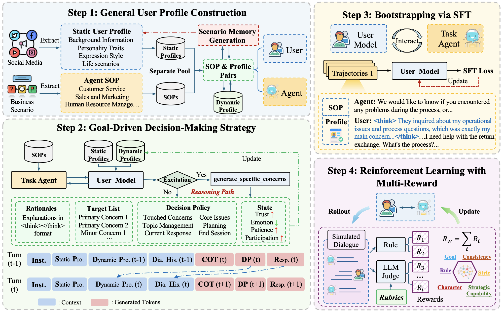
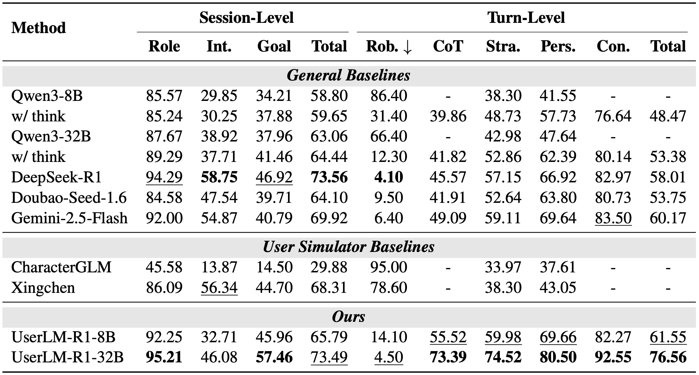

## 0. Overview

Current user simulators for agent post-training fail to generalize across domains and are easily manipulated by task agents. UserLM-R1 fixes this by equipping user simulators with explicit chain-of-thought reasoning and multi-reward RL, enabling strategic, manipulation-resistant user behavior across diverse real-world scenarios.

## 1. Background & Motivation

- **Field / Problem:** User simulation for LLM agent post-training — building scalable, human-like user models that can serve as interactive environments for training and evaluating task-oriented dialogue agents (e.g., sales bots, hiring assistants).
- **Why it matters:** The quality of a user simulator directly determines the quality of the task agents trained against it. A simulator that is easily manipulated or domain-specific produces agents that fail to handle real users. As RL-based agent post-training becomes standard, having a robust, generalizable user simulator is a practical bottleneck — not just an academic one.

## 2. Related Work & Gaps

- **Prior approaches:**
  - *Role-driven simulators* (CharacterGLM, RoleLLM, Beyond Dialogue) maintain a fixed persona and focus on persona consistency, primarily for entertainment.
  - *Goal-driven simulators* (DAUS, UGST) append task objectives to prompts and fine-tune on real dialogue examples to achieve specific conversational goals.
  - *General LLMs as simulators* (GPT-4o, Gemini, DeepSeek-R1) are increasingly used as drop-in simulators via prompting.
- **Key limitations / gaps:**
  - All prior methods rely on static, manually designed profiles that must be re-engineered for each new domain, severely limiting generalizability.
  - None model the *strategic reasoning process* a real human undergoes before responding — they map context directly to output without explicit deliberation. This makes them vulnerable to agent manipulation tactics like false urgency, authority appeals, and sunk cost framing.
  - Evaluation has focused on user-initiated scenarios and neglected adversarial, agent-manipulative settings.

## 3. Core Idea & Contributions

- **Main idea (intuition):** Give the user simulator the ability to *think before it speaks* — by generating an explicit chain-of-thought that tracks goals, emotional states, and conversational traps before producing each response — and then strengthen that reasoning with targeted RL rewards.
- **Claimed contributions:**
  1. UserLM-R1, the first user simulator with an explicit reasoning process that covers decision trajectories and state changes prior to response generation.
  2. A generalizable user profile framework decoupling static persona attributes (background, MBTI, expression style) from dynamic, scenario-specific goals and state transitions, derived from social media and real business SOPs.
  3. A multi-reward RL training pipeline (combining rule-based format rewards and rubric-based quality rewards via GRPO) that improves strategic capability and generalization beyond the SFT training distribution.
- **Evaluation preview:** Evaluated on session-level (120 full dialogues) and turn-level (220 adversarial samples with 11 trap types) benchmarks; also validated downstream on RL agent training for retail and hiring scenarios.

## 4. Method

The method has four components, applied in sequence.

### Component 1 — General User Profile Construction

The authors decouple each user profile into two parts:

- **Static profile $\bm{p}^s$**: stable background attributes including name, age, MBTI personality, expression style (speech rate, verbosity, patience, typical phrases), and life scenarios. These are derived by prompting GPT-4o to enrich 90k user preference records from AlignX — a dataset extracted from Chinese social media (Reddit-style) — into structured profiles across 12+ demographic dimensions.
- **Dynamic profile $\bm{p}^d$**: scenario-specific state that evolves turn-by-turn. At conversation start it is generated from the task agent's standard operating procedure (SOP); during the conversation it tracks scenario memory, a target list (primary and secondary concerns), a decision policy, and four affective state values: trust, emotion, patience, and participation.

This split is the key to generalizability: the static profile transfers across all scenarios while the dynamic profile adapts to each agent SOP on demand.

(Figure: Overview of the UserLM-R1 pipeline showing the three-stage training process — profile construction, goal-driven SFT, and multi-reward RL — and how static and dynamic profiles feed into the reasoning process at each dialogue turn.)

### Component 2 — Goal-Driven Decision-Making Strategy

At each dialogue turn $j$, the standard formulation directly maps profiles and context to a response:

$$\bm{u}_{ij} = \pi_\theta(\bm{p}_i, \bm{c}_{ij})$$

UserLM-R1 instead inserts an explicit reasoning step before the response. The reasoning chain $\bm{r}_{ij}$ is decomposed into five sub-tasks:
1. *Recognize agent intent* — what is the agent trying to accomplish or exploit?
2. *Organize user concerns* — which primary/secondary concerns are currently active?
3. *Plan next action* — what strategy should the user adopt?
4. *Update state values* — how do trust, emotion, patience, and participation change given the agent's turn?
5. *Refine response tone* — adjust language to match the user's current emotional and stylistic profile.

This explicit structure is wrapped in `<think></think>` / `<answer></answer>` tags.

### Component 3 — Bootstrapping via Supervised Fine-Tuning

The model is fine-tuned to jointly predict the reasoning trace and response:

$$\min_{\pi_\theta} \sum_{i,j} -\log \pi_\theta(\bm{r}_{ij}, \bm{u}_{ij} \mid I, \bm{p}_i^s, \bm{p}_{ij}^d, \bm{c}_{ij})$$

Training conversations are generated by running the goal-driven strategy with a strong teacher model, producing explicit reasoning traces as supervision signal. The SFT stage instills baseline reasoning capability and behavioral fidelity.

### Component 4 — Multi-Reward Reinforcement Learning

SFT is bounded by its training distribution; RL allows the model to explore more diverse and strategically coherent reasoning trajectories. The authors use GRPO with two reward classes:

- **Rule-based rewards $R_\text{rule}$**: Format compliance (correct `<think>`/`<answer>` tags), minimum reasoning length, and presence of required dynamic profile fields in the response.
- **Rubric-based rewards $R_\text{rubric}$**: Four LLM-judged criteria averaged:
  1. *Response consistency* — fidelity to character profile, stylistic coherence, oral naturalness.
  2. *Reasoning quality* — goal management precision, state transition validity, depth of multi-step reasoning; penalizes template-based redundancy.
  3. *Alignment* — whether the actual response faithfully executes the strategy outlined in the chain-of-thought.
  4. *Strategic capability* — trap identification accuracy, state alignment, and proactive counter-argumentation (i.e., going on offense, not just defense).

## 5. Experimental Setup

- **Datasets / Benchmarks:**
  - *Profiles*: 90k user profiles from AlignX (social media preference data).
  - *SOPs*: 450 task SOPs covering 6 real business voice-agent scenario types (expanded from 30 originals from VoiceAgentEval).
  - *Session-level test set*: 120 full dialogue tasks.
  - *Adversarial turn-level test set*: 220 samples across 11 manipulation trap types (false urgency, obfuscated costs, sunk cost, identity misinformation, authority appeals, etc.).
- **Baselines:**
  - *General LLMs*: Qwen3-8B, Qwen3-32B (with and without chain-of-thought), DeepSeek-R1, Doubao-Seed-1.6, Gemini-2.5-Flash.
  - *User simulator specialists*: CharacterGLM, Tongyi Xingchen.
- **Metrics:**
  - *Session-level*: Role authenticity (Role), Interaction performance (Int.), Goal progress (Goal).
  - *Turn-level adversarial*: Robotic tone (Rob. ↓), CoT effectiveness (CoT), Game-theoretic strategy (Stra.), Persona fidelity (Pers.), Thought-response consistency (Con.).
  - All LLM-judged metrics use GPT-4o as evaluator; human evaluation uses 3 annotators with Cohen's kappa reported.

## 6. Results & Analysis

- **Main results:** UserLM-R1-32B is the strongest model across most metrics. On the session-level Goal progress metric it outperforms all baselines including commercial frontier models. On turn-level adversarial evaluation, UserLM-R1-32B scores 76.56 total (CoT: 73.39, Stra: 74.52, Pers: 80.50, Con: 92.55), substantially outperforming the next best Gemini-2.5-Flash (60.17) and DeepSeek-R1 (58.01). The 8B variant (UserLM-R1-8B) also delivers competitive performance, validating scalability.

(Table: Session-level and turn-level results comparing UserLM-R1-8B and UserLM-R1-32B against general LLM baselines (Qwen3, DeepSeek-R1, Gemini-2.5-Flash, Doubao-Seed-1.6) and role-play specialist baselines (CharacterGLM, Xingchen). Metrics include Role, Int., Goal, Total at session level and Rob., CoT, Stra., Pers., Con., Total at turn level.)

- **Do results support claims?** Yes, strongly. The session-level and turn-level benchmarks directly probe the two claimed improvements (generalizability and strategic resistance), and the downstream agent training experiment provides real-world validation.
- **Ablations / key insights:** The ablation in Table 2 builds up incrementally: vanilla reasoning (+think) → goal-driven strategy → SFT → RL. Each stage contributes, but the goal-driven strategy delivers the largest single jump — confirming that *structured reasoning decomposition*, not just any chain-of-thought, is the key driver. RL contributes meaningfully on top of SFT, particularly on the adversarial turn-level metrics, consistent with its role in exploring out-of-distribution strategies.
- **Surprising findings:** Standard general LLMs (Qwen3-8B without CoT) have very high Robotic tone scores (86.40%), meaning they frequently produce assistant-like, non-human-sounding responses — a problem that all forms of explicit reasoning largely eliminate. Additionally, CharacterGLM (a dedicated role-play model) performs *worse* than raw Qwen3 on most metrics, suggesting that role-play specialization does not transfer to goal-driven user simulation.

## 7. Discussion & Implications

- **When / why does this work?** The method is most valuable when the task agent is an RL-trained model whose behavior is adversarial or probing. The goal-driven reasoning chain gives the user simulator enough information to identify manipulation tactics and respond strategically rather than capitulating reflexively. The static/dynamic profile split is what enables generalization: you only need to define a new SOP, not rebuild the entire user persona.
- **Potential applications:** Industrial voice agent development (sales negotiation, customer service, hiring screening), agent benchmark construction (replacing static test sets with dynamic adversarial user simulators), and safety testing of deployed conversational agents.
- **Broader significance:** This paper makes the case that *the reasoning process matters for simulation*, not just the output — echoing the argument in position papers like "Simulating Society Requires Simulating Thought." It demonstrates this empirically rather than theoretically, providing a concrete instantiation of cognitively-structured agent design.

## 8. Limitations & Open Questions

- **Authors' stated limitations:**
  - Dynamic profiles still lack *long-term episodic memory* — current profiles cover only within-session history, not cross-session accumulated experience that shapes real human behavior.
  - The current study focuses exclusively on **Chinese-language** data; generalization to other languages and cultural contexts is open.
- **Critique:**
  - The rubric-based rewards are evaluated by GPT-4o, which is also used as the final evaluator. This creates a potential circularity: the model is trained to satisfy GPT-4o's rubrics and then evaluated by GPT-4o. An independent human evaluation (Table 3) partially addresses this but is limited to one model variant and two baselines.
  - The adversarial dataset (220 samples, 20 per trap type) is relatively small and was constructed by the authors themselves — it may inadvertently align with the design choices in the training pipeline. An externally sourced adversarial benchmark would strengthen the claims.
  - The paper's focus on outbound/agent-initiated scenarios (where the agent calls the user) is quite specific. It is unclear how well the method generalizes to user-initiated scenarios, which are arguably more common in deployed systems.
- **Future directions:** Cross-session memory modeling; multilingual and cross-cultural extension; constructing an open-source, standardized adversarial user simulation benchmark; systematic study of how simulator quality (measured by the paper's metrics) correlates with downstream agent task performance.

## 9. Key Takeaways

1. **Explicit reasoning transforms user simulators.** Adding a structured chain-of-thought — goal tracking, state updates, trap detection — before generating each response dramatically improves both strategic resistance and human-likeness, more so than simply enabling any kind of chain-of-thought.
2. **Decoupling static persona from dynamic goals is the key to generalizability.** The static/dynamic profile split lets a single trained model adapt to any task scenario by swapping in a new SOP-derived dynamic profile, without retraining or manual profile redesign.
3. **RL with fine-grained rubric rewards pushes beyond imitation.** SFT establishes a strong baseline, but multi-reward RL — especially the strategic capability reward that incentivizes proactive counter-argumentation — enables the simulator to develop behaviors that were never explicitly demonstrated in training data, which matters most in adversarial conditions.